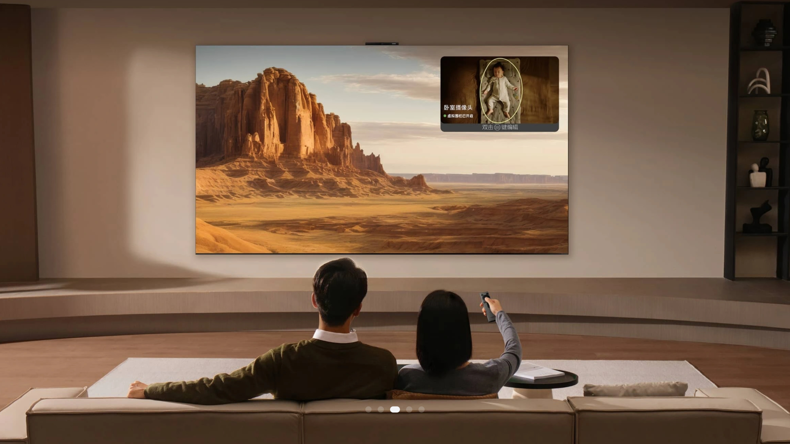

# TV展示应用

### 介绍

本示例通过使用 ArkUI 组件、路由跳转、视频播放、屏保检测等相关 API，展示了一个完整的 OpenHarmony 智慧屏（TV）演示应用的实现方式。实现了以下几点功能：

1. 产品规格展示：根据设备型号动态显示电视产品的屏幕尺寸、操作系统、处理器、音效等规格信息
2. 功能特性介绍：卡片列表形式展示通用互联、投屏、智能AI、指向遥控、智慧屏保、语音交互、分布式等七大特性，支持左右滑动浏览，点击进入详情页
3. 智慧生活场景：展示娱乐影音、儿童关怀、高效办公三大生活场景，详情页带视频自动播放
4. 服务支持页面：Swiper 轮播展示服务与支持内容，支持左右箭头切换
5. 全局屏保检测：应用无操作超过设定时长后自动跳转至屏保页面，任意交互可退出屏保并回到原页面
6. 遥控器焦点导航：完整支持遥控器方向键焦点流转，聚焦元素高亮反馈

相关概念

1. ArkUI 组件：使用 Swiper、List、Stack、Column、Row 等基础容器组件构建 TV 大屏 UI 布局
2. 路由导航：使用 [@kit.ArkUI](https://docs.openharmony.cn/pages/v6.0/zh-cn/application-dev/reference/apis-arkui/js-apis-router.md) 的 router 实现页面跳转与参数传递
3. 视频播放：使用 ArkUI 内置 Video 组件实现视频自动播放与暂停控制
4. 设备信息：使用 [@kit.BasicServicesKit](https://docs.openharmony.cn/pages/v6.0/zh-cn/application-dev/reference/apis-basic-services-kit/js-apis-device-info.md) 获取设备型号，实现差异化产品规格展示

### 效果预览

| 产品规格页 | 功能特性页 |
|---|---|
|  |  |

| 智慧生活页 | 服务支持页 |
|---|---|
|  |  |

使用说明

1. 启动应用后，默认展示"产品规格"页面，显示当前设备对应的电视产品参数
2. 点击或遥控器选择底部导航栏中的"功能特性"，进入功能卡片列表，使用方向键或鼠标左右浏览，点击卡片进入功能详情页查看详细介绍
3. 点击底部"智慧生活"，进入场景卡片列表，点击场景卡片进入详情页，自动播放视频演示，左右滑动切换不同场景
4. 点击底部"服务支持"，查看服务轮播图，通过左右箭头或方向键切换图片
5. 应用静止超过5分钟后自动进入屏保，屏保页面轮播展示图片，按任意键或触碰屏幕退出屏保并回到原页面

### 工程目录

```
entry/src/main/ets/
|---Component
|   |---FeatureComponent.ets          // 功能特性详情页组件
|   |---SmartLifeComponent.ets        // 智慧生活详情页组件
|---entryability
|   |---EntryAbility.ets              // 应用入口 Ability
|---entrybackupability
|   |---EntryBackupAbility.ets        // 备份扩展 Ability
|---pages
|   |---Index.ets                     // 主页面（含底部 Tab 导航）
|   |---FeaturePage.ets               // 功能特性卡片列表页
|   |---SmartLifePage.ets             // 智慧生活卡片列表页
|   |---SupportPage.ets               // 服务支持页
|   |---MediaExperiencePage.ets       // 影音体验页
|   |---ProductSpecPage.ets           // 产品规格页
|   |---ScreenSaver.ets               // 屏保页
|---utils
|   |---AnimationUtils.ets            // 动画工具类
|   |---GlobalScreenSaver.ets         // 全局屏保检测单例
|---Video
|   |---VideoPage.ets                 // 视频播放页
```

### 具体实现

1. 底部导航与页面切换：`Index.ets` 中使用 `Stack` 嵌套 `Column`，底部自定义 `buildTabBar` 构建 Tab 栏，通过 `@State currentTab` 状态变量驱动子页面的条件渲染切换，使用 `focusControl.requestFocus` 实现 Tab 焦点精准控制
2. 功能特性详情页：`FeatureComponent.ets` 使用 Swiper 组件承载七大功能详情，通过路由参数 `index` 控制初始显示项，左右导航箭头调用 `SwiperController` 实现翻页
3. 智慧生活详情页：`SmartLifeComponent.ets` 集成 Video 组件实现场景视频自动播放，`currentIndex` 状态控制视频按需加载，切换时自动暂停避免性能浪费
4. 全局屏保检测：`GlobalScreenSaver.ets` 实现单例模式的 `GlobalIdleDetector` 类，通过 `setTimeout` 定时检测用户无操作时长，超时后调用 `router.pushUrl` 跳转屏保页，退出时精准返回触发前页面

### 相关权限

本示例无需申请额外权限。

### 依赖

无第三方依赖。

### 约束与限制

1. 本示例仅支持标准系统上运行。
2. 本示例为 Stage 模型，从 API version 18 开始支持。SDK 版本号：18。
3. 本示例需要使用 DevEco Studio 6.0.0 Release (Build Version: 6.0.0.858, built on September 24, 2025) 编译运行。

### 下载

如需单独下载本工程，执行如下命令：

```
git init
git config core.sparsecheckout true
echo code/BasicFeature/TV/TVDemonstration/ > .git/info/sparse-checkout
git remote add origin https://gitee.com/openharmony/applications_app_samples.git
git pull origin master
```
