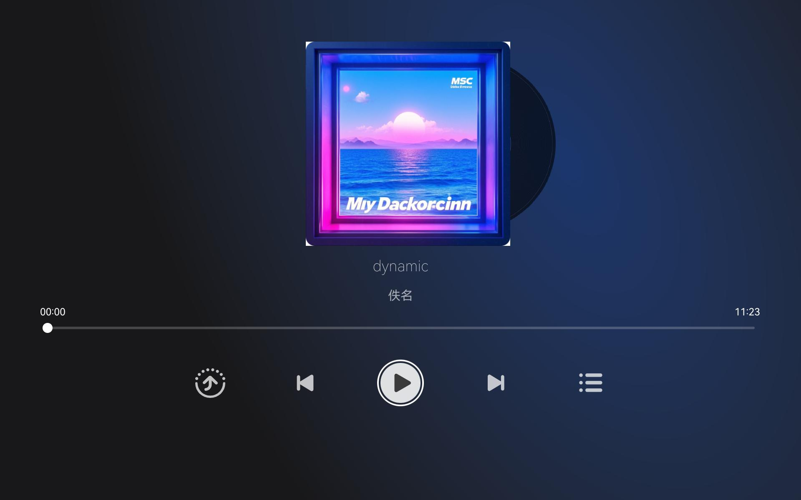

# Music Player

### Introduction

The Music Player application uses fileIo to obtain specified audio files and implements playback, pause, previous track, and next track functionality through AudioPlayer. It also uses DeviceManager for distributed device list display and cross-device sharing of music playback status.

This application is a TV-form distributed music player, adapted for TV remote control interaction and large-screen UI display.

Usage:

1. **Music Playback** — tap the **Play**, **Pause**, **Previous**, or **Next** buttons to control music playback.
2. **Cross-Device Sharing** — when devices are networked and both ends are authorized, tap the **Share** button, select a device, and the remote device will launch the music app with the local playback status synced.
3. **Stop Cross-Device Sharing** — after successful sharing, tap the **Stop Sharing** button to close the remote music application.

### Screenshot Preview
| Home                              |
|--------------------------------------|
||

### Project Directory
```text
entry/src/main/ets/
|---Application
|   |---AbilityStage.ets                 // Application lifecycle entry
|---MainAbility
|   |---MainAbility.ets                  // Main Ability
|---common
|   |---MusicSharedDefinition.ets        // Music player state definitions
|   |---MusicConstants.ets               // Music constants
|   |---DeviceDialog.ets                 // Distributed device list dialog
|   |---EventUtil.ets                    // Event utilities
|   |---PointerUtil.ets                  // Pointer utilities
|---const
|   |---Type.ets                         // Type constant definitions
|---model
|   |---MusicPlayer.ets                  // Player module
|   |---KvStoreModel.ets                 // KVStore operation class
|   |---RemoteDeviceModel.ets            // Remote device operation class
|   |---Music.ets                        // Music data model
|   |---PlayState.ets                    // Playback state model
|   |---ButtonModel.ets                  // Button state model
|---pages
|   |---Index.ets                        // Home page
|---serviceability
|   |---ServiceAbility.ets               // Service Ability (background launch)
|---utils
|   |---Utils.ets                        // Utility class
|   |---Preferences.ets                  // Preferences management
|   |---Logger.ets                       // Logging utility
|   |---Log.ets                          // Log recording
```

### Implementation

In the distributed music player, distributed device management consists of three parts: distributed device discovery, distributed device list dialog, and remote device launch.
First, devices are discovered within the distributed network, then displayed in the distributed device list dialog, and finally the remote device is launched based on user selection.

Devices in the distributed network are discovered via SUBSCRIBE_ID. See the registerDeviceListCallback module for details: [source code reference](entry/src/main/ets/model/RemoteDeviceModel.ets).

The distributed device list dialog is displayed using @CustomDialog. See [DeviceDialog.ets](entry/src/main/ets/common/DeviceDialog.ets).

The remote device package is launched via the startAbility(deviceId) method. See [MainAbility.ets](entry/src/main/ets/MainAbility/MainAbility.ets).

(1) Managing the distributed database
Create a KVManager object instance for managing the distributed database. Use distributedData.createKVManager(config) with specified Options and storeId to create and obtain a KVStore database. This method returns via Promise and is asynchronous, for example: `this.kvManager.getKVStore(STORE_ID, options).then((store) => {})`.

(2) Subscribing to distributed data changes
Data coordination is achieved by subscribing to all distributed database changes (local and remote). See [KvStoreModel.ets](entry/src/main/ets/model/KvStoreModel.ets).

(1) Binding the application package to the distributed device manager
`deviceManager.createDeviceManager('ohos.samples.distributedmusicplayer')`. See [RemoteDeviceModel.ets](entry/src/main/ets/model/RemoteDeviceModel.ets).

(2) Initializing the player
The player is instantiated via the `@ohos.multimedia.media` component in the constructor, and the player initialization function is called. The player's on function listens for error, finish, and timeUpdate events.

(3) Syncing current playback data
The player syncs the currently playing resource, time, and playback state to the selected device by calling selectedIndexChange().

(4) Receiving current playback data
The player calls `this.restoreFromWant()` during aboutToAppear(). The KvStoreModel component retrieves the playlist, and the MusicPlayer component reloads the player state and resources.

Background remote service communication is implemented through ServiceAbility, supporting background launch for distributed music playback. See [ServiceAbility.ets](entry/src/main/ets/serviceability/ServiceAbility.ets).

### Required Permissions

| Permission                             | Description                           |
|----------------------------------------|---------------------------------------|
| ohos.permission.DISTRIBUTED_DATASYNC   | Allows data exchange between devices  |
| ohos.permission.START_ABILITIES_FROM_BACKGROUND | Allows background launch of music pages |
| ohos.permission.START_INVISIBLE_ABILITY | Allows invocation regardless of Ability visibility |
| ohos.permission.ACCESS_SERVICE_DM      | Allows access to distributed device management service |
| ohos.permission.READ_AUDIO             | Allows reading audio files            |
| ohos.permission.WRITE_AUDIO            | Allows writing audio files            |
| ohos.permission.INTERNET               | Allows network access                 |
| ohos.permission.FILE_ACCESS_MANAGER    | Allows file management access         |
| ohos.permission.VIBRATE                | Allows vibration control              |
| ohos.permission.GET_BUNDLE_INFO_PRIVILEGED | Allows retrieving Bundle information  |

### Dependencies

This project depends on the `@ohos/hypium` testing framework and the `@ohos/hamock` mock tool for testing. No other external dependencies.

### Constraints and Limitations

1. This sample runs only on standard systems. Supported devices: RK3568, large-screen TV devices.

2. Full functionality requires both devices to grant distributed collaboration permissions. If only the initiator is authorized, the initiator will display an error dialog.

3. This sample uses the Stage model and is adapted for API version 12 SDK (API Version 12 Release), image version (5.0 Release).

4. This sample requires DevEco Studio version 5.0 Release or later to compile and run.

5. This sample uses system APIs with `@ohos.distributedDeviceManager` system permissions. When using the Full SDK, obtain it manually from the mirror site and replace it in DevEco Studio. Refer to the [replacement guide](https://gitee.com/openharmony/docs/blob/master/zh-cn/application-dev/faqs/full-sdk-switch-guide.md) for details.

6. This sample requires special installation and must be added to a whitelist before installation. Details are as follows:
```json
{
    "bundleName": "ohos.samples.distributedmusicplayer",
    "app_signature" : [],
    "allowAppUsePrivilegeExtension": true
}
```

### Download

To download this project separately, run the following commands:

```bash
git init
git config core.sparsecheckout true
echo code/SystemFeature/TV/TVDistributedMusicPlayer > .git/info/sparse-checkout
git remote add origin https://gitcode.com/openharmony/applications_app_samples.git
git pull origin master
```
