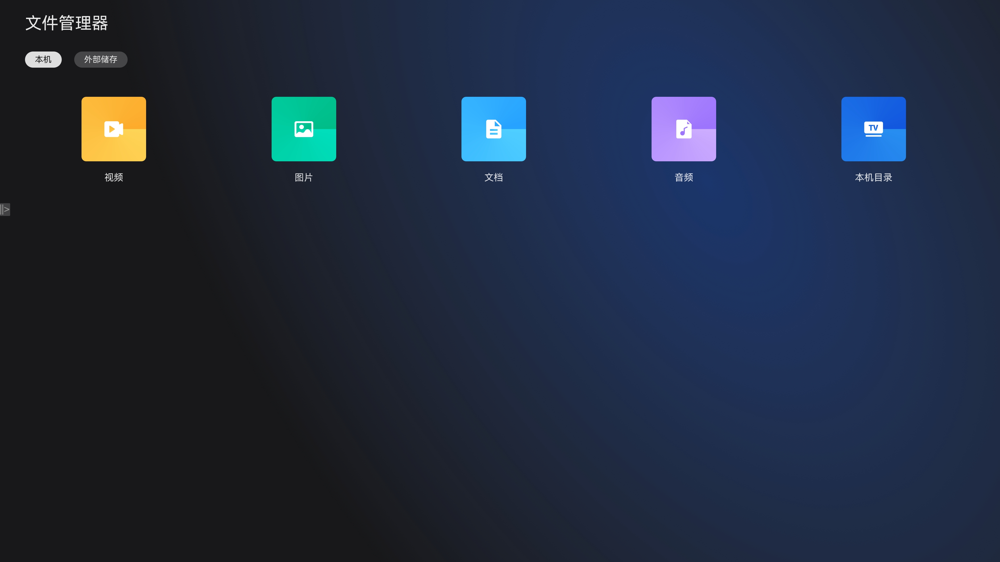

# 文件管理器项目

### 介绍

文件管理器应用使用 fileAccess 和 fileIo 完成了文件的浏览、搜索、复制、移动、删除、重命名等核心文件操作；并通过 userFileManager 实现了媒体文件的分类管理与访问；同时支持外部存储设备的文件访问，以及基于 zlib 的文件压缩/解压功能。

文件管理器应用为 TV 形态的文件管理应用，适配电视端遥控器交互和大屏界面展示，支持本机与外部存储的统一管理。

使用说明：

1. 文件浏览，在首页选择媒体分类（视频、图片、文档、音频）或设备入口，浏览本机/外部存储的文件列表。
2. 文件操作，选中文件后可进行复制、移动、删除、重命名、创建文件/文件夹等操作。
3. 文件搜索，通过 SearchBar 输入关键词搜索文件。
4. 存储空间，查看本机及外部存储的可用空间与总空间。
5. 文件分享，选中文件后点击分享按钮进行文件分享。

### 截图预览
| 首页                                      |
|-----------------------------------------|
|  |

### 工程目录
```text
entry/src/main/ets/
|---Application
|   |---MyAbilityStage.ets              // 应用生命周期入口
|---entryability
|   |---EntryAbility.ets                // 主 Ability
|---common
|   |---data
|   |   |---DeviceType.ets              // 设备类型定义
|   |   |---FileInfo.ets                // 文件信息数据模型
|   |---manager
|   |   |---AbilityManager.ets          // Ability 管理器
|   |   |---CompressManager.ets         // 压缩/解压管理器
|   |   |---FileAccessManager.ets       // 文件访问管理器
|   |   |---FileIoManager.ets           // 文件IO操作管理器
|   |   |---FileTaskPool.ets            // 文件任务线程池
|   |   |---NavPathStackManager.ets     // 导航栈管理器
|   |   |---StorageManager.ets          // 存储空间管理器
|   |   |---UserFileManager.ets         // 用户文件管理器
|   |---utils
|   |   |---DateTools.ets               // 日期工具类
|   |   |---FileUtil.ets                // 文件工具类
|   |   |---InputKeyEventUtils.ets      // 按键事件工具类
|   |   |---MLog.ets                    // 日志工具类
|   |   |---Permission.ets              // 权限管理工具类
|   |   |---PixelUnitConversion.ets     // 像素单位转换工具类
|   |   |---SubtitleHelper.ets          // 副标题辅助类
|   |   |---Tools.ets                   // 通用工具类
|   |   |---lpx.ets                     // 布局像素工具类
|   |---Constants.ets                   // 常量定义（TABS、媒体类型等）
|   |---ConstantsMedia.ets              // 媒体相关常量（文件后缀等）
|   |---FileJumpTools.ets               // 文件跳转工具
|---component
|   |---adapter
|   |   |---BasicDataSource.ets         // 基础数据源适配器
|   |   |---FileDataSource.ets          // 文件数据源适配器
|   |   |---ListPageAdapter.ets         // 列表页适配器
|   |---bean
|   |   |---FileBean.ets                // 文件数据Bean
|   |---dialog
|   |   |---CreateFileDialog.ets        // 创建文件对话框
|   |   |---DeleteDialog.ets            // 删除确认对话框
|   |   |---OverrideDialog.ets          // 覆盖确认对话框
|   |   |---ProgressDialog.ets          // 进度对话框
|   |   |---RenameDialog.ets            // 重命名对话框
|   |   |---RenameFileDialog.ets        // 重命名文件对话框
|   |---FileOperationItem.ets           // 文件操作项组件
|   |---SearchBar.ets                   // 搜索栏组件
|   |---StorageSpaceComponent.ets       // 存储空间展示组件
|---model
|   |---MediaType.ets                   // 媒体类型定义
|   |---Operation.ets                   // 操作类型定义
|   |---PageType.ets                    // 页面类型定义
|---pages
|   |---Index.ets                       // 主页面（Tab切换、焦点控制）
|   |---Home.ets                        // 首页（媒体分类入口）
|   |---FileList.ets                    // 文件列表页面
```

### 具体实现

在TV文件管理器中，文件管理能力包含了文件访问、文件IO操作、文件任务调度、用户文件管理四部分。
通过 FileAccessManager 实现文件的浏览、搜索、删除及回收站管理，通过 FileIoManager 实现目录创建、文件复制/移动等底层IO操作，通过 FileTaskPool 实现批量文件操作的异步执行与进度回调，通过 UserFileManager 封装系统能力实现媒体文件管理。

(1) 文件访问管理
使用 @kit.CoreFileKit 的 fileAccess 和 trash 能力，实现文件浏览器、文件搜索、文件删除及回收站清理功能，详见 [FileAccessManager.ets](entry/src/main/ets/common/manager/FileAccessManager.ets)。

(2) 文件IO操作
使用 @kit.CoreFileKit 的 fileIo 能力，实现目录创建、目录判断、文件复制、文件移动等底层IO操作，详见 [FileIoManager.ets](entry/src/main/ets/common/manager/FileIoManager.ets)。

(3) 文件任务调度
基于 @kit.ArkTS 的 taskpool.LongTask 实现文件批量操作（复制/移动）的异步执行，支持进度回调和取消操作，详见 [FileTaskPool.ets](entry/src/main/ets/common/manager/FileTaskPool.ets)。

(4) 用户文件管理
封装 @kit.CoreFileKit 的 userFileManager 系统能力，提供文件删除、创建等操作，详见 [UserFileManager.ets](entry/src/main/ets/common/manager/UserFileManager.ets)。

(5) 压缩/解压
基于 @kit.BasicServicesKit 的 zlib 能力，实现文件和目录的压缩与解压，详见 [CompressManager.ets](entry/src/main/ets/common/manager/CompressManager.ets)。

(6) 存储空间管理
查询本机及外部存储的可用空间与总空间信息，详见 [StorageManager.ets](entry/src/main/ets/common/manager/StorageManager.ets)。

(7) 导航与焦点管理
通过 NavPathStackManager 管理页面路由栈及焦点控制，适配TV遥控器交互，详见 [NavPathStackManager.ets](entry/src/main/ets/common/manager/NavPathStackManager.ets)。

(8) 页面交互
Index 页面管理本机/外部存储 Tab 切换，参考 [Index.ets](entry/src/main/ets/pages/Index.ets)；Home 页面展示媒体分类入口，参考 [Home.ets](entry/src/main/ets/pages/Home.ets)；FileList 页面处理文件浏览与操作，参考 [FileList.ets](entry/src/main/ets/pages/FileList.ets)。

### 相关权限

| 权限名                                   | 权限说明                     |
|---------------------------------------|--------------------------|
| ohos.permission.CLEAN_BACKGROUND_PROCESSES | 允许清理后台进程               |
| ohos.permission.INTERNET | 允许访问网络                 |
| ohos.permission.READ_MEDIA | 允许读取媒体文件               |
| ohos.permission.WRITE_MEDIA | 允许写入媒体文件               |
| ohos.permission.MEDIA_LOCATION | 允许获取媒体位置信息             |
| ohos.permission.STORAGE_MANAGER | 允许访问存储管理服务             |
| ohos.permission.FILE_ACCESS_MANAGER | 允许访问文件管理               |
| ohos.permission.GET_BUNDLE_INFO_PRIVILEGED | 允许获取 Bundle 信息         |
| ohos.permission.SET_WALLPAPER | 允许设置壁纸                 |
| ohos.permission.MANAGE_MISSIONS | 允许管理任务                 |
| ohos.permission.GET_RUNNING_INFO | 允许获取运行信息               |
| ohos.permission.READ_AUDIO | 允许读取音频文件               |
| ohos.permission.READ_IMAGEVIDEO | 允许读取图片和视频文件            |
| ohos.permission.WRITE_IMAGEVIDEO | 允许写入图片和视频文件            |

### 依赖

- 测试框架：Hypium（`entry/src/ohosTest`）

### 约束与限制

1. 本示例仅支持标准系统上运行，支持设备：RK3568、大屏 TV 设备。

2. 本示例完整功能必须授予文件读写权限，否则无法正常浏览和操作文件。

3. 本示例为 Stage 模型，已适配 API version 12 版本 SDK，SDK 版本号 (API Version 12 Release)，镜像版本号 (5.0 Release)。

4. 本示例需要使用 DevEco Studio 版本号 (5.0 Release) 及以上版本才可编译运行。

5. 本示例需要使用 `@ohos.fileAccessManager` 等系统权限的系统接口。使用 Full SDK 时需要手动从镜像站点获取，并在 DevEco Studio 中替换，具体操作可参考[替换指南](https://gitcode.com/openharmony/docs/blob/master/zh-cn/application-dev/faqs/full-sdk-switch-guide.md)。

6. 本示例中需要使用特殊安装，需要将本示例加入到白名单中再进行安装。详细内容如下：
```json
{
    "bundleName": "com.ohos.file.manager",
    "app_signature" : [],
    "allowAppUsePrivilegeExtension": true
}
```

### 下载

如需单独下载本工程，执行如下命令：

```bash
git init
git config core.sparsecheckout true
echo code/BasicFeature/TV/TVFileManager > .git/info/sparse-checkout
git remote add origin https://gitcode.com/openharmony/applications_app_samples.git
git pull origin master
```
