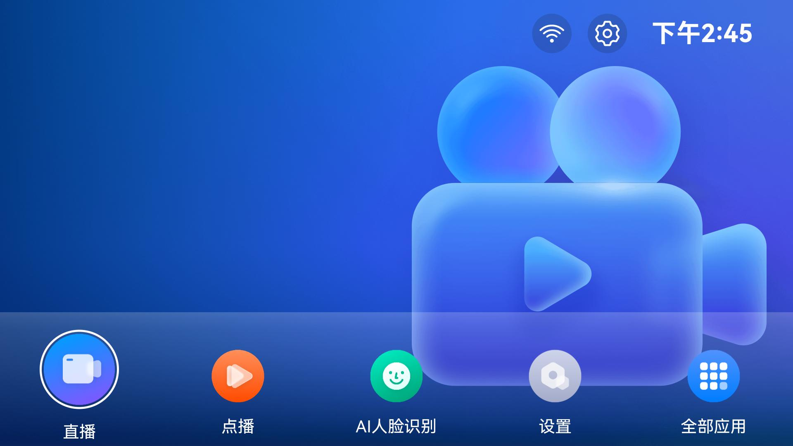

# TV Launcher 项目

### 介绍

本示例为 OpenHarmony 预置桌面（Launcher）的 **TV 形态**实现，作为人机交互的首要入口，基于 [@ohos.bundle.launcherBundleManager](https://gitee.com/openharmony/docs/tree/master/zh-cn/application-dev/reference/apis-ability-kit/js-apis-bundle-launcherBundleManager-sys.md)、窗口与事件等能力，提供应用图标展示、焦点导航、启动应用、沉浸式背景、状态栏信息（时间、网络等）等功能。

使用说明：

1. 桌面展示应用列表与状态栏区域，支持遥控器/键盘 **焦点移动** 与 **获焦高亮**。
2. 焦点在应用图标上时，按 **确定键** 可启动对应应用；部分场景支持长按或菜单扩展能力（以实际产品配置为准）。
3. **沉浸式区域** 可展示直播流、点播海报轮播等背景内容（依赖产品与媒体配置）。
4. **状态栏** 可展示时间、网络连接状态等信息。

### 工程目录

```text
TVLauncher/
|---common/                                    // 公共 HAR 模块 @ohos/common
|   |---index.ets                              // 包入口导出
|   |---src/main/ets/default/
|   |   |---bean/AppItemInfo.ts                // 应用项数据模型
|   |   |---cache/                             // 磁盘/内存缓存（LruCache、DiskLruCache 等）
|   |   |---constants/                         // 公共常量（CommonConstants、EventConstants 等）
|   |   |---manager/
|   |   |   |---LauncherAbilityManager.ets     // 桌面应用列表与启动能力
|   |   |   |---WindowManager.ets              // 子窗口与沉浸式窗口管理
|   |   |   |---CommonEventManager.ets         // 公共事件封装
|   |   |   |---ResourceManager.ts             // 资源加载
|   |   |---utils/Log.ts                       // 日志
|   |   |---utils/CheckEmptyUtils.ts           // 空值判断工具
|---product/tv/src/main/ets/                   // TV 形态 entry 模块
|   |---Application/AbilityStage.ets           // Stage 模型 AbilityStage
|   |---MainAbility/MainAbility.ets            // 桌面主 Service Extension（入口拉起、窗口初始化）
|   |---pages/
|   |   |---EntryView.ets                      // 桌面主页面（组合各布局、按键与 Madvise 等）
|   |   |---RecentView.ets                     // 近期任务相关页面
|   |---default/layout/
|   |   |---DesktopAppListLayout.ets           // 应用列表网格布局
|   |   |---DesktopAppItem.ets                 // 单个应用项组件
|   |   |---DesktopImmersiveLayout.ets         // 沉浸式背景布局
|   |   |---DesktopStatusBarLayout.ets         // 状态栏布局
|   |   |---DesktopStatusBarAppItem.ets        // 状态栏应用项
|   |   |---DesktopToastLayout.ets             // Toast 提示布局
|   |---default/model/EventPublisher.ts        // 事件发布
|   |---common/
|   |   |---baseUtil/                          // 偏好设置、存储、节流等
|   |   |---bean/AppItemInfo.ets               // 与 common 模型对齐的扩展
|   |   |---constants/                         // TV 侧样式与键值常量
|   |   |---utils/EventUtil.ets、PointerUtil.ets
|---api/                                       // 本地类型/声明补充（按需）
|---signature/                                 // 示例签名资源（建议使用本目录下配置）
```

### 具体实现

- 桌面 **入口与窗口生命周期** 封装在 [MainAbility.ets](product/tv/src/main/ets/MainAbility/MainAbility.ets)
  * 继承 `ServiceExtensionAbility`，负责初始化 Launcher 窗口、与 `WindowManager` 协同创建子窗口；
- **主界面组装与焦点/按键** 封装在 [EntryView.ets](product/tv/src/main/ets/pages/EntryView.ets)
  * 组合 `DesktopAppListLayout`、`DesktopStatusBarLayout`、`DesktopImmersiveLayout` 等；
  * 通过 `@ohos/common` 中的 `launcherAbilityManager` 获取应用列表并支持启动应用；
  * 可选调用 Native `libentry.so` 的 Madvise 接口做内存访问优化。
- **应用列表与点击启动** 能力主要封装在 [DesktopAppListLayout.ets](product/tv/src/main/ets/default/layout/DesktopAppListLayout.ets)、[DesktopAppItem.ets](product/tv/src/main/ets/default/layout/DesktopAppItem.ets)
  * 列表数据与启动逻辑与 `LauncherAbilityManager`、事件总线配合。
- **沉浸式背景** 相关 UI 与媒体逻辑见 [DesktopImmersiveLayout.ets](product/tv/src/main/ets/default/layout/DesktopImmersiveLayout.ets)（具体播控依赖业务配置）。
- **公共能力** 集中在 `common` 模块，例如 [LauncherAbilityManager.ets](common/src/main/ets/default/manager/LauncherAbilityManager.ets)、[WindowManager.ets](common/src/main/ets/default/manager/WindowManager.ets)，由 `product/tv` 通过 `oh-package.json5` 依赖 `@ohos/common` 引用。

### 截图预览



### 相关权限

| 权限名 | 权限说明 | 备注 |
|--------|----------|------|
| ohos.permission.GET_BUNDLE_INFO_PRIVILEGED | 获取设备上已安装应用的包信息 | 系统级 |
| ohos.permission.INSTALL_BUNDLE | 安装应用 | 系统级 |
| ohos.permission.LISTEN_BUNDLE_CHANGE | 监听应用安装/卸载/更新 | 系统级 |
| ohos.permission.MANAGE_MISSIONS | 管理任务与最近任务 | 系统级 |
| ohos.permission.REQUIRE_FORM | 卡片/表单相关能力 | 系统级 |
| ohos.permission.INPUT_MONITORING | 输入事件监听 | 系统级 |
| ohos.permission.NOTIFICATION_CONTROLLER | 通知控制能力 | 系统级 |
| ohos.permission.MANAGE_SECURE_SETTINGS | 修改安全相关设置 | 系统级 |
| ohos.permission.START_ABILITIES_FROM_BACKGROUND |  支持系统级应用通过该权限，从后台启动指定功能模块，需严格遵循权限管控规则 | 系统级 |
| ohos.permission.USE_BLUETOOTH | 使用蓝牙 | 按产品需要 |
| ohos.permission.GET_WIFI_INFO | 获取 Wi-Fi 信息 | 状态展示 |
| ohos.permission.GET_NETWORK_INFO | 获取网络信息 | 状态展示 |
| ohos.permission.MODIFY_AUDIO_SETTINGS | 修改音频设置 | 沉浸式/媒体场景 |
| ohos.permission.MANAGE_AUDIO_CONFIG | 管理音频配置 | 系统级 |
| ohos.permission.INTERNET | 访问网络 | 媒体/网络能力 |
| ohos.permission.MANAGE_SETTINGS | 管理系统设置 | 系统级 |

实际签名与权限级别需与设备/产品安全要求一致；系统应用可参考 [特殊权限配置方法](https://gitcode.com/openharmony/docs/blob/master/zh-cn/device-dev/subsystems/subsys-app-privilege-config-guide.md)，将配置中的 **apl** 等字段调整为与系统应用匹配的值（如 `system_core`）。

### 依赖

- 本工程 **TV 产品模块** 依赖同级目录下的 HAR：`@ohos/common`（路径 `TVLauncher/common`），在 [product/tv/oh-package.json5](product/tv/oh-package.json5) 中声明。

### 约束与限制

1. 本示例面向 **TV / 大屏** 交互场景，需在支持相应设备类型的标准系统上运行；具体机型以实际集成版本为准（如 RK3568、V900 等，以产品文档为准）。

2. 本示例为 **Stage 模型**，建议使用 **API 12** 对应 SDK（如 **5.0 Release** 镜像与配套 **DevEco Studio 5.0 Release** 及以上）进行编译运行。

3. Launcher 涉及多项 **系统特权权限**，需使用 **系统应用签名** 与正确的特权配置，否则会出现权限校验失败；推荐使用本工程 **signature** 目录下的签名与配置说明。

4. 若单独检出本工程构建，请确认 `common` 与 `product/tv` 的模块关系未被破坏，并在 `product/tv` 下执行依赖安装（如 `ohpm install`）后再编译。

### 下载

如需单独下载本工程，执行如下命令：

```
git init
git config core.sparsecheckout true
echo code/BasicFeature/TV/TVLauncher > .git/info/sparse-checkout
git remote add origin https://gitcode.com/openharmony/applications_app_samples.git
git pull origin master
```
