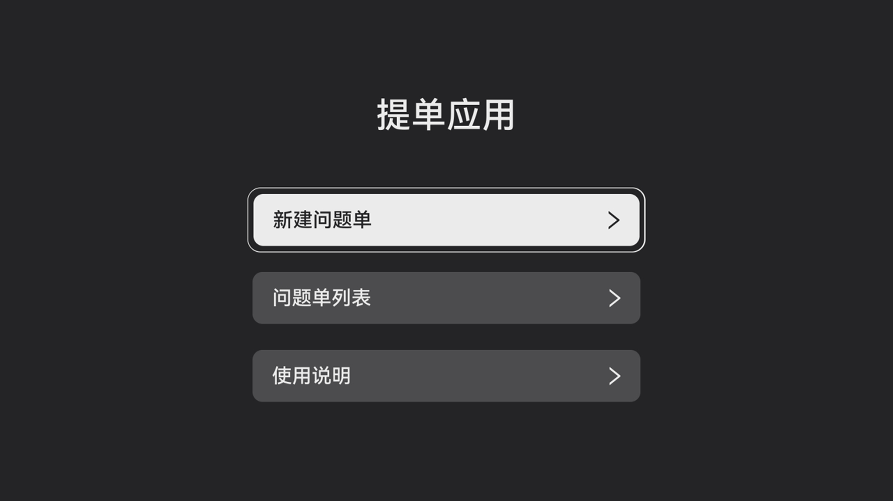

# TVLavalBetaClub

## 介绍

TVLavalBetaClub 是为 Laval 社区开发者提供的问题反馈与提交应用。本示例使用了以下 OpenHarmony 包：

- [@ohos.app.ability.UIAbility](https://gitee.com/openharmony/docs/blob/master/zh-cn/application-dev/reference/apis-ability-kit/js-apis-app-ability-uiAbility.md) —
  提供 UIAbility 生命周期管理
- [@ohos.window](https://gitee.com/openharmony/docs/blob/master/zh-cn/application-dev/reference/apis-arkui/js-apis-window.md) —
  窗口管理
- [@ohos.net.http](https://gitee.com/openharmony/docs/blob/master/zh-cn/application-dev/reference/apis-network-kit/js-apis-http.md) —
  HTTP 网络请求
- [@ohos.request](https://gitee.com/openharmony/docs/blob/master/zh-cn/application-dev/reference/apis-basic-services-kit/js-apis-request.md) —
  文件上传与下载
- [@ohos.file.fs](https://gitee.com/openharmony/docs/blob/master/zh-cn/application-dev/reference/apis-core-file-kit/js-apis-file-fs.md) —
  文件系统操作
- [@ohos.file.photoAccessHelper](https://gitee.com/openharmony/docs/blob/master/zh-cn/application-dev/reference/apis-media-library-kit/js-apis-photoAccessHelper.md) —
  相册资源访问
- [@ohos.router](https://gitee.com/openharmony/docs/blob/master/zh-cn/application-dev/reference/apis-arkui/js-apis-router.md) —
  页面路由
- [@ohos.promptAction](https://gitee.com/openharmony/docs/blob/master/zh-cn/application-dev/reference/apis-arkui/js-apis-promptAction.md) —
  弹窗提示
- [@ohos.multimodalInput.keyCode](https://gitee.com/openharmony/docs/blob/master/zh-cn/application-dev/reference/apis-input-kit/js-apis-keycode.md) —
  按键事件处理
- [@kit.InputKit](https://gitee.com/openharmony/docs/blob/master/zh-cn/application-dev/reference/apis-input-kit/js-apis-inputclient.md) —
  输入事件注入
- [@ohos.bundle.bundleManager](https://gitee.com/openharmony/docs/blob/master/zh-cn/application-dev/reference/apis-ability-kit/js-apis-bundleManager.md) —
  Bundle 信息获取
- [@ohos.systemparameter](https://gitee.com/openharmony/docs/blob/master/zh-cn/application-dev/reference/apis-basic-services-kit/js-apis-system-parameter.md) —
  系统参数读取
- [@kit.ArkData](https://gitee.com/openharmony/docs/blob/master/zh-cn/application-dev/reference/apis-arkdata/js-apis-data-preferences.md) —
  偏好数据存储
- [@kit.BasicServicesKit](https://gitee.com/openharmony/docs/blob/master/zh-cn/application-dev/reference/apis-basic-services-kit/js-apis-zlib.md) —
  zlib 压缩
- [@kit.CoreFileKit](https://gitee.com/openharmony/docs/blob/master/zh-cn/application-dev/reference/apis-core-file-kit/js-apis-fileIo.md) —
  文件 I/O
- [@kit.IMEKit](https://gitee.com/openharmony/docs/blob/master/zh-cn/application-dev/reference/apis-ime-kit/js-apis-inputmethod.md) —
  输入法控制

应用主要功能包括：

- 问题创建：填写故障时间、问题概率、问题类型、问题描述并上传附件截图/视频，提交问题单
- 问题列表：查看已提交的问题单，支持分页加载与状态标记
- 问题详情：查看问题单详情及处理流转记录
- 问题重提：支持对失败问题单重新编辑提交
- 使用说明：展示预设条件及问题反馈操作步骤

## 效果预览



### 使用说明

编译前将[sdk](sdk)目录下的文件替换sdk对应文件

1. 在主界面，选择"创建问题单"进入问题反馈页面
2. 在创建问题单页面，依次选择问题概率、故障日期/时间、问题类型，填写问题描述，上传附件后点击"提交"按钮提交问题单
3. 在主界面，选择"问题单列表"查看已提交的问题单，支持通过方向键上下切换、点击进入查看问题单详情
4. 在问题单详情页，可查看问题单号、状态、附件及处理流转记录
5. 在主界面，选择"使用说明"查看问题反馈的预设条件与操作步骤

## 工程目录

```
entry/src/main/ets/
├── entryability
│   └── EntryAbility.ets                    // UIAbility 入口
├── common
│   ├── Constants
│   │   ├── KeyConstant.ets                 // 键值常量定义
│   │   ├── TypeData.ets                    // 数据类型定义
│   │   └── UrlConstant.ets                 // 接口地址常量
│   ├── Device
│   │   └── DeviceManager.ets               // 设备信息管理
│   ├── Log
│   │   └── LogManager.ets                  // 日志管理
│   ├── Network
│   │   └── NetworkManager.ets              // 网络请求管理
│   ├── Permission
│   │   └── PermissionManager.ets           // 权限管理
│   ├── Utils
│   │   ├── EventUtil.ets                   // 事件工具类
│   │   └── PointerUtil.ets                 // 指针样式工具类
│   └── kvManager
│       └── KvManagerService.ets            // KV 数据库服务
├── manager
│   ├── PhotoManager.ets                    // 相册管理
│   ├── VideoThumbLoader.ets                // 视频缩略图加载
│   ├── loader
│   │   ├── AllPhotoLoader.ets              // 全量图片加载器
│   │   ├── BasePhotoLoader.ets             // 基础加载器
│   │   ├── ILoader.ets                     // 加载器接口
│   │   ├── LoadUtil.ets                    // 加载工具类
│   │   ├── MediaTasks.ets                  // 媒体任务
│   │   └── SubTypeLoader.ets               // 子类型加载器
│   └── utils
│       └── FileUtils.ets                   // 文件工具类
├── models
│   └── PhotoModel.ets                      // 图片数据模型
└── pages
    ├── Index.ets                           // 应用主页面
    ├── common
    │   ├── BaseModel.ets                   // 基础数据模型
    │   ├── CustomDialogTvComponent.ets     // 自定义弹窗组件
    │   ├── EventUtil.ets                   // 页面事件工具类
    │   ├── KeyCode.ets                     // 按键码定义
    │   ├── NavigationBar.ets               // 导航栏组件
    │   ├── PointerUtil.ets                 // 页面指针工具类
    │   ├── SettingItemTvModel.ets          // 设置项模型
    │   ├── StyleConstants.ets              // 样式常量
    │   ├── ThumbnailList.ets               // 缩略图列表组件
    │   └── UtilImage.ets                   // 图片工具类
    ├── IssueReporter
    │   ├── IssueReporterHome.ets            // 问题反馈首页
    │   ├── IssueReporterAdd.ets             // 创建/重新提交问题单
    │   ├── IssueReporterDetail.ets          // 问题单详情
    │   ├── UseIntroduction.ets              // 使用说明页
    │   ├── AttachmentVideoView.ets          // 附件视频预览
    │   ├── models
    │   │   └── IssueDetailInfo.ets          // 问题单数据模型
    │   └── views
    │       ├── ImagePreViewDialog.ets       // 图片预览弹窗
    │       ├── IssueAttachment.ets          // 附件管理组件
    │       ├── IssueReportCardItem.ets      // 问题单信息卡片
    │       ├── IssueReporterDetailItem.ets  // 问题单详情项
    │       ├── IssueReportHistory.ets       // 问题处理记录
    │       ├── IssueReportSelectItem.ets    // 问题单选择项
    │       ├── IssueReporterList.ets        // 问题单列表
    │       └── IssueReporterListItem.ets    // 问题单列表项
    └── Security
        └── SecurityHome.ets                 // 安全验证页面
```

## 具体实现

### 问题单提交功能

问题单创建与提交流程在 [IssueReporterAdd.ets](entry/src/main/ets/pages/IssueReporter/IssueReporterAdd.ets) 中实现：

- 使用 `router.getParams()` 获取传递参数新建模式和失败重试模式
- 使用 `issueReportSelectItem`
  组件实现问题概率、故障时间、问题类型的选择，源码参考：[IssueReportSelectItem.ets](entry/src/main/ets/pages/IssueReporter/views/IssueReportSelectItem.ets)
- 使用 `TextArea` 组件实现问题描述输入，最大支持1024字符
- 使用@ohos.file.fs 进行日志文件的复制与管理，使用@kit.BasicServicesKit (zlib)将日志压缩后上传

- 使用@ohos.request实现附件与日志文件的上传

- 通过 [NetworkManager.ets](entry/src/main/ets/common/Network/NetworkManager.ets)
  封装 [@ohos.net.http](https://gitee.com/openharmony/docs/blob/master/zh-cn/application-dev/reference/apis-network-kit/js-apis-http.md)
  进行问题单提交的网络请求

### 问题单列表功能

问题单列表的加载与展示在 [IssueReporterList.ets](entry/src/main/ets/pages/IssueReporter/views/IssueReporterList.ets)
中实现：

- 使用@ohos.net.http
发送 GET 请求分页获取问题单列表数据

- 使用 `List` 组件展示问题单列表，支持焦点切换与滚动
- 通过 @kit.ArkData (preferences)
和 [KvManagerService.ets](entry/src/main/ets/common/kvManager/KvManagerService.ets) 缓存问题单数据，支持离线查看

- 使用 `AppStorage` 实现跨页面的数据刷新通知

### 问题单详情与流转记录

问题单详情查看在 [IssueReporterDetail.ets](entry/src/main/ets/pages/IssueReporter/IssueReporterDetail.ets) 中实现：

- 通过 [IssueReportCardItem.ets](entry/src/main/ets/pages/IssueReporter/views/IssueReportCardItem.ets)
  展示问题单号、问题概率、问题类型、创建时间、问题描述等信息
- 通过 [IssueAttachment.ets](entry/src/main/ets/pages/IssueReporter/views/IssueAttachment.ets) 展示问题单附件缩略图，支持点击放大预览
- 通过 [IssueReportHistory.ets](entry/src/main/ets/pages/IssueReporter/views/IssueReportHistory.ets) 展示问题单处理流转记录

### 附件管理功能

附件管理在IssueAttachment.ets 中实现：

- 使用 @ohos.file.photoAccessHelper
访问系统相册，获取图片和视频资源

- 通过 [PhotoManager.ets](entry/src/main/ets/manager/PhotoManager.ets) 管理相册数据加载，使用 `AllPhotoLoader`、
  `SubTypeLoader` 等加载器按类型加载媒体文件
- 使用 `ThumbnailList` 组件展示附件缩略图列表，在 [ThumbnailList.ets](entry/src/main/ets/pages/common/ThumbnailList.ets)
  中实现

### 遥控器/TV 适配

针对 TV 设备遥控器操作进行了适配：

- 使用 @ohos.multimodalInput.keyCode 处理遥控器方向键（上/下/左/右/确认/返回）事件

- 通过@kit.InputKit注入 Tab 键事件，确保默认焦点组件多态样式生效

- 使用 `focusControl.requestFocus()` 实现焦点管理，通过 `focusBox` 自定义焦点框样式
- 实现 Hover 焦点效果，鼠标悬停时自动聚焦

## 相关权限

| 权限名称                                       | 用途说明             | 链接                                                                                                     |
|--------------------------------------------|------------------|--------------------------------------------------------------------------------------------------------|
| ohos.permission.INTERNET                   | 网络请求             | [文档](https://gitee.com/openharmony/docs/blob/master/zh-cn/application-dev/security/permission-list.md) |
| ohos.permission.GET_NETWORK_INFO           | 获取网络状态           | [文档](https://gitee.com/openharmony/docs/blob/master/zh-cn/application-dev/security/permission-list.md) |
| ohos.permission.SET_NETWORK_INFO           | 设置网络信息           | [文档](https://gitee.com/openharmony/docs/blob/master/zh-cn/application-dev/security/permission-list.md) |
| ohos.permission.READ_IMAGEVIDEO            | 读取图片和视频          | [文档](https://gitee.com/openharmony/docs/blob/master/zh-cn/application-dev/security/permission-list.md) |
| ohos.permission.READ_MEDIA                 | 读取媒体文件           | [文档](https://gitee.com/openharmony/docs/blob/master/zh-cn/application-dev/security/permission-list.md) |
| ohos.permission.sec.ACCESS_UDID            | 获取设备 UDID        | [文档](https://gitee.com/openharmony/docs/blob/master/zh-cn/application-dev/security/permission-list.md) |
| ohos.permission.GET_BUNDLE_INFO            | 获取 Bundle 信息     | [文档](https://gitee.com/openharmony/docs/blob/master/zh-cn/application-dev/security/permission-list.md) |
| ohos.permission.GET_BUNDLE_INFO_PRIVILEGED | 获取 Bundle 信息（特权） | [文档](https://gitee.com/openharmony/docs/blob/master/zh-cn/application-dev/security/permission-list.md) |
| ohos.permission.START_INVISIBLE_ABILITY    | 启动后台 Ability     | [文档](https://gitee.com/openharmony/docs/blob/master/zh-cn/application-dev/security/permission-list.md) |
| ohos.permission.KEEP_BACKGROUND_RUNNING    | 保持后台运行           | [文档](https://gitee.com/openharmony/docs/blob/master/zh-cn/application-dev/security/permission-list.md) |
| ohos.permission.FILE_ACCESS_MANAGER        | 文件访问管理           | [文档](https://gitee.com/openharmony/docs/blob/master/zh-cn/application-dev/security/permission-list.md) |

## 约束与限制

1. 本示例仅支持在 OpenHarmony 标准系统上运行，支持设备：LHT16（始祖鸟）、oriole（黄鹂）
2. 本示例基于 API 18 开发，SDK 版本：Full-SDK 4.0.10.15。使用 Full SDK
   需参考[替换指南](https://gitee.com/openharmony/docs/blob/master/zh-cn/application-dev/faqs/full-sdk-switch-guide.md)
3. 本示例仅支持在 DevEco Studio 4.0 Release（Build Version: 4.0.0.600）及以上版本运行
4. 本示例为系统应用，需使用系统签名证书，指纹证书信息如下：
   ```
   161B018F761647414D959344141CAD4F48525DD8DA9B9286844ACED06781E879
   ```
5. 本示例为 `system_basic` 或更高 APL 等级应用，需配置 `install_list.json` 预置安装：
   ```json
   {
     "app_dir": "/system/app/com.samples.betaclub",
     "removable": false
   }
   ```
6. 开发前需将根目录 `apis` 文件夹中的 API 声明文件（如 `@ohos.logCatcher.d.ts`）复制到 SDK 的 `ets\api` 目录下并重新 Sync
   工程

## 构建说明

1. 开发环境构建：`entry\build\default\outputs\default\entry-default-signed.hap` 为开发环境构建的 HAP 包
2. 生产环境构建：`entry\build\default\outputs\product\entry-product-signed.hap` 为生产环境构建的 HAP 包，需编译
   release 包
3. 资源区别：开发环境引用 `entry\src\main\resources` 目录资源，生产环境引用 `entry\src\main\resources_product`
   目录资源，新增资源时需根据情况同步到生产环境
4. 版本管理：每次版本发布时，需单独提交 PR 进行版本号升级

## 下载

如需单独下载本工程，可使用如下命令：

```bash
git init
git config core.sparsecheckout true
echo code/SystemFeature/TV/TVLavalBetaClub/ > .git/info/sparse-checkout
git remote add origin https://gitee.com/openharmony/applications_app_samples.git
git pull origin master
```
