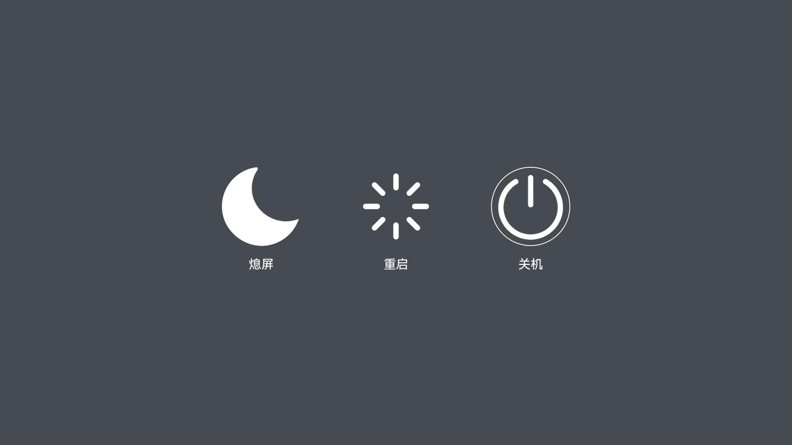

# PowerDialog

- [PowerDialog](#PowerDialog)
    - [简介](#简介)
    - [TV特性](#TV特性)
    - [截图预览](#截图预览)
    - [约束](#约束)

## 简介
PowerDialog是OpenHarmony预置的系统应用，提供关机、重启、熄屏等功能。

## TV特性
OpenHarmony系统应用支持根据不同产品和不同屏幕来区分部件形态。TV形态下的PowerDialog有如下特性：
- TV风格UX
- 支持熄屏

## 截图预览

## 约束
- 开发环境
    - **IDE**：DevEco Studio（版本号3.1.0.100）
    - **SDK**：Full-SDK（版本号3.2.10.10）

- 语言版本
    - [eTS](https://gitee.com/openharmony/docs/blob/master/zh-cn/application-dev/quick-start/start-with-ets.md)

- 建议
    -  推荐使用本工程下的签名配置，路径：signature目录下的所有签名文件。
