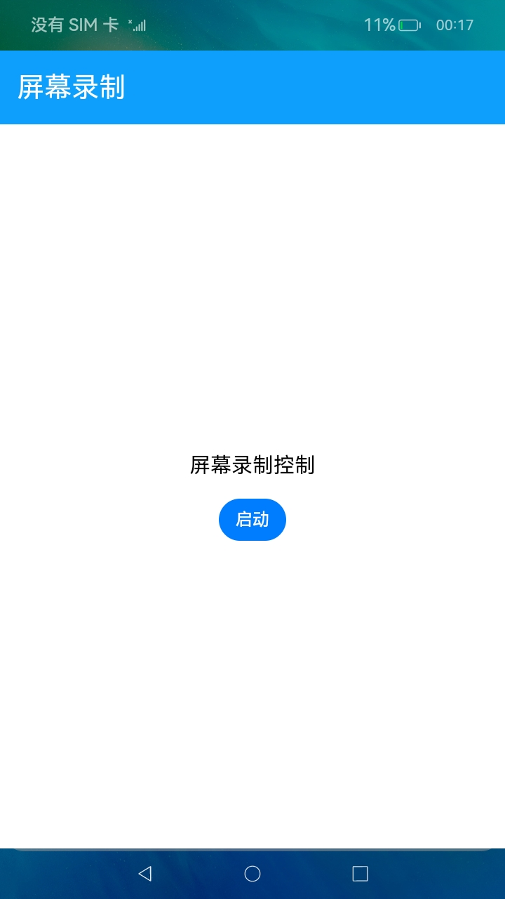
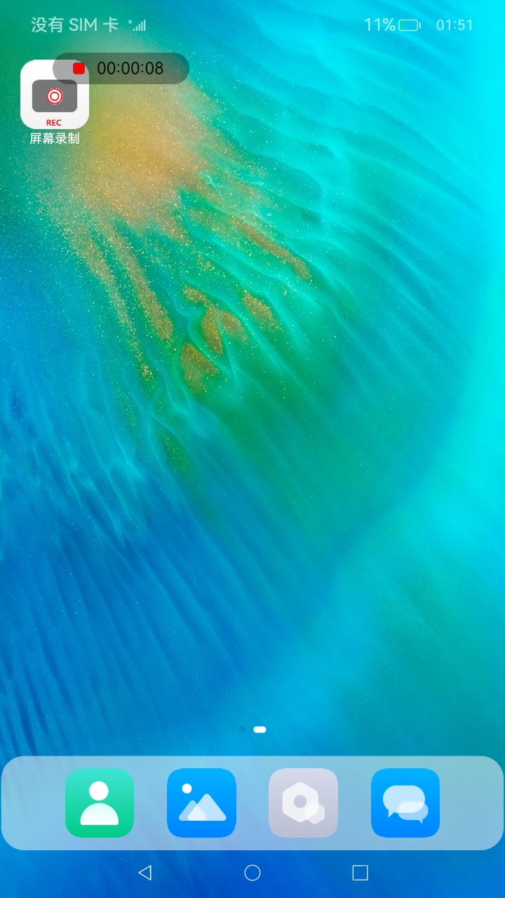
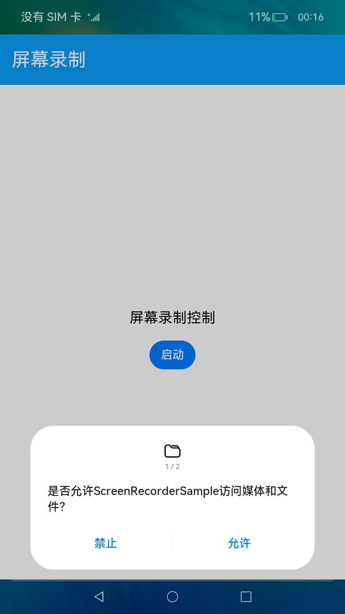

# Screen Recorder

### Introduction

This sample demonstrates the screen recording capability for TV devices. It shows how to combine screen capture, media encoding, floating timer prompts, and media library writing to complete a full screen recording workflow.

The project includes both application code and `ohosTest` automated test suites, which can be used to validate recording start and stop, permission requests, Recent task projection, status bar linkage, exception recovery, and performance regression scenarios.

Usage:

1. Start the application and grant the required permissions to begin screen recording.
2. During recording, a floating timer window is displayed to show the current recording status and duration.
3. After recording stops, a result dialog is displayed and the recorded file is saved to the system media library.
4. If the resolution is not supported or recording fails, the corresponding prompt page or error state is displayed.

### Screenshots





### Project Structure
```text
entry/src/main/
|---ets
|   |---ServiceExtAbility
|   |   |---ScreenRecorderAbility.ets    // Screen recording service extension entry
|   |---common
|   |   |---Constants.ets                // Recording status and constants
|   |   |---InputConsumer.ets            // Key event consumption logic
|   |   |---Logger.ets                   // Logger wrapper
|   |   |---SRManager.ets                // Core screen recording manager
|   |   |---WindowManager.ets            // Floating window and dialog management
|   |---pages
|   |   |---ResolutionNotSupportedDialog.ets // Unsupported resolution prompt page
|   |   |---ScreenRecorderDialog.ets     // Recording completion dialog
|   |   |---ScreenRecorderTimer.ets      // Recording timer floating window
|   |---utils
|   |   |---SizeCalc.ets                 // TV size calculation utility
|---resources
|   |---base                             // Default resources
|   |---en_US                            // English resources
|   |---zh_CN                            // Chinese resources
entry/src/ohosTest/ets/
|---TestRunner
|   |---OpenHarmonyTestRunner.ets        // Automated test entry
|---test
|   |---foundation                       // Base assertions, mocks, and fixtures
|   |---srmanager                        // Deep SRManager regression tests
|   |---ability                          // Lifecycle and orchestration tests
|   |---window                           // Window and floating window tests
|   |---ui                               
|   |---service                          // Input and command flow tests
|   |---performance                      // Performance and long-run stress tests
|   |---contract                         // Contract, security, and persistence tests
```

### Implementation Details

- The core recording flow is implemented in [SRManager.ets](entry/src/main/ets/common/SRManager.ets)
    * Responsible for recording creation, start, stop, state maintenance, and result write-back.
    * Works with media library and screen recording capabilities to complete the output pipeline.
- Window presentation logic is implemented in [WindowManager.ets](entry/src/main/ets/common/WindowManager.ets)
    * Responsible for creating and closing the recording timer floating window, completion dialog, and exception dialog.
    * Works with page components to display recording status, completion prompts, and resolution exception prompts.
- Page presentation logic is implemented in [ScreenRecorderTimer.ets](entry/src/main/ets/pages/ScreenRecorderTimer.ets), [ScreenRecorderDialog.ets](entry/src/main/ets/pages/ScreenRecorderDialog.ets), and [ResolutionNotSupportedDialog.ets](entry/src/main/ets/pages/ResolutionNotSupportedDialog.ets)
    * `ScreenRecorderTimer` displays recording status, red-dot flashing, and elapsed time.
    * `ScreenRecorderDialog` notifies the user that recording is complete and saved to the media library.
    * `ResolutionNotSupportedDialog` informs the user that the current device resolution does not meet recording requirements.
- Service and input handling are implemented in [ScreenRecorderAbility.ets](entry/src/main/ets/ServiceExtAbility/ScreenRecorderAbility.ets) and [InputConsumer.ets](entry/src/main/ets/common/InputConsumer.ets)
    * The former provides the service extension entry.
    * The latter handles key event consumption and shortcut-based recording termination.
- Automated test coverage is integrated in [ListTest.ets](entry/src/ohosTest/ets/test/ListTest.ets)
    * Serves as the regression validation entry for the TV screen recorder project.

### Permissions

| Permission Name                                 | Description                                                  | Level |
|-------------------------------------------------|--------------------------------------------------------------|-------|
| ohos.permission.MEDIA_LOCATION                  | Allows access to location information in media files         | -     |
| ohos.permission.MICROPHONE                      | Allows microphone audio capture during screen recording      | -     |
| ohos.permission.READ_IMAGEVIDEO                 | Allows reading image and video media files                   | -     |
| ohos.permission.WRITE_IMAGEVIDEO                | Allows writing image and video media files                   | -     |
| ohos.permission.SYSTEM_FLOAT_WINDOW             | Allows displaying the floating recording timer window        | System |
| ohos.permission.CAPTURE_SCREEN                  | Allows screen capture and recording                          | System |
| ohos.permission.EXEMPT_CAPTURE_SCREEN_AUTHORIZE | Allows screen recording authorization without prompt dialog  | System |

### Dependencies

At runtime, this project mainly depends on OpenHarmony system capabilities for screen capture, media encoding, media library access, and window management. On the test side, it uses `@ohos/hypium` as the automated testing framework.

### Constraints

1. This sample can run only on standard-system devices and supports devices such as RK3568 and V900.

2. This sample uses the Stage model, supports API10 SDK, and targets API Version 12 Release with image version 5.0 Release.

3. DevEco Studio 5.0 Release or later is required to build and run this sample.

4. Some APIs in this sample require system application signing. For details, refer to [Special Permission Configuration Guide](https://gitcode.com/openharmony/docs/blob/master/zh-cn/device-dev/subsystems/subsys-app-privilege-config-guide.md), and change the `apl` field in the configuration file to `system_core`.

### Download

To download only this project, run the following commands:

```bash
git init
git config core.sparsecheckout true
echo code/SystemFeature/TV/TVScreenRecorder > .git/info/sparse-checkout
git remote add origin https://gitcode.com/openharmony/applications_app_samples.git
git pull origin master
```
