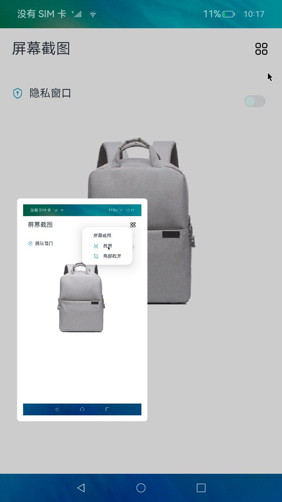

# 截屏项目

### 介绍

截屏应用是一个基于 OpenHarmony Stage 模型实现的 TV 截屏示例工程，提供系统级截屏触发、悬浮预览、图片保存以及测试验证能力。

本工程由 `product/TV` 入口模块和 `features/screenshot_tv` HAR 功能模块组成，适配 TV 场景下的大屏展示与系统能力调用。

使用说明：

1. 服务扩展能力接收系统截屏动作后，拉起悬浮窗口并触发截屏流程。
2. HAR 模块负责封装截屏、图片打包、媒体库写入和窗口显示等核心逻辑。
3. TV 页面模块负责展示截屏预览、提示信息以及保存完成后的交互反馈。
4. `ohosTest` 用例覆盖模型、服务、性能、兼容性、安全性和可访问性等验证场景。

### 截图预览


### 工程目录
```text
product/TV/src/main/ets/
|---application
|   |---AbilityStage.ets                 // Stage 生命周期入口
|---common
|   |---Constants.ets                    // 预览时长、窗口尺寸等常量
|   |---Log.ets                          // 日志封装
|   |---SizeCalc.ets                     // 大屏尺寸计算工具
|---pages
|   |---Index.ets                        // 截屏预览主页面
|   |---TipPage.ets                      // 截屏提示浮层
|---serviceExtAbility
|   |---ServiceExtAbility.ets            // 系统截屏服务入口
|---vm
|   |---ViewModel.ets                    // 页面交互与流程编排

features/screenshot_tv/src/main/ets/
|---common
|   |---Constants.ets                    // HAR 公共常量
|   |---Log.ets                          // HAR 日志封装
|---components
|   |---MainPage.ets                     // HAR 示例页面
|---model
|   |---ScreenShotModel.ets              // 截屏核心模型
```

### 具体实现

- 应用入口与生命周期管理能力封装在 [AbilityStage.ets](product/TV/src/main/ets/application/AbilityStage.ets)
    * 负责 Stage 生命周期初始化；
    * 作为 `product/TV` 模块的入口文件，与模块配置中的 `srcEntry` 保持一致。
- 系统截屏服务能力封装在 [ServiceExtAbility.ets](product/TV/src/main/ets/serviceExtAbility/ServiceExtAbility.ets)
    * 接收 `com.ohos.systemui.action.TOGGLE` 动作；
    * 创建系统悬浮窗，并驱动后续截屏、预览和保存流程。
- 截屏核心模型能力封装在 [ScreenShotModel.ets](features/screenshot_tv/src/main/ets/model/ScreenShotModel.ets)
    * 负责调用截屏能力、打包图片、保存到媒体库；
    * 对外提供窗口展示、窗口销毁和 Ability 跳转等统一接口。
- 预览页面与交互编排能力分别封装在 [Index.ets](product/TV/src/main/ets/pages/Index.ets)、[TipPage.ets](product/TV/src/main/ets/pages/TipPage.ets)、[ViewModel.ets](product/TV/src/main/ets/vm/ViewModel.ets)
    * `Index.ets` 负责展示截屏图片预览；
    * `TipPage.ets` 负责显示保存提示与操作反馈；
    * `ViewModel.ets` 负责关闭预览、保存图片、结束流程等业务编排。

### 相关权限

| 权限名                                              | 权限说明                         | 级别 |
|--------------------------------------------------|------------------------------|------|
| ohos.permission.MEDIA_LOCATION                   | 允许读取媒体位置信息，用于媒体库写入相关流程     | -    |
| ohos.permission.GET_BUNDLE_INFO_PRIVILEGED       | 允许获取系统应用相关包信息               | -    |
| ohos.permission.CAPTURE_SCREEN                   | 允许执行系统截屏                    | -    |
| ohos.permission.START_ABILITIES_FROM_BACKGROUND  | 允许从后台拉起相关 Ability           | -    |
| ohos.permission.WRITE_IMAGEVIDEO                 | 允许将截屏结果写入系统媒体库             | -    |
| ohos.permission.SYSTEM_FLOAT_WINDOW              | 允许创建系统级悬浮预览窗口              | -    |
| ohos.permission.CUSTOM_SCREEN_CAPTURE            | 允许申请定制化屏幕截屏能力              | -    |

### 依赖

本工程主要依赖 `@kit.AbilityKit`、`@kit.ArkUI`、`@kit.ImageKit`、`@kit.MediaLibraryKit`、`@kit.CoreFileKit`、`@kit.BasicServicesKit` 等系统能力，并通过 `features/screenshot_tv` HAR 模块复用截屏核心逻辑。

### 约束与限制

1.本示例仅支持标准系统上运行，支持设备：RK3568, V900。

2.本示例为Stage模型，支持API10版本SDK，SDK版本号(API Version 12 Release),镜像版本号(5.0 Release)

3.本示例需要使用DevEco Studio 版本号(5.0 Release)及以上版本才可编译运行。

4.本示例涉及部分接口需要配置系统应用签名，可以参考[特殊权限配置方法](https://gitcode.com/openharmony/docs/blob/master/zh-cn/device-dev/subsystems/subsys-app-privilege-config-guide.md)
，把配置文件中的“apl”字段信息改为“system_core”。

### 下载

如需单独下载本工程，执行如下命令：

```bash
git init
git config core.sparsecheckout true
echo code/SystemFeature/TV/TVScreenshot > .git/info/sparse-checkout
git remote add origin https://gitcode.com/openharmony/applications_app_samples.git
git pull origin master
```