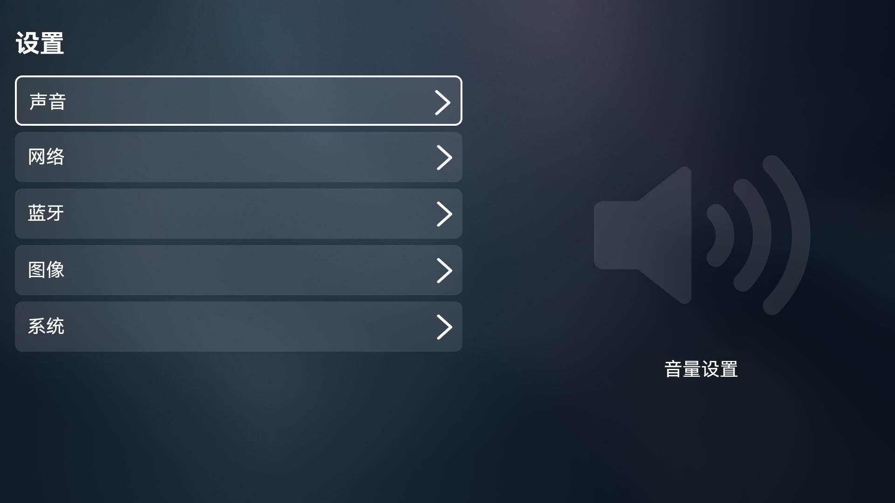
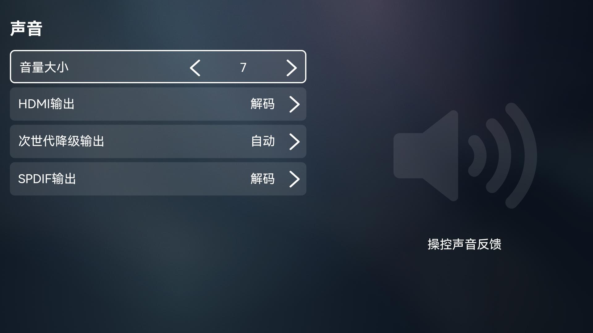
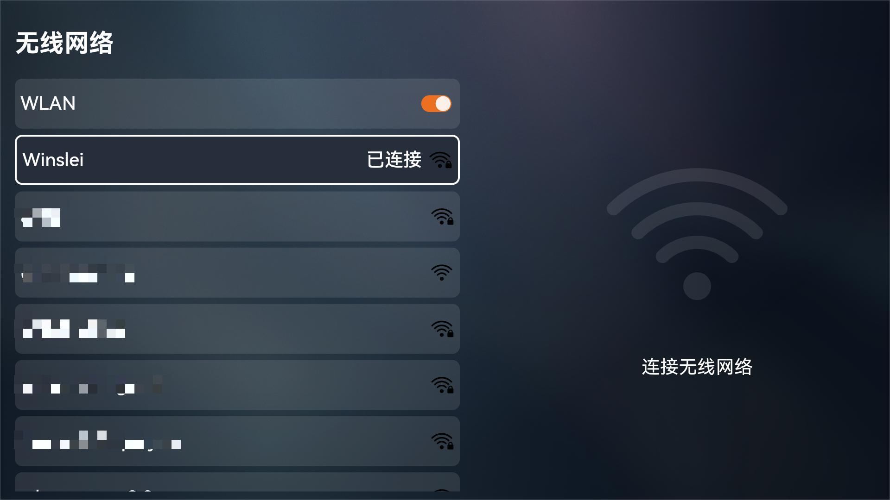
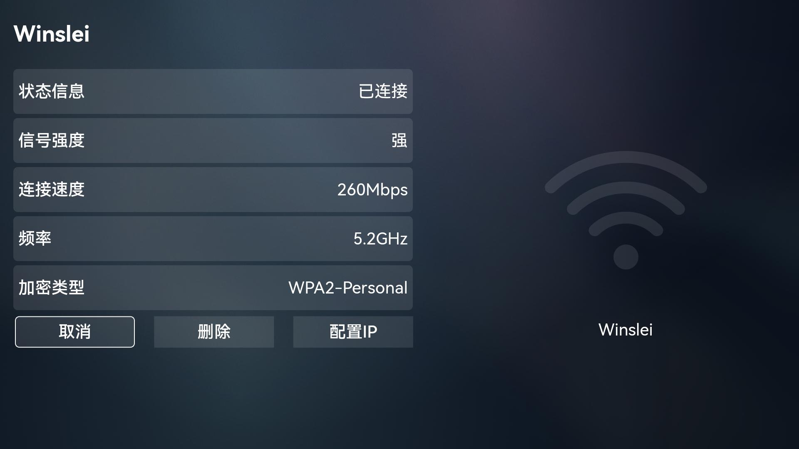
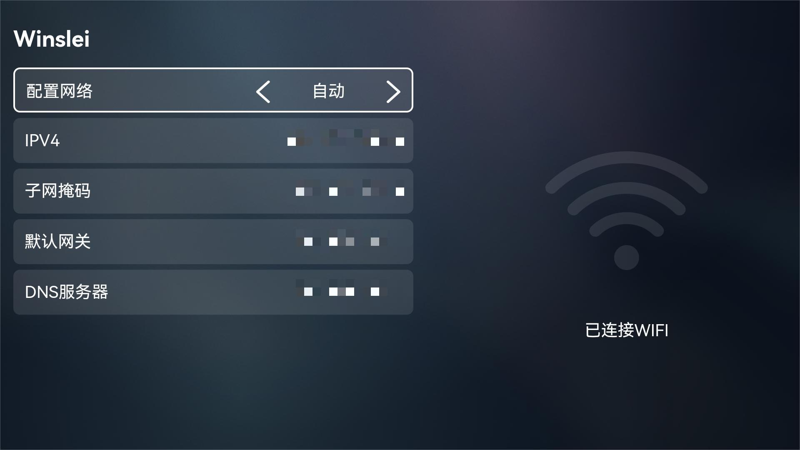
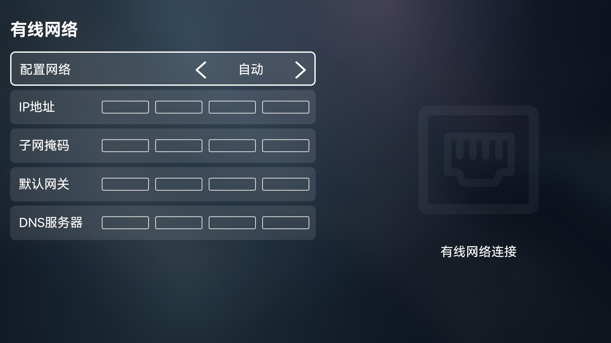
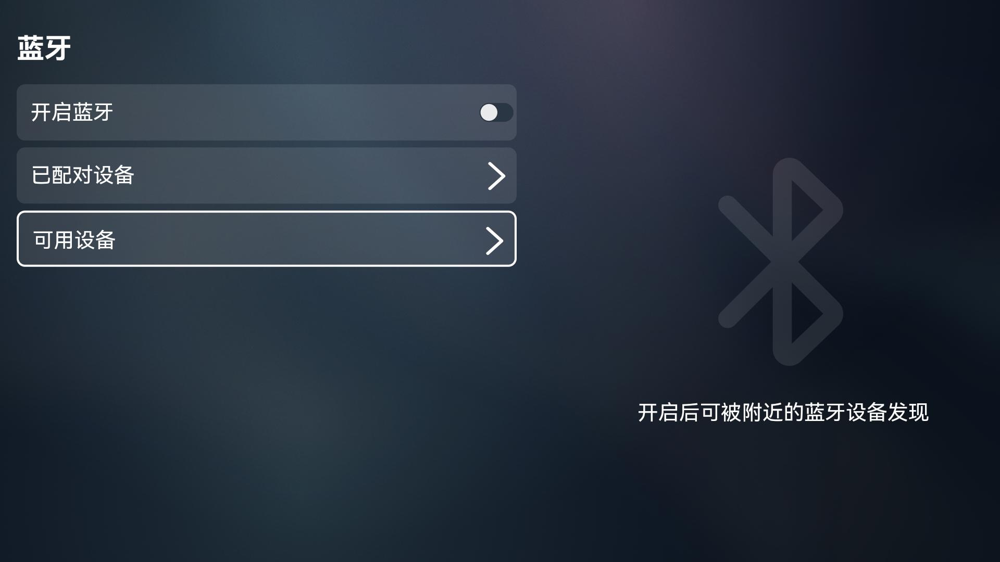
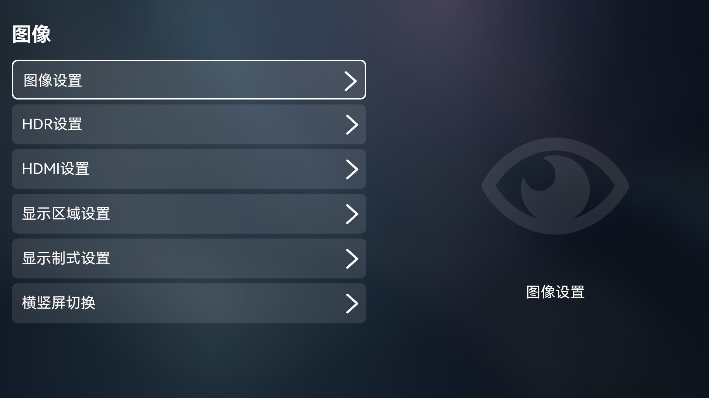
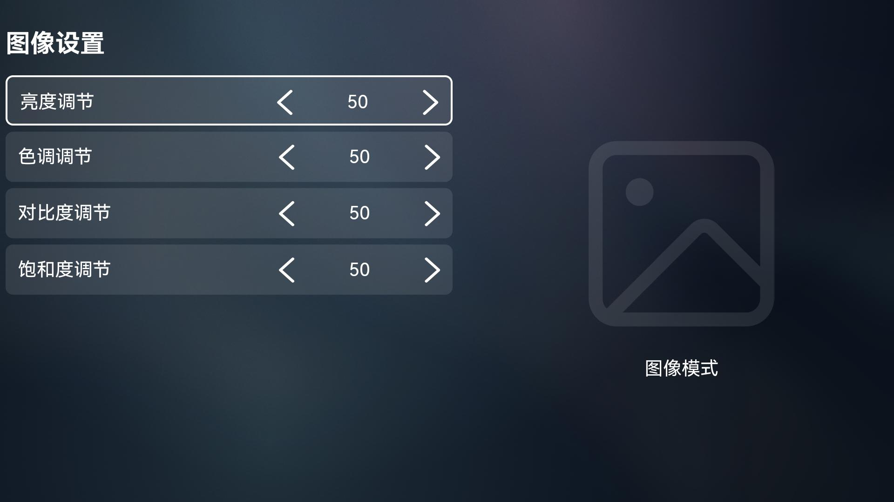
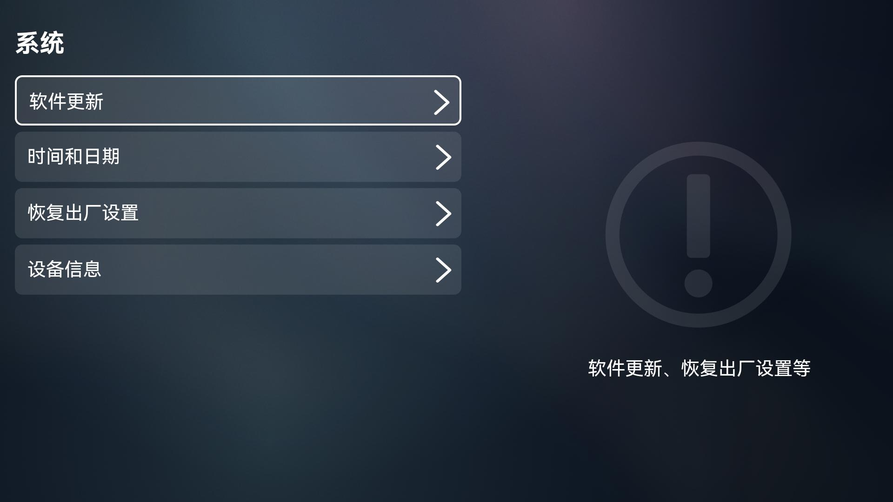

# Settings

- [Settings](#Settings)
    - [简介](#简介)
    - [TV特性](#TV特性)
    - [截图预览](#截图预览)
    - [约束](#约束)

## 简介
Settings是OpenHarmony预置的系统应用，为用户提供设置系统属性的交互界面，例如设置系统声音、屏幕亮度、有线网络、无线网络、蓝牙连接、设备名称、时间和日期等系统属性。

## TV特性
OpenHarmony系统应用支持根据不同产品和不同屏幕来区分部件形态。TV形态下的Settings有如下特性：
- TV风格UX
- 支持选择HDMI输出方式
- 支持选择次世代降级输出方式
- 支持选择SPDIF输出方式
- 支持配置有线网络
- 支持网络管理
- 支持设置色调、对比度、饱和度
- 支持选择HDR方式
- 支持设置CEC和HDCP
- 支持设置显示区域
- 支持设置显示制式
- 支持设置横竖屏切换

## 截图预览

## 约束
- 开发环境
    - **IDE**：DevEco Studio（版本号4.1.0.400）
    - **SDK**：Full-SDK（版本号3.2.10.10）

- 语言版本
    - [eTS](https://gitee.com/openharmony/docs/blob/master/zh-cn/application-dev/quick-start/start-with-ets.md)

- 建议
    -  推荐使用本工程下的签名配置，路径：signature目录下的所有签名文件。

