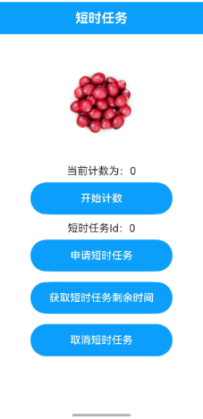

# 短时任务

### 介绍

本示例主要展示后台任务中的短时任务。

通过[@ohos.resourceschedule.backgroundTaskManager](https://gitcode.com/openharmony/docs/blob/master/zh-cn/application-dev/reference/apis-backgroundtasks-kit/js-apis-resourceschedule-backgroundTaskManager.md)，实现应用申请短时任务的功能。

### 效果预览

|退后台前                                   |退后台一段时间在进前台                                |
|---------------------------------------|-------------------------------------|
| ||

使用说明

1.进入应用，点击申请短时任务按钮，点击开始计数按钮；

2.将应用退出到后台后关闭；

3.应用在后台一段时间（单次不超过3分钟、一天不超过10分钟）内，仍然可以进行计数；

### 工程目录
```
entry/src/main/ets/
|---Application
|   |---MyAbilityStage.ts                    
|---pages
|   |---Index.ets                            // 首页
|   |---TitleBar.ets                         // 标题
|   |---TransientTaskDialog.ets              // 短时任务
|---util
|   |---Logger.ts                            // 日志工具
```
### 具体实现

* 该示例使用[requestSuspendDelay](https://gitcode.com/openharmony/docs/blob/master/zh-cn/application-dev/reference/apis-backgroundtasks-kit/js-apis-resourceschedule-backgroundTaskManager.md#backgroundtaskmanagerrequestsuspenddelay)方法申请短时任务，使用[getRemainingDelayTime](https://gitcode.com/openharmony/docs/blob/master/zh-cn/application-dev/reference/apis-backgroundtasks-kit/js-apis-resourceschedule-backgroundTaskManager.md#backgroundtaskmanagergetremainingdelaytime)获取短时任务剩余时间，使用[cancelSuspendDelay](https://gitcode.com/openharmony/docs/blob/master/zh-cn/application-dev/reference/apis-backgroundtasks-kit/js-apis-resourceschedule-backgroundTaskManager.md#backgroundtaskmanagercancelsuspenddelay)取消短时任务。
* 源码链接：[Interval.ets](entry/src/main/ets/pages/Interval.ets)，[TransientTaskDialog.ets](entry/src/main/ets/pages/TransientTaskDialog.ets)
* 接口参考：[@ohos.resourceschedule.backgroundTaskManager](https://gitcode.com/openharmony/docs/blob/master/zh-cn/application-dev/reference/apis-backgroundtasks-kit/js-apis-resourceschedule-backgroundTaskManager.md)，[timer](https://gitcode.com/openharmony/docs/blob/master/zh-cn/application-dev/reference/common/js-apis-timer.md)

### 相关权限

不涉及

### 依赖

不涉及。

### 约束与限制

1.本示例仅支持标准系统上运行,支持设备：RK3568；

2.本示例已适配API version 20版本SDK，版本号：6.0 Release；

3.本示例需要使用DevEco Studio 版本号(6.0 Release)及以上版本才可编译运行。

### 下载

如需单独下载本工程，执行如下命令：
```
git init
git config core.sparsecheckout true
echo code/SystemFeature/TaskManagement/TransientTask/ > .git/info/sparse-checkout
git remote add origin https://gitcode.com/openharmony/applications_app_samples.git
git pull origin master

```