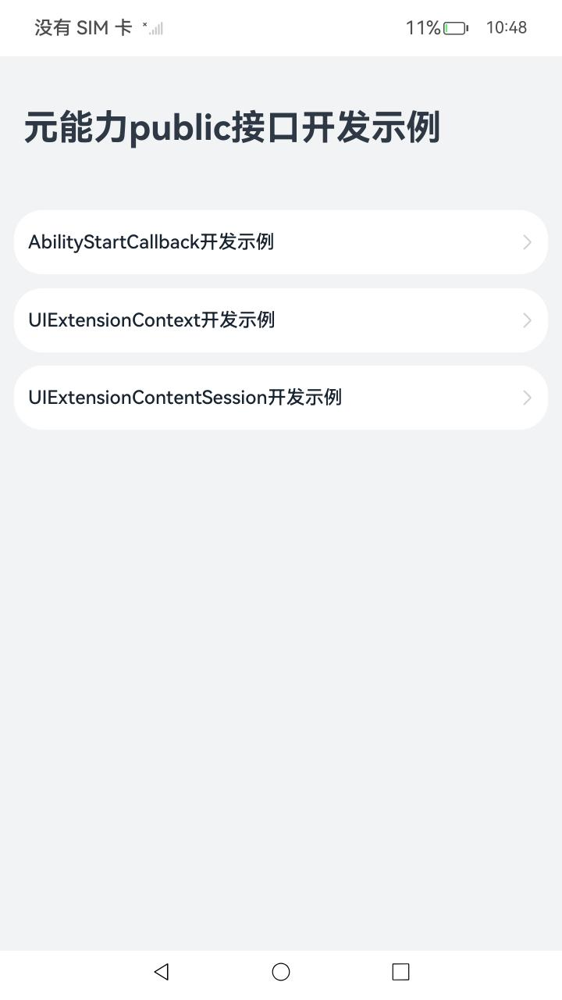
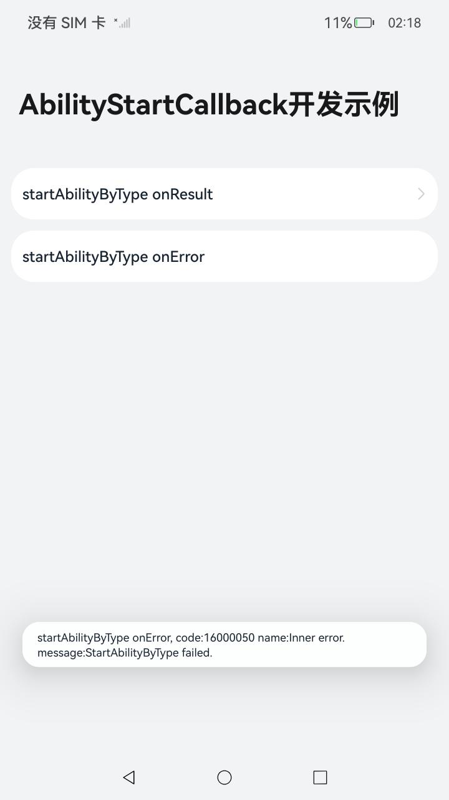
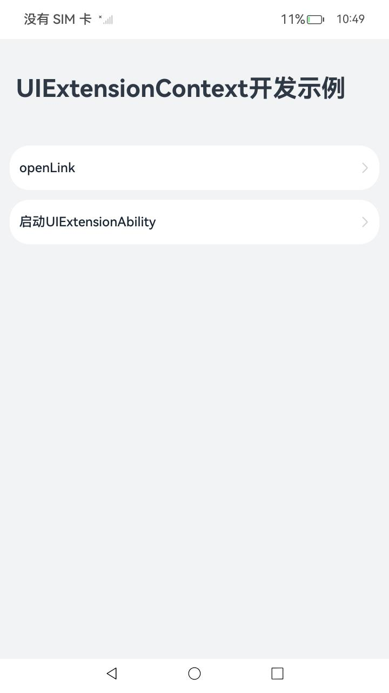
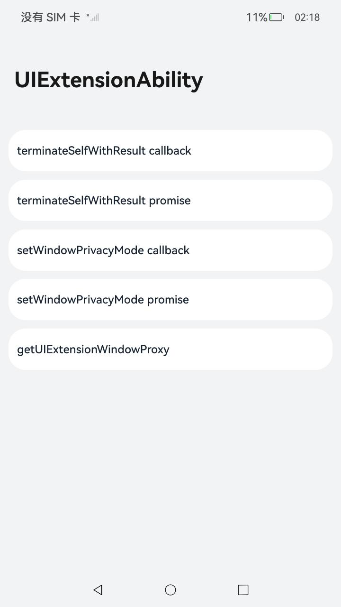

# 基础能力增强

### 介绍

本示例使用 [AbilityStartCallback](https://gitee.com/openharmony/docs/blob/master/zh-cn/application-dev/reference/apis-ability-kit/js-apis-inner-application-abilityStartCallback.md) , [UIExtensionContent](https://gitee.com/openharmony/docs/blob/master/zh-cn/application-dev/reference/apis-ability-kit/js-apis-inner-application-uiExtensionContext.md) , [UIExtensionContentSession](https://gitee.com/openharmony/docs/blob/master/zh-cn/application-dev/reference/apis-ability-kit/js-apis-app-ability-uiExtensionContentSession.md) 中的接口进行实现。

### 效果预览

|                      主页面                      |                     弹出状态Toast                     |            UIExtensionContentSession页面             |                   UIExtension启动页                    |
| :----------------------------------------------: | :---------------------------------------------------: | :--------------------------------------------------: | :----------------------------------------------------: |
|  |  |  |  |

使用说明

AbilityStartCallback对应接口

1.点击主页面**AbilityStartCallback开发示例**按钮，跳转到'AbilityStartCallback开发示例'界面；

2.点击**startAbilityByTyp onResult**按钮，拉起'所有照片'窗口，点击返回按钮，返回上级界面；

3.点击**startAbilityByType onError**按钮，弹出提示'startAbilityByType onError...'信息。


UIExtensionContext对应接口

1.点击主页面**UIExtensionContext开发示例**按钮，跳转到'UIExtensionContext开发示例'界面；

2.点击**openLink**按钮，启动一个新的UIAbility，点击返回按钮，返回上级界面;

3.点击**启动UIExtensionAbility**按钮，启动一个新的UIExtensionAbility，在UIExtensionAbility界面上显示reportDrawnCompleted，terminateSelf(callback)，terminateSelf(promise)，terminateSelfWithResult(callback)，terminateSelfWithResult(promise)接口对应的按钮；

4.点击**reportDrawnCompleted**按钮，弹出提示'UIExtensionContent.reportDrawnCompleted succeed.'信息；

5.点击**terminateSelf callback**按钮，关闭UIExtensionAbility，显示'UIExtensionContext开发示例'界面；

6.点击**启动UIExtensionAbility**按钮，在UIExtensionAbility界面上点击**terminateSelf promise**按钮，关闭UIExtensionAbility，显示'UIExtensionContext开发示例'界面；

7.点击**启动UIExtensionAbility**按钮，在UIExtensionAbility界面上点击**terminateSelfWithResult callback**按钮，关闭UIExtensionAbility，显  示'UIExtensionContext开发示例'界面；

8.点击**启动UIExtensionAbility**按钮，在UIExtensionAbility界面上点击**terminateSelfWithResult promise**按钮，关闭UIExtensionAbility，显示'UIExtensionContext开发示例'界面。


UIExtensionContentSession对应接口

1.点击主页面**UIExtensionContentSession**按钮，跳转到'UIExtensionContentSession开发示例'界面；

2.点击**启动UIExtensionAbility**按钮，启动一个新的UIExtensionAbility，在UIExtensionAbility界面上显示terminateSelfWithResult(callback)，terminateSelfWithResult(promise)，setWindowPrivacyMode(callback)，setWindowPrivacyMode(promise)，getUIExtensionWindowProxy接口对应的按钮；

3.点击**terminateSelfWithResult callback**按钮，关闭UIExtensionAbility，显示'UIExtensionContentSession开发示例'界面；

4.点击**terminateSelfWithResult promise**按钮，关闭UIExtensionAbility，显示'UIExtensionContentSession开发示例'界面；

5.点击**setWindowPrivacyMode callback**按钮，弹出提示'UIExtensionContentSession.setWindowPrivacyMode(callback)...'信息；

6.点击**setWindowPrivacyMode promise**按钮，弹出提示'UIExtensionContentSession.setWindowPrivacyMode(promise)...'信息；

7.点击**getUIExtensionWindowProxy**按钮，弹出提示'UIExtensionContentSession.getUIExtensionWindowProxy...'信息；

### 工程目录

```
entry/src/main/ets/
|---entryability
|   |---EntryAbility.ets					// 首页的Ability
|   |---OpenLinkUIAbility.ets				// UIAbility(用于验证新接口使用)
|---pages
|   |---Index.ets							// 首页
|   |---OpenLinkIndex.ets					// 被启动的OpenLink接口的展示页
|---uiextensionentry						
|   |---ContextUIExtensionAbility.ets		// UIExtensionAbility(用于验证新接口使用)
|   |---SessionUIExtensionAbility.ets		// UIExtensionAbility(用于验证新接口使用)
|---uiextensionpages						
|   |---AbilityStartCallback.ets			// AbilityStartCallback的接口的展示页
|   |---UIExtensionContentSession.ets		// UIExtensionContentSession的接口的展示页
|   |---UIExtensionContentSessionPage.ets	// SessionUIExtensionAbility加载的页面
|   |---UIExtensionContext.ets				// UIExtensionContext的接口的展示页
|   |---UIExtensionContextPage.ets			// ContextUIExtensionAbility加载的页面

```

### 具体实现

* AbilityStartCallback对应接口实现，源码参考[AbilityStartCallback.ets](entry/src/main/ets/uiextensionpages/AbilityStartCallback.ets)

  * onResult接口实现：通过调用startAbilityByType接口，'所有照片'窗口，关闭窗口回调触发onResult接口；
  * onError接口实现：通过调用startAbilityByType接口，调用失败触发onError接口；

* UIExtensionContext对应接口实现，源码参考[UIExtensionContext.ets](entry/src/main/ets/uiextensionpages/UIExtensionContext.ets)和[UIExtensionContextPage.ets](entry/src/main/ets/uiextensionpages/UIExtensionContextPage.ets)

  * openLink接口实现：在被启动的UIAbility的module.json5中配置下列字段：

    -"actions"列表中包含"ohos.want.action.viewData"

    \- "entities"列表中包含"entity.system.browsable"

    \- "uris"列表中包含"scheme"为"https"且"domainVerify"为true的元素

    在调用端调用openLink接口，传入对应字段信息，可以拉起对应的UIAbility；

  * reportDrawnCompleted接口实现：通过调用this.context.reportDrawnCompleted口开发者提供打点功能；

  * terminateSelf（Promise）接口实现：通过调用this.context.terminateSelf()接口实现停止Ability自身功能；

  * terminateSelf（Callback）接口实现：通过调用this.context.terminateSelf()接口实现停止Ability自身功能；

  * terminateSelfWithResult（Promise）接口实现：通过调用this.context.terminateSelfWithResult()接口实现停止Ability自身，并将结果返回给调用者的功能；

  * terminateSelfWithResult（Callback）接口实现：通过调用this.context.terminateSelfWithResult()接口实现停止Ability自身，并将结果返回给调用者的功能；

* UIExtensionContentSession对应接口实现，源码参考[UIExtensionContentSession.ets](entry/src/main/ets/uiextensionpages/UIExtensionContentSession.ets)和[UIExtensionContentSessionPage.ets](entry/src/main/ets/uiextensionpages/UIExtensionContentSessionPage.ets)

  * terminateSelfWithResult（Promise）接口实现：通过调用this.session.terminateSelfWithResult()接口，实现停止UIExtensionContentSession对应的窗口界面对象，并将结果返回给UIExtensionComponent控件的功能；
  * terminateSelfWithResult（Callback）接口实现：通过调用this.session.terminateSelfWithResult()接口，实现停止UIExtensionContentSession对应的窗口界面对象，并将结果返回给UIExtensionComponent控件的功能；
  * setWindowPrivacyMode（Promise）接口实现：通过调用this.session.setWindowPrivacyMode()接口，实现设置窗口是否为隐私模式功能；
  * setWindowPrivacyMode（Callback）接口实现：通过调用this.session.setWindowPrivacyMode()接口，实现设置窗口是否为隐私模式功能；
  * getUIExtensionWindowProxy接口实现：通过调用this.session.getUIExtensionWindowProxy()接口，实现获取UIExtension窗口代理功能；

### 相关权限

[ohos.permission.START_INVISIBLE_ABILITY](https://gitee.com/openharmony/docs/blob/master/zh-cn/application-dev/security/AccessToken/permissions-for-system-apps.md)

[ohos.permission.PRIVACY_WINDOW](https://gitee.com/openharmony/docs/blob/eb73c9e9dcdd421131f33bb8ed6ddc030881d06f/zh-cn/application-dev/security/permission-list.md)

### 依赖

不涉及。

### 约束与限制

1.本示例仅支持标准系统上运行，支持设备：RK3568；

2.本示例为Stage模型，支持API12版本SDK，版本号：5.0.0.31；

3.本示例涉及使用系统接口：UIAbilityContext.requestModalUIExtension，UIAbilityContext.startAbilityByType
需要手动替换Full SDK才能编译通过；

4.本示例需要使用DevEco Studio NEXT Developer Beta1 (Build Version: 5.0.3.403, built on June 20, 2024)才可编译运行；

5.本示例涉及[ohos.permission.START_INVISIBLE_ABILITY](https://gitee.com/openharmony/docs/blob/master/zh-cn/application-dev/security/AccessToken/permissions-for-system-apps.md)权限为 system_core级别，需要配置高权限签名。

### 下载

```shell
git init
git config core.sparsecheckout true
echo code/SystemFeature/UIExtensionSamples/ > .git/info/sparse-checkout
git remote add origin https://gitee.com/openharmony/applications_app_samples.git
git pull origin master
```

