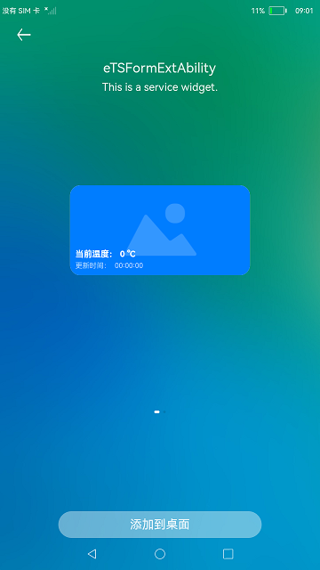

# Stage模型卡片

### 介绍

本示例展示了Stage模型卡片提供方的创建与使用。  

用到了卡片扩展模块接口，[@ohos.app.form.FormExtensionAbility](https://gitee.com/openharmony/docs/blob/master/zh-cn/application-dev/reference/apis-form-kit/js-apis-app-form-formExtensionAbility-sys.md) 。  

卡片信息和状态等相关类型和枚举接口，[@ohos.app.form.formInfo](https://gitee.com/openharmony/docs/blob/master/zh-cn/application-dev/reference/apis-form-kit/js-apis-app-form-formInfo-sys.md) 。

卡片提供方相关接口的能力接口，[@ohos.app.form.formProvider](https://gitee.com/openharmony/docs/blob/master/zh-cn/application-dev/reference/apis-form-kit/js-apis-app-form-formProvider-sys.md) 。

应用组件间的信息传递接口，[@ohos.app.ability.Want](https://gitee.com/openharmony/docs/blob/master/zh-cn/application-dev/reference/apis-ability-kit/js-apis-app-ability-want.md) 。

### 效果预览

| 卡片应用主页面 | 卡片应用修改订阅条件页面 | 卡片应用发布数据页面 | 卡片应用卡片预览图页面 |
|-------| ------- | ------- | ------- |
|  |  |  |  |
| **formProvider应用主界面** | **formProvider应用修改订阅条件** | **formProvider应用发布数据** | **formProvider应用卡片样式** |
|  |  |  |  |
| **添加卡片** | | | |
|| | | |

使用说明

1.部分设备的桌面不支持卡片，可以通过自己的开发卡片使用方，进行卡片的创建、更新和删除等操作。

2.卡片的样式如"添加卡片"所示。当卡片更新时，卡片上的温度和时间会产生变化。

3.安装[卡片应用](./processProxyForm/)或[formProvider应用](./persistentProxyForm/)，长按卡片应用图标或formProvider应用图标弹出菜单，点击"服务卡片"选项可以添加服务卡片至桌面（第3张，第4张卡片为formProvider应用卡片；第5张，第6张为卡片应用卡片）；

4.长按数据卡片弹出菜单，点击"移除"可以将已添加至桌面的数据卡片从桌面上移除；

5.点击打开卡片应用图标或formProvider应用图标，点击"修改订阅条件"按键，界面将跳转至修改订阅条件界面，对应选择想要发布的数据完成对订阅条件的修改，离开页面或退出应用后再次打开修改订阅条件页面，页面单选框会显示当前订阅的城市；

6.在卡片应用或formProvider应用应用中点击"发布数据"按键，界面将跳转至数据发布界面，对应选择想要发布的数据并点击"发布数据"完成数据发布(若选择发布的城市与当前订阅城市不一致，则不能将数据更新至卡片)；

### 工程目录
```
entry/src/main
|---module.json5                           // 添加卡片拓展能力
|---/ets/pages
|   |---index.ets                          // 首页
|   |---second.ets                         // 第二跳转页
|---/ets/FormAbility                                 
|   |---FormAbility.ts                     // 定义卡片对象首次被创建时需要做的操作
|---js/widget/index                        // 定义卡片内容                 
|   |---index.hml                                                    
|   |---index.css                          
|   |---index.json                         
|---resources/base/profile                                  
|   |---form_config.json                   // 配置卡片（卡片名称，引入js卡片，卡片窗口大小等）                          
persistentProxyForm/src/main/
|---common
|  |---StatePersistence.ts                // 订阅条件数据持久化
|  └---Logger.ts
|---ets
|  └---dataShare
|  | └---DataShare.ts
|  |---entryability
|  |  └---PersistentEntryAbility.ts
|  |---entryformability
|  |  └---EntryFormAbility.ts
|  |---pages
|  |  |---Index.ets                        // PersistentEntryAbility页面
|  |  |---ModifyConditionIndex.ets         // 修改订阅条件页面
|  |  └---PublishIndex.ets                 // 发布数据页面
|  └---widget
|     └---pages
|        └---WidgetCard.ets                // ArkTS卡片
|---js
|  |---common
|  |---i18n
|  └---widgetJS
|     └---pages
|        └---index
|           |---index.css                  // JS卡片样式
|           |---index.hml                  // JS卡片
|           └---index.json                 // JS卡片默认值
└---resources    
processProxyForm/src/main/
|---common
|  |---StatePersistence.ts                 // 订阅条件数据持久化
|  └---Logger.ts
|---ets
|  |---entryability
|  |  └---ProcessEntryAbility.ts
|  |---entryformability
|  |  └---ProcessEntryFormAbility.ts
|  |---pages
|  |  |---Index.ets                         // ProcessEntryAbility页面
|  |  |---ModifyConditionIndex.ets          // 修改订阅条件页面
|  |  └---PushIndex.ets                     // 发布数据页面
|  └---widget
|     └---pages
|        └---WidgetCard.ets                 // ArkTS卡片
|---js
|  |---common
|  |---i18n
|  └---jsWidget
|     └---pages
|        └---index
|           |---index.css                    // JS卡片样式
|           |---index.hml                    // JS卡片
|           └---index.json                   // JS卡片默认值
└---resources                                // 资源信息
```
#### 相关概念

Ability：Ability是应用所具备能力的抽象，也是应用程序的重要组成部分。Ability是系统调度应用的最小单元，是能够完成一个独立功能的组件。

### 具体实现

1、在module.json5文件添加拓展能力，类型为卡片，并设置卡片入口srcEntrance和卡片元数据metadata。[源码参考](entry/src/main/module.json5) 例如："metadata": [
{
"name": "ohos.extension.form",
"resource": "$profile:form_config"
}。  
2、初始化卡片：通过实现@ohos.app.form.FormExtensionAbility卡片操作类，在卡片对象首次被创建时，初始化卡片绑定数据为空，并将卡片状态设置为就绪状态READY。 例如：onCreate(){
formBindingData.createFormBindingData({}) onAcquireFormState(want) {
return formInfo.FormState.READY }。   
3、配置卡片：用js编写相应的卡片，将卡片配置到resources/base/profile/form_config, [源码参考](entry/src/main/resources/base/profile/form_config.json) 。

- 修改数据卡片的订阅条件的功能封装在ModifyConditionIndex.ets中，源码参考：[ModifyConditionIndex.ets](./persistentProxyForm/src/main/ets/pages/ModifyConditionIndex.ets)及[ModifyConditionIndex.ets](./processProxyForm/src/main/ets/pages/ModifyConditionIndex.ets)。
    - 使用modifyCondition来获取所有已经建立出的卡片对象。
    - 修改订阅条件：使用updateCardDisplayContent遍历所有卡片对象，并根据界面获取的订阅条件数据修改订阅条件。
    - 退出页面或应用后再次打开修改订阅条件页面，可以保留上次订阅的城市选择，源码参考：[StatePersistence.ts](./persistentProxyForm/src/main/common/StatePersistence.ts)及[StatePersistence.ts](./processProxyForm/src/main/common/StatePersistence.ts)。
- 发布数据的功能封装在PublishIndex.ets及PushIndex.ets中，源码参考：[PublishIndex.ets](./persistentProxyForm/src/main/ets/pages/PublishIndex.ets)及[PushIndex.ets](./processProxyForm/src/main/ets/pages/PushIndex.ets)。
    - [PublishIndex.ets](./persistentProxyForm/src/main/ets/pages/PublishIndex.ets)使用updateRDB来修改rdb数据库中的对应数据。
    - [PushIndex.ets](./processProxyForm/src/main/ets/pages/PushIndex.ets)使用getRunningFormInfosByFilter获取已经建立出的卡片对象，并使用updateCardDisplayContent遍历所有卡片对象，使用createDataShareHelper创建DataShareHelper对象，并根据界面获取的数据信息使用publish进行数据的发布以实现发布数据的功能
- 在dataShare模块中，建立rdb数据库，并提供对应update方法。
    - 在onCreate中初始化数据库中的数据。
    - 在update中实现对应的数据更新方法。

### 相关权限

[ohos.permission.START_ABILITIES_FROM_BACKGROUND](https://gitee.com/openharmony/docs/blob/master/zh-cn/application-dev/security/AccessToken/permissions-for-system-apps.md#ohospermissionstart_abilities_from_background)

[ohos.permission.START_INVISIBLE_ABILITY](https://gitee.com/openharmony/docs/blob/master/zh-cn/application-dev/security/AccessToken/permissions-for-system-apps.md#ohospermissionstart_invisible_ability)

[ohos.permission.GET_BUNDLE_INFO_PRIVILEGED](https://gitee.com/openharmony/docs/blob/master/zh-cn/application-dev/security/AccessToken/permissions-for-system-apps.md#ohospermissionget_bundle_info_privileged)

[ohos.permission.GET_BUNDLE_INFO](https://gitee.com/openharmony/docs/blob/master/zh-cn/application-dev/security/AccessToken/permissions-for-all.md#ohospermissionget_bundle_info)

[ohos.permission.REQUIRE_FORM](https://gitee.com/openharmony/docs/blob/master/zh-cn/application-dev/security/AccessToken/permissions-for-system-apps.md#ohospermissionrequire_form)

### 依赖

1.本应用中[Form.test.ets](./entry/src/ohosTest/ets/test/Form.test.ets)需要安装在仿桌面应用上进行测试。launcher应用地址：[Launcher](https://gitee.com/openharmony/applications_app_samples/tree/master/code/SystemFeature/ApplicationModels/Launcher)

2.本应用中[Form.test.ets](./entry/src/ohosTest/ets/test/Form.test.ets)需要安装[卡片应用](./processProxyForm/)以及[formProvider应用](./persistentProxyForm/)进行测试。（以上两个应用为本工程的feature module）

### 约束与限制

1.本示例仅支持标准系统上运行，支持设备：RK3568。

2.本示例为Stage模型，支持API10版本SDK，SDK版本号(API Version 10 Release),镜像版本号(4.0 Release)。

3.本示例需要使用DevEco Studio 版本号(4.0 Release)及以上版本才可编译运行。

4.本示需要使用Full SDK编译。使用Full SDK时需要手动从镜像站点获取，并在DevEco Studio中替换，具体操作可参考[替换指南]( https://gitee.com/openharmony/docs/blob/master/zh-cn/application-dev/faqs/full-sdk-switch-guide.md)。

5.本示例所配置的权限为system_core级别(相关权限级别可通过[权限定义列表](https://gitee.com/openharmony/docs/blob/master/zh-cn/application-dev/security/AccessToken/permissions-for-system-apps.md)查看)，需要手动配置对应级别的权限签名(具体操作可查看[自动化签名方案](https://docs.openharmony.cn/pages/v4.0/zh-cn/application-dev/security/hapsigntool-overview.md/))。

6.本示例类型为系统应用，需要手动配置对应级别的应用类型("app-feature": "hos_system_app")。具体可参考profile配置文件[bundle-info对象内部结构]( https://gitee.com/openharmony/docs/blob/master/zh-cn/application-dev/security/app-provision-structure.md#bundle-info%E5%AF%B9%E8%B1%A1%E5%86%85%E9%83%A8%E7%BB%93%E6%9E%84)

7.本示例使用了ServiceExtensionAbility，需要手动配置特权应用能力申请"app-privilege-capabilities": ["AllowAppUsePrivilegeExtension"]，否则安装失败。具体操作指南可参考[应用特权配置指南]( https://gitee.com/openharmony/docs/blob/master/zh-cn/device-dev/subsystems/subsys-app-privilege-config-guide.md)。在文件最后添加内容：    
    "app-privilege-capabilities" : [
        "AllowAppUsePrivilegeExtension"
    ]

8.本示例中使用到DataShareExtensionAbility，需要将本示例加入到白名单中再进行安装。详细内容如下
{
    "bundleName": "ohos.samples.formextability",
    "app_signature" : [],
    "associatedWakeUp": true,
    "allowAppUsePrivilegeExtension": true
}

### 下载

如需单独下载本工程，执行如下命令：
```
git init
git config core.sparsecheckout true
echo code/SystemFeature/Widget/FormExtAbility/ > .git/info/sparse-checkout
git remote add origin https://gitee.com/openharmony/applications_app_samples.git
git pull origin master
```