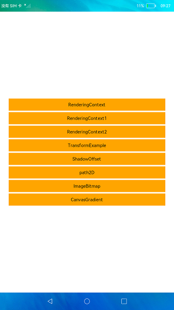

# 画布组件

### 简介

<canvas\>组件可以自定义绘制图形，本示例展示了<canvas\>组件的使用方法。实现效果如下：

### 相关概念

Canvas：提供画布组件，用于自定义绘制图形。

### 相关权限

不涉及。

### 使用说明

1.点击“RenderingContext”按钮，跳转进入RenderingContext页面查看相关的方法属性；点击按钮可查看对应的方法属性的效果展示。

2.点击“TransformExample”按钮，跳转进入TransformExample页面查看相关的方法属性；点击按钮可查看对应的方法属性的效果展示。

3.点击“ShadowOffset”按钮，跳转进入ShadowOffset页面查看相关的方法属性；点击按钮可查看对应的方法属性的效果展示。

4.点击“Path2D”按钮，跳转进入Path2D页面查看所有相关的方法属性；点击按钮可查看对应的方法属性的效果展示。

5.点击“ImageBitmap”按钮，跳转进入ImageBitmap页面查看图片效果展示。

6.点击“CanvasGrident”按钮，跳转进入CanvasGrident页面可查看两种渐变方法的效果展示。

### 约束与限制

1.本示例仅支持标准系统运行。

2.本示例需要使用DevEco Studio 3.0 Beta4 (Build Version: 3.0.0.992, built on July 14, 2022)才可编译运行。