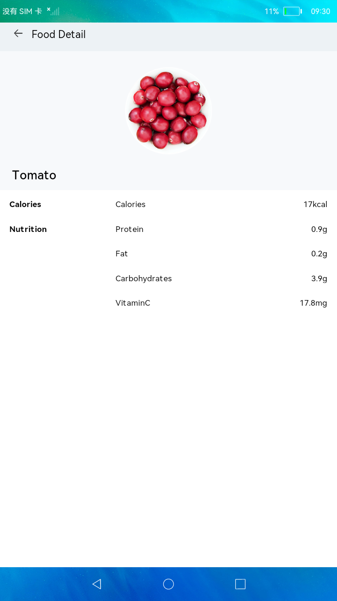
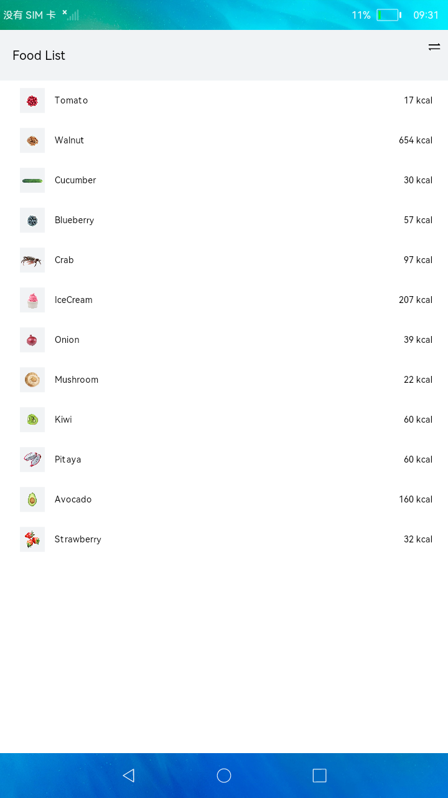

# 页面布局和连接

### 介绍

本示例构建食物分类列表页面和食物详情页，包含：

1.List布局：创建食物数据模型，ForEach循环渲染ListItem。

2.Grid布局：展示食物分类信息，创建Tabs页签展示不同分类的食物。

3.路由机制：router接口、Navigator和页面间数据传递。

### 效果预览

| 主页                                        |详情页|列表页|
|-------------------------------------------|--------------------------------------|--------------------------------------|
|  ||  |

使用说明

1.点击首页的切换按钮，可切换List和Grid布局。

2.点击食物单元，可跳转到食物详情页。

### 工程目录
```
entry/src/main/ets/MainAbility
|---model
|   |---FoodData.ets                        // 页面数据初始化
|   |---FoodDataModel.ets                   // 数据渲染
|---pages
|   |---app.ets                             // 首页
|   |---FoodCategoryList.ets                // 数据列表展示
|   |---FoodDetail.ets                      // 数据详情展示
```

### 具体实现

* 创建定义数据类型文件，源码参考：[FoodData.ets](https://gitee.com/yan-huan369/applications_app_samples_readmeRetify/blob/master/code/UI/ArkTsComponentClollection/DefiningPageLayoutAndConnection/entry/src/main/ets/MainAbility/model/FoodData.ets)

* List布局：创建食物数据模型，ForEach循环渲染ListItem。

* Grid布局：展示食物分类信息，创建Tabs页签展示不同分类的食物。

* 路由机制：[@ohos.router接口](https://gitee.com/openharmony/docs/blob/master/zh-cn/application-dev/reference/apis/js-apis-router.md)、Navigator和页面间数据传递。

#### 相关概念

List：列表包含一系列相同宽度的列表项。适合连续、多行呈现同类数据，例如图片和文本。

Grid：网格容器，由“行”和“列”分割的单元格所组成，通过指定“项目”所在的单元格做出各种各样的布局。

### 相关权限

不涉及。

### 依赖

不涉及。

### 约束与限制

1.本示例仅支持在标准系统上运行。

2.本示例需要使用DevEco Studio 3.0 Beta4 (Build Version: 3.0.0.992, built on July 14, 2022)才可编译运行。

### 下载

如需单独下载本工程，执行如下命令：
```
git init
git config core.sparsecheckout true
echo /code/UI/ArkTsComponentClollection/DefiningPageLayoutAndConnection > .git/info/sparse-checkout
git remote add origin https://gitee.com/openharmony/applications_app_samples.git
git pull origin master
```