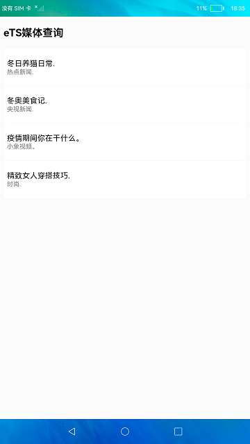
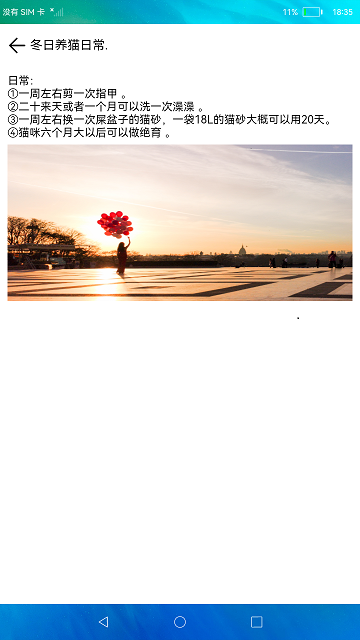

# 横竖屏切换

### 介绍

本实例展示如何使用媒体查询，通过[@ohos.mediaquery](https://gitee.com/openharmony/docs/blob/master/zh-cn/application-dev/reference/apis/js-apis-mediaquery.md) 接口完成在不同设备上显示不同的界面效果。

### 效果预览

|主页|详情页面|
|--------------------------------|--------------------------------|
|| |

使用说明

1.在竖屏设备上，首页展示新闻列表，点击新闻进入详情界面。

2.在横屏设备上，首页左侧展示新闻列表，右侧显示新闻详情，点击新闻右侧显示所点击的新闻的详情。

### 工程目录
```
entry/src/main/ets/
|---component
|   |---NewView.ets                    // 弹窗组件
|   |---TitleBar.ets                   // 首页标题组件
|   |---TitleWithBack.ets              // 详情页面标题组件
|---entryAbility
|---model
|   |---DataModel.ts                   // 数据类型
|   |---Logger.ts                      // 日志工具
|   |---New.ts                         // 虚拟数据
|---pages
|   |---Index.ets                      // 首页
|   |---New.ets                        // 详情页面
```
### 具体实现

* 横竖屏切换功能接口封装在Index，源码参考:[Index.ets](https://gitee.com/openharmony/applications_app_samples/blob/master/code/UI/ArkTsComponentClollection/MediaQuery/entry/src/main/ets/pages/Index.ets)
    * 获取监听句柄：通过mediaQuery.matchMediaSync('screen and (min-aspect-ratio: 1.5) or (orientation: landscape)')方法来获取有一个监听横竖屏的句柄，接口参考：[@ohos.mediaquery](https://gitee.com/openharmony/docs/blob/master/zh-cn/application-dev/reference/apis/js-apis-mediaquery.md) ；
    * 执行控制横竖屏切换效果的函数：调用this.listener.on('change', this.onLand.bind(this))函数来实现横竖屏下不同的功能或者页面效果；

### 相关权限

不涉及。

### 依赖

不涉及。

### 约束与限制

1.本示例仅支持标准系统上运行。

2.本示例已适配API10版本SDK，版本号：4.0.5.1。

3.本示例需要使用DevEco Studio 3.1 Canary1 (Build Version: 3.1.0.100)及以上版本才可编译运行。

### 下载

如需单独下载本工程，执行如下命令：
```
git init
git config core.sparsecheckout true
echo /code/UI/ArkTsComponentClollection/MediaQuery > .git/info/sparse-checkout
git remote add origin https://gitee.com/openharmony/applications_app_samples.git
git pull origin master
```
