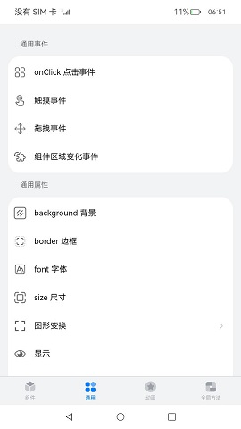

# 组件集合

### 介绍

本示例为ArkUI中组件、通用、动画、全局方法的集合。

### 效果预览

|绑定|通用|动画|全局方法|
|--------------------------------|--------------------------------|--------------------------------|--------------------------------|
|||||
|<center>Button 按钮</center>|<center>onClick 点击事件</center>|<center>元素共享转场</center>|<center>警告弹窗</center>|
|||||

使用说明：

1.点击**组件**、**通用**、**动画**、**全局方法**四个按钮或左右滑动切换不同视图。

2.点击二级导航（如通用属性、通用事件等），若存在三级导航则展开三级导航（如Border 边框、点击事件等）；若不存在三级导航，则跳转至详情页面。

3.若存在三级导航（如Border 边框、点击事件等），点击跳转至详情页面。

### 工程目录
```
entry/src/main/ets/
|---component
|   |---AttributeModificationTool.ets                    // 组件
|   |---IntroductionTitle.ets                            // 首页介绍标题组件
|   |---TabContentNavigation.ets                         // 切换组件
|   |---TitleBar.ets                                     // 详情页面标题组件
|---Application
|   |---MyAbilityStage.ts              
|---data
|   |---CollectionCategory.ts                            // 数据分类
|   |---ResourceDataHandle.ts                            // 源数据
|---MainAbility
|   |---MainAbility.ts              
|---model
|   |---CategoricalDataType.ts                           // 数据类型
|---util
|   |---Logger.ts                                        // 打印
|   |---ShowToast.ets                                    // 弹窗                       
|---pages
|   |---Index.ets                                        // 首页
|   |---animations                                       // 动画
|   |   |---AnimationData.ets
|   |   |---interpolationCalculationSample    
|   |   |   |---InterpolationCalculationSample.ets       // 插值计算
|   |   |---pageTransitionSample
|   |   |   |---PageTransitionSample.ets                 // 页面间转场
|   |   |   |---PageTransitionSampleTo.ets      
|   |   |---shareElementTransitionSample
|   |   |   |---ShareElementTransitionSample.ets         // 共享元素转场
|   |   |   |---ShareElementTransitionSampleTo.ets
|   |   |---floatingSample
|   |   |   |---FloatingWindowSample.ets                 // 悬浮窗
|   |   |---folderSample
|   |   |   |---FolderSample.ets                         // 文件夹展开
|   |   |---gallerySample
|   |   |   |---GalleryCardSample.ets                    // 图库卡片展开
|   |   |---multiplexSample
|   |   |   |---MultiplexSample.ets                      // 多任务
|   |   |---shopSample
|   |   |   |---ShopCardSample.ets                       // 商店卡片展开
|   |---components                                       // 详情页面
|   |   |---ComponentData.ets
|   |   |---auxiliary         // 辅助
|   |   |   |---alphabetIndexerSample
|   |   |   |   |---AlphabetIndexerSample.ets            // 字母索引条
|   |   |   |---badgeSample
|   |   |   |   |---BadgeSample.ets                      // 标记
|   |   |   |---panelSample
|   |   |   |   |---PanelSample.ets                      // 弹出面板
|   |   |   |---refreshSample
|   |   |   |   |---RefreshSample.ets                    // 下拉刷新
|   |   |   |---scrollbarSample 
|   |   |   |   |---ScrollBarSample.ets                  // 滚动条
|   |   |---blankAndDivider                              // 空白与分分隔
|   |   |   |---dividerSample
|   |   |   |   |---ChangePanel.ets
|   |   |   |   |---DividerSample.ets
|   |   |---buttonAndSelection                           // 按钮与选择
|   |   |   |---buttonSample
|   |   |   |   |---ButtonSample.ets                     // 按钮
|   |   |   |---checkboxSample
|   |   |   |   |---CheckboxSample.ets                   // 勾选框
|   |   |   |---counterSample
|   |   |   |   |---CounterSample.ets                    // 计数器
|   |   |   |---datePickerSample
|   |   |   |   |---DatePickerSample.ets                 // 日期选择器
|   |   |   |---radioSample
|   |   |   |   |---RadioSample.ets                      // 单选按钮
|   |   |   |---ratingSample
|   |   |   |   |---RatingSample.ets                     // 评分条
|   |   |   |---selectSample
|   |   |   |   |---SelectSample.ets                     // 选择菜单
|   |   |   |---sliderSample
|   |   |   |   |---ChangePanel.ets
|   |   |   |   |---SliderSample.ets                     // 滑动条
|   |   |   |---textPickerSample 
|   |   |   |   |---TextPickerSample.ets                 // 文本选择器
|   |   |   |---timePickerSample
|   |   |   |   |---TimePickerSample.ets                 // 时间选择器
|   |   |   |---toggleSample
|   |   |   |   |---ToggleSample.ets                     // 切换按钮
|   |   |---informationPresentationAndDynamicEffects
|   |   |   |---dataPanelSample
|   |   |   |   |---DataPanelSample.ets                  // 数据面板
|   |   |   |---gaugeSample
|   |   |   |   |---GaugeSample.ets                      // 仪表盘
|   |   |   |---loadingProgressSample
|   |   |   |   |---LoadingProgressSample.ets
|   |   |   |---marqueeSample
|   |   |   |   |---MarqueeSample.ets                    // 跑马灯
|   |   |   |---radioSample
|   |   |   |   |---RadioSample.ets                      // 单选
|   |   |   |---progressSample
|   |   |   |   |---ProgressSample.ets                   // 进度条
|   |   |   |---qrCodeSample
|   |   |   |   |---QRCodeSample.ets                     // 二维码
|   |   |   |---textclockSample
|   |   |   |   |---TextClockSample.ets                  // 文字时钟
|   |   |   |---textTimerSample
|   |   |   |   |---TextTimerSample.ets                  // 文字计时器
|   |   |---scrollAndSwipe
|   |   |   |---scrollSample
|   |   |   |   |---ScrollSample.ets
|   |   |---textAndInput
|   |   |   |---richTextSample
|   |   |   |   |---RichTextSample.ets                   // 富文本
|   |   |   |---spanSample
|   |   |   |   |---ChangePanel.ets
|   |   |   |   |---SpanSample.ets                       // 行内文本
|   |   |   |---textInputSample
|   |   |   |   |---TextInputSample.ets                  // 文本输入
|   |   |   |---textSample
|   |   |   |   |---ChangePanel.ets
|   |   |   |   |---TextSample.ets                       // 文本
|   |---globalMethods                                    // 详情页面
|   |   |---GlobalMethodData.ets
|   |   |---dialogs
|   |   |   |---alertDialogSample
|   |   |   |   |---AlertDialogSample.ets                // 警告弹窗
|   |   |   |---customDialogSample
|   |   |   |   |---CustomDialog.ets
|   |   |   |   |---CustomDialogSample.ets               // 自定义弹窗
|   |   |   |---dateDialogSample
|   |   |   |   |---DateDialogSample.ets                 // 日期选择弹窗
|   |   |   |---timeDialogSample
|   |   |   |   |---TimeDialogSample.ets                 // 时间选择弹窗
|   |---universal                                        // 详情页面
|   |   |---UniversialData.ets
|   |   |---events
|   |   |   |---areaChangeEventSample
|   |   |   |   |---AreaChangeEventSample.ets            // 组件区域变化事件
|   |   |   |---clickEventSample
|   |   |   |   |---ClickEventSample.ets                 // 点击事件
|   |   |   |---touchEventSample
|   |   |   |   |---TouchEventSample.ets                 // 触摸事件
|   |   |---properties
|   |   |   |---backgroundSample
|   |   |   |   |---BackgroundSample.ets                 // 背景
|   |   |   |---borderSample
|   |   |   |   |---BorderSample.ets                     // 边框
|   |   |   |---displaySample
|   |   |   |   |---DisplaySample.ets                    // 显示
|   |   |   |---effectsSample
|   |   |   |   |---EffectsSample.ets                    // 互动
|   |   |   |---fontSample
|   |   |   |   |---FontSample.ets                       // 字体
|   |   |   |---interactionSample
|   |   |   |   |---InteractionSample.ets                // 图像效果
|   |   |   |---rotateSample
|   |   |   |   |---RotateSample.ets                     // 旋转
|   |   |   |---sizeSample
|   |   |   |   |---SizeSample.ets                       // 尺寸
|   |   |   |---translateSample
|   |   |   |   |---TranslateSample.ets                  // 图像变换
``` 

### 具体实现

* 本示例使用 [Tabs容器组件](https://gitee.com/openharmony/docs/blob/master/zh-cn/application-dev/reference/arkui-ts/ts-container-tabs.md) 搭建整体应用框架，每个 [TabContent内容视图](https://gitee.com/openharmony/docs/blob/master/zh-cn/application-dev/reference/arkui-ts/ts-container-tabcontent.md) 使用 [List容器组件](https://gitee.com/openharmony/docs/blob/master/zh-cn/application-dev/reference/arkui-ts/ts-container-list.md) 布局，在每个 [ListItem](https://gitee.com/openharmony/docs/blob/master/zh-cn/application-dev/reference/arkui-ts/ts-container-listitem.md) 中使用 [循环渲染](https://gitee.com/openharmony/docs/blob/master/zh-cn/application-dev/quick-start/arkts-rendering-control-foreach.md) 加载此分类下分类导航数据，底部导航菜单使用 [TabContent中tabBar属性](https://gitee.com/openharmony/docs/blob/master/zh-cn/application-dev/reference/arkui-ts/ts-container-tabcontent.md#%E5%B1%9E%E6%80%A7) 设置自定义样式 。

* 将组件库分成四大类，切换查看

    * 组件模块：
        * 空白与分隔
            * 封装自定义组件：CommonItemSlider，CommonItemSelect，CommonItemColorSelect
            * 接口参考：[@ohos.app.ability.common](https://gitee.com/openharmony/docs/blob/master/zh-cn/application-dev/reference/apis/js-apis-app-ability-common.md)

        * 按钮与选择
            * 使用全局组件ShowToast,TitleBar,IntroductionTitle实现按钮，时间选择器，单选按钮，选择菜单，滑动条，切换按钮，勾选框，文本选择器，时间选择器，计数器，评分条组件功能
            * 使用getStringArrayData，getStringData获取数据[ResourceDataHandle.ets](entry/src/main/ets/data/ResourceDataHandle.ets)

        * 滚动与滑动
            * 使用全局组件TitleBar实现滚动，翻页组件功能

        * 信息展示与功效
            * 使用全局组件TitleBar，AttributeModificationTool实现二维码，进度条，跑马灯，文字计时器，文字时钟，仪表盘，数据面板组件功能
            * 使用getStringArrayData，getStringData获取数据[ResourceDataHandle.ets](entry/src/main/ets/data/ResourceDataHandle.ets)

        * 文本与输入
            * 使用全局组件ShowToast，TitleBar，AttributeModificationTool,IntroductionTitle实现行内文本，文本输入，文本，富文本组件功能
            * 使用getStringArrayData，getStringData获取数据[ResourceDataHandle.ets](entry/src/main/ets/data/ResourceDataHandle.ets)

        * 辅助
            * 使用全局组件TitleBar实现标记，滚动条，下拉刷新，弹出面板，字母索引条组件功能
            * 使用getStringArrayData，getStringData获取数据[ResourceDataHandle.ets](entry/src/main/ets/data/ResourceDataHandle.ets)

    * 通用模块：
        * 通用事件
            * 用到全局组件TitleBar，IntroductionTitle实现页面
            * resetBallMotion，isSideReached，calculateReachedSide，decideMoveDirection方法计算区域坐标，moveBall方法移动球体

        * 通用属性
            * 使用全局组件TitleBar，AttributeModificationTool实现组件页面
            * 接口参考：[@ohos.promptAction](https://gitee.com/openharmony/docs/blob/master/zh-cn/application-dev/reference/apis/js-apis-promptAction.md)

    * 动画模块：
        * 转场动画
            * 用到全局组件TitleBar，IntroductionTitle实现页面
            * 接口参考：[@ohos.promptAction](https://gitee.com/openharmony/docs/blob/master/zh-cn/application-dev/reference/apis/js-apis-promptAction.md)

        * 插值计算
            * 用到全局组件TitleBar，IntroductionTitle实现页面
            * 接口参考：[@ohos.curves](https://gitee.com/openharmony/docs/blob/master/zh-cn/application-dev/reference/apis/js-apis-curve.md)， [@ohos.router](https://gitee.com/openharmony/docs/blob/master/zh-cn/application-dev/reference/apis/js-apis-router.md)

    * 全局方法模块：
        * 弹窗
            * 使用全局组件ShowToast，TitleBar，IntroductionTitle实现弹窗组件页面
            * 使用getStringArrayData，getStringData获取数据[ResourceDataHandle.ets](entry/src/main/ets/data/ResourceDataHandle.ets)

### 相关权限

不涉及。

### 依赖

不涉及。

### 约束与限制

1.本示例仅支持标准系统上运行，支持设备：RK3568。

2.本示例已适配API version 9版本SDK，版本号：3.2.11.9。

3.本示例需要使用DevEco Studio 3.1 Beta2 (Build Version: 3.1.0.400, built on April 7, 2023)才可编译运行。

### 下载

如需单独下载本工程，执行如下命令：
```
git init
git config core.sparsecheckout true
echo code/UI/ArkTsComponentCollection/ComponentCollection/ > .git/info/sparse-checkout
git remote add origin https://gitee.com/openharmony/applications_app_samples.git
git pull origin master

```