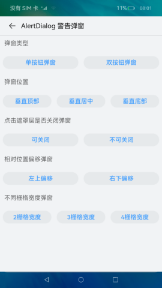

# 组件集合

### 介绍

本示例为ArkUI中组件、通用、动画、全局方法的集合。

### 效果预览

| 绑定                                          | 通用                                               | 动画                                                            | 全局方法                                               |
|---------------------------------------------|--------------------------------------------------|---------------------------------------------------------------|----------------------------------------------------|
|  |         |                    |            |
| <center>Button 按钮</center>                  | <center>onClick 点击事件</center>                    | <center>元素共享转场</center>                                       | <center>警告弹窗</center>                              |
|  |  |  |  |

使用说明：

1.点击**组件**、**通用**、**动画**、**全局方法**四个按钮或左右滑动切换不同视图。

2.点击二级导航（如通用属性、通用事件等），若存在三级导航则展开三级导航（如Border 边框、点击事件等）；若不存在三级导航，则跳转至详情页面。

3.若存在三级导航（如Border 边框、点击事件等），点击跳转至详情页面。

### 工程目录

```
entry/src/main/ets/
|---component
|   |---AttributeModificationTool.ets                    // 组件
|   |---IntroductionTitle.ets                            // 首页介绍标题组件
|   |---TabContentNavigation.ets                         // 切换组件
|   |---TitleBar.ets                                     // 详情页面标题组件
|---Application
|   |---MyAbilityStage.ts              
|---data
|   |---CollectionCategory.ts                            // 数据分类
|   |---ResourceDataHandle.ts                            // 源数据
|---MainAbility
|   |---MainAbility.ts              
|---model
|   |---CategoricalDataType.ts                           // 数据类型
|---util
|   |---Logger.ts                                        // 打印
|   |---ShowToast.ets                                    // 弹窗                       
|---pages
|   |---Index.ets                                        // 首页
|   |---animations                                       // 动画
|   |   |---AnimationData.ets
|   |   |---interpolationCalculationSample    
|   |   |   |---InterpolationCalculationSample.ets       // 插值计算
|   |   |---pageTransitionSample
|   |   |   |---PageTransitionSample.ets                 // 页面间转场
|   |   |   |---PageTransitionSampleTo.ets      
|   |   |---shareElementTransitionSample
|   |   |   |---ShareElementTransitionSample.ets         // 共享元素转场
|   |   |   |---ShareElementTransitionSampleTo.ets
|   |   |---floatingSample
|   |   |   |---FloatingWindowSample.ets                 // 悬浮窗
|   |   |---folderSample
|   |   |   |---FolderSample.ets                         // 文件夹展开
|   |   |---systemIcon
|   |   |   |---SystemIcon.ets                           // 系统图标
|   |   |---gallerySample
|   |   |   |---GalleryCardSample.ets                    // 图库卡片展开
|   |   |---multiplexSample
|   |   |   |---MultiplexSample.ets                      // 多任务
|   |   |---shopSample
|   |   |   |---ShopCardSample.ets                       // 商店卡片展开
|   |---components                                       // 详情页面
|   |   |---ComponentData.ets
|   |   |---auxiliary         // 辅助
|   |   |   |---alphabetIndexerSample
|   |   |   |   |---AlphabetIndexerSample.ets            // 字母索引条
|   |   |   |---badgeSample
|   |   |   |   |---BadgeSample.ets                      // 标记
|   |   |   |---panelSample
|   |   |   |   |---PanelSample.ets                      // 弹出面板
|   |   |   |---refreshSample
|   |   |   |   |---RefreshSample.ets                    // 下拉刷新
|   |   |   |---scrollbarSample 
|   |   |   |   |---ScrollBarSample.ets                  // 滚动条
|   |   |---blankAndDivider                              // 空白与分分隔
|   |   |   |---dividerSample
|   |   |   |   |---ChangePanel.ets
|   |   |   |   |---DividerSample.ets
|   |   |---buttonAndSelection                           // 按钮与选择
|   |   |   |---buttonSample
|   |   |   |   |---ButtonSample.ets                     // 按钮
|   |   |   |---checkboxSample
|   |   |   |   |---CheckboxSample.ets                   // 勾选框
|   |   |   |---counterSample
|   |   |   |   |---CounterSample.ets                    // 计数器
|   |   |   |---datePickerSample
|   |   |   |   |---DatePickerSample.ets                 // 日期选择器
|   |   |   |---radioSample
|   |   |   |   |---RadioSample.ets                      // 单选按钮
|   |   |   |---ratingSample
|   |   |   |   |---RatingSample.ets                     // 评分条
|   |   |   |---selectSample
|   |   |   |   |---SelectSample.ets                     // 选择菜单
|   |   |   |---sliderSample
|   |   |   |   |---ChangePanel.ets
|   |   |   |   |---SliderSample.ets                     // 滑动条
|   |   |   |---textPickerSample 
|   |   |   |   |---TextPickerSample.ets                 // 文本选择器
|   |   |   |---timePickerSample
|   |   |   |   |---TimePickerSample.ets                 // 时间选择器
|   |   |   |---toggleSample
|   |   |   |   |---ToggleSample.ets                     // 切换按钮
|   |   |---canvasAndGraphicDrawing                      // 画布与图形绘制
|   |   |   |---canvasSample
|   |   |   |   |---CanvasSample.ets                     // 画布
|   |   |   |---circleSample
|   |   |   |   |---ChangePanel.ets
|   |   |   |   |---CircleSample.ets                     // 圆形
|   |   |   |---ellipseSample
|   |   |   |   |---ChangePanel.ets
|   |   |   |   |---EllipseSample.ets					 // 椭圆
|   |   |   |---lineSample
|   |   |   |   |---ChangePanel.ets
|   |   |   |   |---LineSample.ets                       // 直线
|   |   |   |---pathSample
|   |   |   |   |---ChangePanel.ets
|   |   |   |   |---PathSample.ets                       // 路径
|   |   |   |---polygonSample
|   |   |   |   |---ChangePanel.ets
|   |   |   |   |---PolygonSample.ets                    // 多边形
|   |   |   |---polylineSample
|   |   |   |   |---ChangePanel.ets
|   |   |   |   |---PolylineSample.ets                   // 折线
|   |   |   |---rectSample
|   |   |   |   |---ChangePanel.ets
|   |   |   |   |---RectSample.ets                       // 矩形
|   |   |   |---shapeSample
|   |   |   |   |---ShapeSample.ets                      // 指定图形
|   |   |---imageVideoAndMedia
|   |   |   |---imageAnimatorSample
|   |   |   |   |---ImageAnimatorSample.ets              // 逐帧播放图片
|   |   |   |---imageSample
|   |   |   |   |---ImageControlPanel.ets
|   |   |   |   |---ImageSample.ets                      // 图片
|   |   |   |---pluginComponentSample
|   |   |   |   |---PluginComponentSample.ets			 // 嵌入式显示
|   |   |   |---videoSample
|   |   |   |   |---VideoControlPanel.ets
|   |   |   |   |---VideoSample.ets                      // 视频
|   |   |   |---xcomponentSample
|   |   |   |   |---XComponentSample.ets                 // 绘制组件
|   |   |---canvas
|   |   |   |---attributesSample
|   |   |   |   |---AttributesSample.ets                 // 属性
|   |   |   |---gradientSample
|   |   |   |   |---GradientSample.ets                   // 渐变对象
|   |   |   |---image_bitmapSample
|   |   |   |   |---Image_bitmapSample.ets               // 位图对象
|   |   |   |---methodsSample
|   |   |   |   |---MethodsSample.ets                    // 方法
|   |   |   |---path2dSample
|   |   |   |   |---Path2dSample.ets                     // 路径对象
|   |   |   |---shadowsSample
|   |   |   |   |---ShadowsSample.ets                    // 阴影
|   |   |   |---transformSample
|   |   |   |   |---TransformSample.ets                  // 转换
|   |   |---informationPresentationAndDynamicEffects
|   |   |   |---dataPanelSample
|   |   |   |   |---DataPanelSample.ets                  // 数据面板
|   |   |   |---gaugeSample
|   |   |   |   |---GaugeSample.ets                      // 仪表盘
|   |   |   |---loadingProgressSample
|   |   |   |   |---LoadingProgressSample.ets
|   |   |   |---marqueeSample
|   |   |   |   |---MarqueeSample.ets                    // 跑马灯
|   |   |   |---radioSample
|   |   |   |   |---RadioSample.ets                      // 单选
|   |   |   |---progressSample
|   |   |   |   |---ProgressSample.ets                   // 进度条
|   |   |   |---qrCodeSample
|   |   |   |   |---QRCodeSample.ets                     // 二维码
|   |   |   |---textclockSample
|   |   |   |   |---TextClockSample.ets                  // 文字时钟
|   |   |   |---textTimerSample
|   |   |   |   |---TextTimerSample.ets                  // 文字计时器
|   |   |---listAndGrid
|   |   |   |---gridItemSample
|   |   |   |   |---GridItemControlPanel.ets
|   |   |   |   |---GridItemSample.ets                   // 网格容器子组件
|   |   |   |---gridSample
|   |   |   |   |---GridControlPanel.ets
|   |   |   |   |---GridSample.ets                       // 网格容器
|   |   |   |---listItemSample
|   |   |   |   |---ListItemSample.ets                   // 列表容器子组件
|   |   |   |---listSample
|   |   |   |   |---ListControlPanel.ets
|   |   |   |   |---ListSample.ets                       // 列表容器
|   |   |---navigation
|   |   |   |---navigationSample
|   |   |   |   |---NavigationSample.ets                 // 导航
|   |   |   |   |---NavigationSecondPage.ets
|   |   |   |   |---NavigationThirdPage.ets
|   |   |   |---stepperAndStepperItemSample
|   |   |   |   |---StepperAndStepperItemSample.ets      // 步骤导航器
|   |   |   |---tabContentSample
|   |   |   |   |---TabContentSample.ets                 // 页签子组件
|   |   |   |---tabSample
|   |   |   |   |---TabControlPanel.ets
|   |   |   |   |---TabSample.ets                        // 页签
|   |   |---rowsAndColumns
|   |   |   |---columnSample
|   |   |   |   |---ColumnControlPanel.ets
|   |   |   |   |---ColumnSample.ets                     // 列容器
|   |   |   |---columnSplitSample
|   |   |   |   |---ColumnSplitSample.ets                // 列分割容器
|   |   |   |---rowSample
|   |   |   |   |---RowControlPanel.ets
|   |   |   |   |---RowSample.ets                        // 行容器
|   |   |   |---rowSplitSample
|   |   |   |   |---RowSplitSample.ets                   // 行分割容器
|   |   |   |---sideBarContainerSample
|   |   |   |   |---SideBarContainerControlPanel.ets
|   |   |   |   |---SideBarContainerSample.ets           // 侧边栏
|   |   |---scrollAndSwipe
|   |   |   |---scrollSample
|   |   |   |   |---ScrollSample.ets                     // 滚动
|   |   |   |---swiperSample
|   |   |   |   |---SwiperControlPanel.ets
|   |   |   |   |---SwiperSample.ets                     // 轮播
|   |   |---stackFlexAndGrid
|   |   |   |---flexSample                               
|   |   |   |   |---FlexControlPanel.ets
|   |   |   |   |---FlexSample.ets                       // 弹性布局
|   |   |   |---gridContainerSample
|   |   |   |   |---GridContainerControlPanel.ets
|   |   |   |   |---GridContainerSample.ets              // 栅格系统
|   |   |   |---stackSample
|   |   |   |   |---StackControlPanel.ets
|   |   |   |   |---StackSample.ets                      // 层叠布局
|   |   |---textAndInput
|   |   |   |---patternLockSample
|   |   |   |   |---ChangePanel.ets
|   |   |   |   |---PattternLockSample.ets               // 密码锁
|   |   |   |---searchSample
|   |   |   |   |---ChangePanel.ets
|   |   |   |   |---SearchSample.ets                     // 搜索栏
|   |   |   |---imageSpanSample
|   |   |   |   |---ChangePanel.ets
|   |   |   |   |---imageSpanSample.ets                  // 行内图像
|   |   |   |---textAreaSample
|   |   |   |   |---ChangePanel.ets
|   |   |   |   |---TextAreaSample.ets                   // 文本域
|   |   |   |---richTextSample
|   |   |   |   |---RichTextSample.ets                   // 富文本
|   |   |   |---spanSample
|   |   |   |   |---ChangePanel.ets
|   |   |   |   |---SpanSample.ets                       // 行内文本
|   |   |   |---textInputSample
|   |   |   |   |---TextInputSample.ets                  // 文本输入
|   |   |   |---textSample
|   |   |   |   |---ChangePanel.ets
|   |   |   |   |---TextSample.ets                       // 文本
|   |   |---web
|   |   |   |---webSample
|   |   |   |   |---WebSample.ets                        // 网页
|   |---globalMethods                                    // 详情页面
|   |   |---GlobalMethodData.ets
|   |   |---dialogs
|   |   |   |---alertDialogSample
|   |   |   |   |---AlertDialogSample.ets                // 警告弹窗
|   |   |   |---customDialogSample
|   |   |   |   |---CustomDialog.ets
|   |   |   |   |---CustomDialogSample.ets               // 自定义弹窗
|   |   |   |---dateDialogSample
|   |   |   |   |---DateDialogSample.ets                 // 日期选择弹窗
|   |   |   |---timeDialogSample
|   |   |   |   |---TimeDialogSample.ets                 // 时间选择弹窗
|   |   |   |---actionSheetDialogSample
|   |   |   |   |---ActionSheetDialogSample.ets          // 列表选择弹窗
|   |   |   |---textPickerDialogSample
|   |   |   |   |---TextPickerDialogSample.ets           // 文本滑动选择器弹窗
|   |   |   |---menuSample
|   |   |   |   |---MenuSample.ets                       // 菜单
|   |---universal                                        // 详情页面
|   |   |---UniversialData.ets
|   |   |---events
|   |   |   |---areaChangeEventSample
|   |   |   |   |---AreaChangeEventSample.ets            // 组件区域变化事件
|   |   |   |---clickEventSample
|   |   |   |   |---ClickEventSample.ets                 // 点击事件
|   |   |   |---dragEventSample
|   |   |   |   |---component                            // 组件拖拽
|   |   |   |   |   |---FormComponentDrag.ets
|   |   |   |   |   |---GridItemDrag.ets
|   |   |   |   |   |---HyperlinkDrag.ets
|   |   |   |   |   |---ImageDrag.ets
|   |   |   |   |   |---ListItemDrag.ets
|   |   |   |   |   |---TextDrag.ets
|   |   |   |   |   |---VideoDrag.ets
|   |   |   |   |---DragEventSample.ets                  // 拖拽事件
|   |   |   |---focusEventSample
|   |   |   |   |---FocusEventSample.ets                 // 焦点事件
|   |   |   |---keyPressEventSample
|   |   |   |   |---KeyPressEventSample.ets              // 按压事件
|   |   |   |---mountUnmountEventSample
|   |   |   |   |---MountUnmountEventSample.ets          // 挂载卸载事件
|   |   |   |---mouseEventSample
|   |   |   |   |---MouseEventSample.ets                 // 鼠标事件
|   |   |   |---scrollEventSample
|   |   |   |   |---ScrollEventSample.ets                // 滚动事件
|   |   |   |---touchEventSample
|   |   |   |   |---TouchEventSample.ets                 // 触摸事件
|   |   |---gesture
|   |   |   |---bindGestureSample
|   |   |   |   |---BindGestureSample.ets                // 绑定手势方法
|   |   |   |---combinedSample
|   |   |   |   |---CombinedSample.ets                   // 组合手势
|   |   |   |---longPressSample
|   |   |   |   |---LongPressSample.ets                  // 长按手势
|   |   |   |---panSample
|   |   |   |   |---PanSample.ets                        // 拖动手势
|   |   |   |---pinchSample
|   |   |   |   |---PinchSample.ets                      // 捏合手势
|   |   |   |---rotationSample
|   |   |   |   |---RotationSample.ets                   // 旋转手势
|   |   |   |---swipeSample
|   |   |   |   |---SwipeSample.ets                      // 滑动手势
|   |   |   |---tapGestureSample
|   |   |   |   |---TapGestureSample.ets                 // Tap手势
|   |   |---properties
|   |   |   |---backgroundSample
|   |   |   |   |---BackgroundSample.ets                 // 背景
|   |   |   |---borderSample
|   |   |   |   |---BorderSample.ets                     // 边框
|   |   |   |---componentBlurredSample
|   |   |   |   |---ComponentBlurredSample.ets           // 分布式迁移标识
|   |   |   |---componentIDSample
|   |   |   |   |---ComponentIDSample.ets                // 组件标识
|   |   |   |---displaySample
|   |   |   |   |---DisplaySample.ets                    // 显示
|   |   |   |---effectsSample
|   |   |   |   |---EffectsSample.ets                    // 互动
|   |   |   |---flexSample
|   |   |   |   |---FlexSample.ets                       // flex布局
|   |   |   |---focusControlSample
|   |   |   |   |---FocusControlSample.ets               // 焦点控制
|   |   |   |---fontSample
|   |   |   |   |---FontSample.ets                       // 字体
|   |   |   |---gridSettingsSample
|   |   |   |   |---GridSettingsSample.ets               // 栅格设置
|   |   |   |---interactionSample
|   |   |   |   |---InteractionSample.ets                // 图像效果
|   |   |   |---layoutConstraintSample
|   |   |   |   |---LayoutConstraintSample.ets           // 布局约束
|   |   |   |---locationSample
|   |   |   |   |---LocationSample.ets                   // 位置设置
|   |   |   |---pictureBorderSample
|   |   |   |   |---PictureBorderSample.ets              // 图片边框设置
|   |   |   |---restoreIdSample
|   |   |   |   |---RestoreIdSample.ets                  // 分布式迁移标识
|   |   |   |---rotateSample
|   |   |   |   |---RotateSample.ets                     // 旋转
|   |   |   |---scaleSample
|   |   |   |   |---ScaleSample.ets                      // 缩放
|   |   |   |---shapeCropSample
|   |   |   |   |---ShapeCropSample.ets                  // 形状裁剪
|   |   |   |---sizeSample
|   |   |   |   |---SizeSample.ets                       // 尺寸
|   |   |   |---transformSample
|   |   |   |   |---TransformSample.ets                  // 变换矩阵
|   |   |   |---translateSample
|   |   |   |   |---TranslateSample.ets                  // 图像变换
``` 

### 具体实现

本示例使用 [Tabs容器组件](https://gitee.com/openharmony/docs/blob/master/zh-cn/application-dev/reference/arkui-ts/ts-container-tabs.md)
搭建整体应用框架，每个 [TabContent内容视图](https://gitee.com/openharmony/docs/blob/master/zh-cn/application-dev/reference/arkui-ts/ts-container-tabcontent.md)
使用 [List容器组件](https://gitee.com/openharmony/docs/blob/master/zh-cn/application-dev/reference/arkui-ts/ts-container-list.md)
布局，在每个 [ListItem](https://gitee.com/openharmony/docs/blob/master/zh-cn/application-dev/reference/arkui-ts/ts-container-listitem.md)
中使用 [循环渲染](https://gitee.com/openharmony/docs/blob/master/zh-cn/application-dev/quick-start/arkts-rendering-control-foreach.md)
加载此分类下分类导航数据，底部导航菜单使用 [TabContent中tabBar属性](https://gitee.com/openharmony/docs/blob/master/zh-cn/application-dev/reference/arkui-ts/ts-container-tabcontent.md#%E5%B1%9E%E6%80%A7)
设置自定义样式 。

* 将组件库分成四大类，切换查看

    * 组件模块：
        * 空白与分隔
            * 封装自定义组件：CommonItemSlider，CommonItemSelect，CommonItemColorSelect
            接口参考：[@ohos.app.ability.common](https://gitee.com/openharmony/docs/blob/master/zh-cn/application-dev/reference/apis/js-apis-app-ability-common.md)

        * 按钮与选择
            * 使用全局组件ShowToast,TitleBar,IntroductionTitle实现按钮，时间选择器，单选按钮，选择菜单，滑动条，切换按钮，勾选框，文本选择器，时间选择器，计数器，评分条组件功能
            使用getStringArrayData，getStringData获取数据[ResourceDataHandle.ets](entry/src/main/ets/data/ResourceDataHandle.ets)

        * 滚动与滑动
            * 使用全局组件TitleBar实现滚动，翻页组件功能

        * 信息展示与功效
            * 使用全局组件TitleBar，AttributeModificationTool实现二维码，进度条，跑马灯，文字计时器，文字时钟，仪表盘，数据面板组件功能
            使用getStringArrayData，getStringData获取数据[ResourceDataHandle.ets](entry/src/main/ets/data/ResourceDataHandle.ets)

        * 文本与输入
            * 使用全局组件ShowToast，TitleBar，AttributeModificationTool,IntroductionTitle实现行内文本，行内图像，文本输入，文本，富文本组件功能
	    使用getStringArrayData，getStringData获取数据[ResourceDataHandle.ets](entry/src/main/ets/data/ResourceDataHandle.ets)

        * 辅助
            * 使用全局组件TitleBar实现标记，滚动条，下拉刷新，弹出面板，字母索引条组件功能
            使用getStringArrayData，getStringData获取数据[ResourceDataHandle.ets](entry/src/main/ets/data/ResourceDataHandle.ets)

        * 画布
            * 使用全局组件TitleBar, CanvasGradient, CanvasPattern, ImageBitmap, Path2D等实现图形绘制属性，图形绘制方法，渐变对象绘制，路径对象绘制，位图的绘制，阴影绘制，变换绘制
            * 使用getStringArrayData，getStringData获取数据[ResourceDataHandle.ets](entry/src/main/ets/data/ResourceDataHandle.ets)

    * 通用模块：
        * 通用事件
            * 用到全局组件TitleBar，IntroductionTitle实现页面
            * resetBallMotion，isSideReached，calculateReachedSide，decideMoveDirection方法计算区域坐标，moveBall方法移动球体

        * 通用属性
            * 使用全局组件TitleBar，AttributeModificationTool实现组件页面
            接口参考：[@ohos.promptAction](https://gitee.com/openharmony/docs/blob/master/zh-cn/application-dev/reference/apis/js-apis-promptAction.md)

    * 动画模块：
        * 转场动画
            * 用到全局组件TitleBar，IntroductionTitle实现页面
            接口参考：[@ohos.promptAction](https://gitee.com/openharmony/docs/blob/master/zh-cn/application-dev/reference/apis/js-apis-promptAction.md)

        * 插值计算
            * 用到全局组件TitleBar，IntroductionTitle实现页面
            接口参考：[@ohos.curves](https://gitee.com/openharmony/docs/blob/master/zh-cn/application-dev/reference/apis/js-apis-curve.md)， [@ohos.router](https://gitee.com/openharmony/docs/blob/master/zh-cn/application-dev/reference/apis/js-apis-router.md)
        * 显示动画
          * 用到全局组件TitleBar，IntroductionTitle实现页面
          * 接口参考：[animateTo](https://gitee.com/openharmony/docs/blob/master/zh-cn/application-dev/reference/arkui-ts/ts-explicit-animation.md)

        * 属性动画
            * 用到全局组件TitleBar，IntroductionTitle实现页面
            * 接口参考：[animation](https://gitee.com/openharmony/docs/blob/master/zh-cn/application-dev/reference/arkui-ts/ts-animatorproperty.md)

        * 路径动画
            * 用到全局组件TitleBar，IntroductionTitle实现页面
            * 接口参考：[path](https://gitee.com/openharmony/docs/blob/master/zh-cn/application-dev/reference/arkui-ts/ts-motion-path-animation.md)

    * 全局方法模块：
        * 弹窗
            * 使用全局组件ShowToast，TitleBar，IntroductionTitle实现弹窗组件页面
            * 使用getStringArrayData，getStringData获取数据[ResourceDataHandle.ets](entry/src/main/ets/data/ResourceDataHandle.ets)

### 相关权限

[ohos.permission.GET_BUNDLE_INFO](https://gitee.com/openharmony/docs/blob/master/zh-cn/application-dev/security/permission-list.md#ohospermissionget_bundle_info)

[ohos.permission.GET_BUNDLE_INFO_PRIVILEGED](https://gitee.com/openharmony/docs/blob/master/zh-cn/application-dev/security/permission-list.md#ohospermissionget_bundle_info_privileged)

[ohos.permission.REQUIRE_FORM](https://gitee.com/openharmony/docs/blob/master/zh-cn/application-dev/security/permission-list.md#ohospermissionrequire_form)

### 依赖

不涉及。

### 约束与限制

1.本示例仅支持标准系统上运行，支持设备：RK3568。

2.本示例仅支持API10版本SDK，版本号：4.0.8.5，镜像版本号：OpenHarmony 4.0.8.5。

3.本示例涉及使用系统接口，FormComponent组件相关接口，需要手动替换Full
SDK才能编译通过，具体操作可参考[替换指南](https://gitee.com/openharmony/docs/blob/master/zh-cn/application-dev/faqs/full-sdk-switch-guide.md)。

4.本示例需要使用DevEco Studio 3.1 Release (Build Version: 3.1.0.500, built on April 28, 2023)才可编译运行。

5.本示例涉及ohos.permission.GET_BUNDLE_INFO_PRIVILEGED、ohos.permission.REQUIRE_FORM为system_basic级别（相关权限级别可通过[权限定义列表](https://gitee.com/openharmony/docs/blob/master/zh-cn/application-dev/security/permission-list.md)
查看），需要配置高权限签名，可参考[应用apl等级说明](https://gitee.com/openharmony/docs/blob/master/zh-cn/application-dev/security/accesstoken-overview.md#应用apl等级说明)。

6.本示例涉及系统接口，需要配置系统应用签名，可以参考[修改harmonyappprovision配置文件](https://gitee.com/openharmony/docs/blob/master/zh-cn/application-dev/security/app-provision-structure.md#修改harmonyappprovision配置文件)
，把配置文件中的“app-feature”字段信息改为“hos_system_app”。

### 下载

如需单独下载本工程，执行如下命令：

```
git init
git config core.sparsecheckout true
echo code/UI/ArkTsComponentCollection/ComponentCollection/ > .git/info/sparse-checkout
git remote add origin https://gitee.com/openharmony/applications_app_samples.git
git pull origin master

```