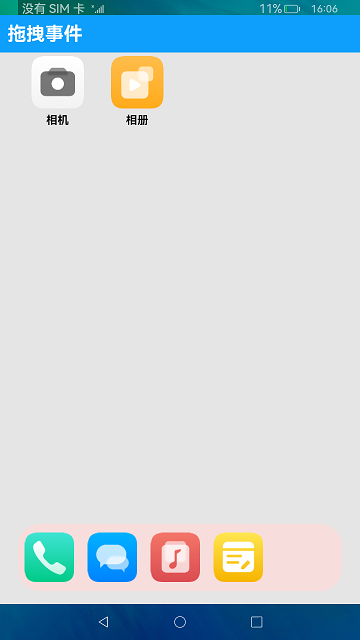

# 拖拽事件

### 介绍

本示例主要展示了拖拽操作的功能。实际效果如下：

### 效果预览
|               主页              |
|--------------------------------|
||

使用说明

1.按住桌面图标进行拖拽可以与桌面其他图标交换位置。

2.按住桌面图标可以拖拽至底部Dock栏任意位置。

3.按住底部Dock栏图标进行拖拽可以与Dock栏其他图标交换位置。

4.点击底部Dock栏图标可以进行移除，移除的图标可以返回到桌面上。

### 工程目录
```
entry/src/main/ets/MainAbility
|---app.ets              
|---model
|   |---HiLogUtil.ets                   // 输出打印
|   |---IconData.ets                    // 图标数据
|---pages
|   |---Index.ets                       // 首页数据展示
```

### 具体实现

* 本模块提供了界面元素拖拽的功能。

* 创建IconData文件定义图标，源码参考：[IconData.ets](entry/src/main/ets/MainAbility/model/IconData.ets)整改

* onDragStart，onDrop拖拽事件方法实现图标的拖拽

### 相关权限

不涉及。

### 依赖

不涉及。

### 约束与限制

1.本示例仅支持在标准系统上运行。

2.本示例已适配API version 9版本SDK，版本号：3.2.11.9。

3.本示例需要使用DevEco Studio 3.1 Beta2 (Build Version: 3.1.0.400, built on April 7, 2023)才可编译运行。

### 下载

如需单独下载本工程，执行如下命令：
```
git init
git config core.sparsecheckout true
echo /code/UI/ArkTsComponentCollection/Drag > .git/info/sparse-checkout
git remote add origin https://gitee.com/openharmony/applications_app_samples.git
git pull origin master
```