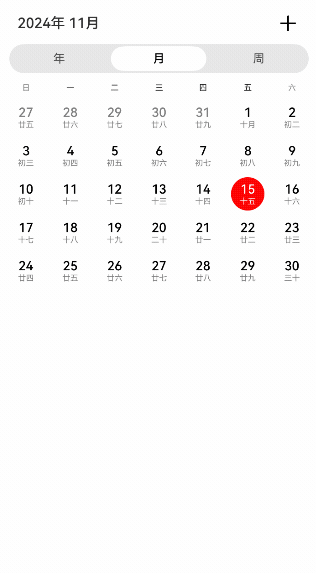

# 日历视图切换

### 介绍

本示例介绍使用Swiper实现自定义日历年视图、月视图、周视图左右滑动切换年、月、周的效果。同时使用Tabs实现年视图、月视图、周视图之间的切换效果。使用Canvas来实现日历年视图绘制。还有使用Calendar Kit日历服务实现日程提醒的功能。

### 效果图预览



**使用说明**

1. 进入页面，在月视图上手指往右滑动，可切换到上个月，往左滑动可切换到下个月。

2. 在月视图上点击非当日日期，日期上显示绿色边框选中效果。选中当日日期，当日日期显示为红底白字。

3. 月视图上点击非当月的日期，可切换到对应月，同时日期显示选中效果。

4. 点击“周”按钮，可从月视图切换到周视图，周视图展示的周信息根据月视图之前选中的日期进行跳转。

5. 周视图左右滑动可切换下一周和上一周。

6. 周视图上选中日期后，点击“月”按钮，可从周视图切换到月视图，月视图展示的月份信息根据周视图之前选中的日期进行月份跳转。

7. 周视图切换时，默认根据周视图中第一天的年月信息刷新页面顶部的“xxxx年x月”数据。手动点击周视图日期时，则根据选中的年月信息刷新数据。

8. 点击“年”按钮，可从月视图或周视图切换到年视图，年视图展示的年数据根据月视图或周视图之前选中的日期（不选默认今天）所在年份显示对应的年视图数据。

9. 在年视图上，往左滑切换到下一年，往右滑切换到上一年。

10. 点击年视图上某个月，会自动切换并显示对应月份的月视图。

11. 点击“月”或“周”按钮从年视图切换到月视图或周视图，会根据之前月视图或周视图选中的日期切换到对应月或周。

12. 打开设备预装的日历应用，打开应用页面会弹窗，点击“同意”。然后在设备“设置”中找到“通知和状态”，选择“日历”，启用“允许通知”。然后打开本示例页面，点击页面右上角的“+”，进入新建日程页面。在新建日程页面，输入“标题”（必填），“地点”（非必填），选择“开始时间”，“结束时间”，“提醒时间”，填写“说明”（非必填）后，点击“添加”，即可添加日程。设备将根据添加的日程进行相应的日程提醒。

### 实现思路

**日历切换功能：**

1. 自定义日历组件CustomCalendar。这里参考[日历三方库@xsqd/calendar](https://ohpm.openharmony.cn/#/cn/detail/@xsqd%2Fcalendar)的部分源码使用两个ForEach循环实现日历的月视图和周视图的日期布局效果。通过CalendarViewType条件渲染对应的月视图或周视图。年视图使用Canvas绘制显示年视图中每个月。使用OffscreenCanvasRenderingContext2D在Canvas上进行离屏绘制（主要使用fillText绘制月份，星期，日期等文本数据），它会将需要绘制的内容先绘制在缓存区，然后使用transferToImageBitmap将其转换成图片，一次性绘制到canvas上，以加快绘制速度。源码参考[CustomCalendar.ets](./casesfeature/calendarswitch/src/main/ets/customcalendar/components/CustomCalendar.ets)、[YearViewItem.ets](./casesfeature/calendarswitch/src/main/ets/customcalendar/view/YearViewItem.ets)、[MonthViewItem.ets](./casesfeature/calendarswitch/src/main/ets/customcalendar/view/MonthViewItem.ets)、[WeekViewItem.ets](./casesfeature/calendarswitch/src/main/ets/customcalendar/view/WeekViewItem.ets)。

```typescript
// YearViewItem.ets
// 年视图
Grid() {
  ForEach(this.yearViewList, (monthItem: OffscreenCanvas) => {
    GridItem() {
      // TODO: 高性能知识点: 年视图使用Canvas绘制显示年视图中每个月，以减少节点数量，同时使用OffscreenCanvasRenderingContext2D离屏绘制，将需要绘制的内容先绘制在缓存区，然后将其转换成图片，一次性绘制到canvas上，以加快绘制速度。
      Canvas(monthItem.context)
        .width($r('app.string.calendar_switch_full_size'))
        .height($r('app.string.calendar_switch_full_size'))
        .onReady(() => {
          // 绘制年视图中一个月的数据
          // ...
          // 画月
          monthItem.offContext.fillText(Constants.MONTHS[monthItem.month-1], Constants.YEAR_VIEW_INIT_THREE, Constants.YEAR_VIEW_MONTH_HEIGHT);
          // 画星期
          monthItem.offContext.fillText(Constants.WEEKS[i], horizontalOffset, Constants.YEAR_VIEW_WEEK_HEIGHT);
          // 画日期
          monthItem.offContext.fillText(dayIndex.toString(), horizontalOffset, verticalOffset);
          // ...
          // 从OffscreenCanvas组件中最近渲染的图像创建一个ImageBitmap对象
          const IMAGE = monthItem.offContext.transferToImageBitmap();
          // 显示给定的ImageBitmap对象
          monthItem.context.transferFromImageBitmap(IMAGE);
        })
    }
  }, (monthItem: OffscreenCanvas) => monthItem.year + '' + monthItem.month)
}

// MonthViewItem.ets
// 月视图
Column() {
  ForEach(this.monthDays, (items: Day[], index: number) => {
    Row() {
      ForEach(items, (item: Day) => {
        this.monthDayBuilder(item, index + 1)
      }, (item: Day, index: number) => {
        return item.dayNum + '' + index
      })
    }
    .width($r('app.string.calendar_switch_full_size'))
    .justifyContent(FlexAlign.SpaceBetween)
  }, (item: Day[], index: number) => {
    return item.reduce((item1, item2) => {
      return item1 + item2.dayInfo.year + item2.dayInfo.month + item2.dayInfo.date
    }, '') + index
  })
}.width($r('app.string.calendar_switch_full_size'))

// WeekViewItem.ets
// 周视图
Column() {
  ForEach(this.weekDays, (items: Day[]) => {
    Row() {
      ForEach(items, (item: Day) => {
        this.weekDayBuilder(item)
      }, (item: Day, index: number) => {
        return item.dayNum + '' + index;
      })
    }
    .width($r('app.string.calendar_switch_full_size'))
    .justifyContent(FlexAlign.SpaceBetween)
  }, (item: Day[], index: number) => {
    return item.reduce((item1, item2) => {
      return item1 + item2.dayInfo.year + item2.dayInfo.month + item2.dayInfo.date
    }, '') + index
  })
}.width($r('app.string.calendar_switch_full_size'))
```

2. 为了实现年视图、月视图、周视图的左右切换年、月、周的效果，通过在Swiper里使用三个自定义日历视图组件实现。以月视图为例，Swiper里放三个MonthViewItem月视图子组件，Swiper中索引0，1，2分别对应上个月，本月，下个月份的数据，通过yearMonth进行指定。年视图和周视图也类似，这里不再赘述。源码参考[MonthView.ets](./casesfeature/calendarswitch/src/main/ets/customcalendar/view/MonthView.ets)。

```typescript
Swiper() {
  // 月视图子组件
  MonthViewItem({
    yearMonth: this.lastYearMonth,
    currentSelectDate: this.currentSelectDate,
    onDateClick: (year: number, month: number, date: number) => {
      this.onDateClick(year, month, date);
    },
    CalendarStyle: {
      textScaling: this.CalendarStyle.textScaling,
      backgroundColor: this.CalendarStyle.backgroundColor,
      monthDayColor: this.CalendarStyle.monthDayColor,
      noMonthDayColor: this.CalendarStyle.noMonthDayColor,
      lunarColor: this.CalendarStyle.lunarColor
    }
  })
  MonthViewItem({
    yearMonth: this.currentYearMonth,
    currentSelectDate: this.currentSelectDate,
    onDateClick: (year: number, month: number, date: number) => {
      this.onDateClick(year, month, date);
    },
    CalendarStyle: {
      textScaling: this.CalendarStyle.textScaling,
      backgroundColor: this.CalendarStyle.backgroundColor,
      monthDayColor: this.CalendarStyle.monthDayColor,
      noMonthDayColor: this.CalendarStyle.noMonthDayColor,
      lunarColor: this.CalendarStyle.lunarColor
    }
  })
  MonthViewItem({
    yearMonth: this.nextYearMonth,
    currentSelectDate: this.currentSelectDate,
    onDateClick: (year: number, month: number, date: number) => {
      this.onDateClick(year, month, date);
    },
    CalendarStyle: {
      textScaling: this.CalendarStyle.textScaling,
      backgroundColor: this.CalendarStyle.backgroundColor,
      monthDayColor: this.CalendarStyle.monthDayColor,
      noMonthDayColor: this.CalendarStyle.noMonthDayColor,
      lunarColor: this.CalendarStyle.lunarColor
    }
  })
}
```

3. 年视图、月视图、周视图都是根据Swiper的onAnimationStart事件（切换动画开始时触发该回调）进行年、月、周的切换。以月视图为例，通过oldMonthViewIndex存储上一次的Swiper索引值，然后跟本次切换的索引进行比较，来识别月份是左滑还是右滑。然后根据当前切换后的索引值去刷新所需的月份。例如，假设swiper索引0（7月），swiper索引1（8月），swiper索引2（9月），当前Swiper显示的索引为1。当Swiper右滑从索引1（8月）切换到索引0（7月）时，需要把Swiper里索引2（9月）的月份更新为6月的数据。年视图和周视图也是类似的逻辑，这里不再赘述。源码参考[MonthView.ets](./casesfeature/calendarswitch/src/main/ets/customcalendar/view/MonthView.ets)。

```typescript
.onAnimationStart((index: number, targetIndex: number, extraInfo: SwiperAnimationEvent) => {
  if (this.oldMonthViewIndex === targetIndex) {
    // 如果手指滑动swiper松开时，targetIndex和之前记录子组件索引oldMonthViewIndex一样，说明swiper没有切换子组件，不需要切换月份
    return;
  }
  // 记录子组件索引
  this.oldMonthViewIndex = targetIndex;
  // 判断是否右滑切换月份
  const IS_RIGHT_SLIDE: boolean = (index === 1 && targetIndex === 0) || (index === 0 && targetIndex === 2) ||
    (index === 2 && targetIndex === 1);
  // TODO: 高性能知识点: 左右滑动切换月时，每次切换月只更新一个月的数据，以优化月视图左右切换时的性能。年视图和周视图也类似，这里不再赘述。
  // 右滑切换到上个月
  if (IS_RIGHT_SLIDE) {
    // 将当前月份设置为上个月
    this.currentShowYear = TimeUtils.getLastYear(this.currentShowYear, this.currentShowMonth);
    this.currentShowMonth = TimeUtils.getLastMonth(this.currentShowYear, this.currentShowMonth);
    this.onChangeYearMonth(this.currentShowYear, this.currentShowMonth);
    if (targetIndex === 0) {
      // swiper索引右滑到0时，修改swiper索引2的月份为当前月份（索引0）的上一个月。比如，假设swiper索引0（7月），swiper索引1（8月），swiper索引2（9月）。当右滑切换到索引0（7月）时，需要把索引2（9月）的月份改成6月。
      // 修改swiper索引2的月份为当前月份（索引0）的上一个月
      this.nextYearMonth = TimeUtils.getLastYearMonth(this.currentShowYear, this.currentShowMonth);
    } else if (targetIndex === 1) {
      // swiper索引右滑到1时，修改swiper索引0的月份为当前月份（索引1）的上一个月。
      this.lastYearMonth = TimeUtils.getLastYearMonth(this.currentShowYear, this.currentShowMonth);
    } else if (targetIndex === 2) {
      // swiper索引右滑到2时，修改swiper索引1的月份为当前月份（索引2）的上一个月。
      this.currentYearMonth = TimeUtils.getLastYearMonth(this.currentShowYear, this.currentShowMonth);
    }
  } else {
    // 右滑切换到下个月
    // 将当前月份设置为下个月
    this.currentShowYear = TimeUtils.getNextYear(this.currentShowYear, this.currentShowMonth);
    this.currentShowMonth = TimeUtils.getNextMonth(this.currentShowYear, this.currentShowMonth);
    this.onChangeYearMonth(this.currentShowYear, this.currentShowMonth);
    if (targetIndex === 0) {
      // swiper索引左滑到0时，修改swiper索引1的月份为当前月份（索引0）的下一个月。
      this.currentYearMonth = TimeUtils.getNextYearMonth(this.currentShowYear, this.currentShowMonth);
    } else if (targetIndex === 1) {
      // swiper索引左滑到1时，修改swiper索引2的月份为当前月份（索引1）的下一个月。
      this.nextYearMonth = TimeUtils.getNextYearMonth(this.currentShowYear, this.currentShowMonth);
    } else if (targetIndex === 2) {
      // swiper索引左滑到2时，修改swiper索引0的月份为当前月份（索引2）的下一个月。
      this.lastYearMonth = TimeUtils.getNextYearMonth(this.currentShowYear, this.currentShowMonth);
    }
  }
})
```

4. 年视图、月视图、周视图之间的切换通过changeIndex控制Tabs切换到指定页签，使用视图控制器的swiperRefresh方法刷新对应视图数据。从周视图切换到月视图时，月视图需要刷新的月份数据根据目前选中的日期currentSelectDay中的年月信息设置到MonthViewItem的yearMonth，然后通过触发yearMonth的updateMonthData监听进行月份数据刷新（getMonthViewData）。从月视图切换到周视图时，周视图需要刷新的周数据，也是根据目前选中的日期currentSelectDay中的年月日信息。通过计算选中日期到今天相差几周，来计算需要传入WeekViewItem的weekNum，触发updateWeekData监听，进行周数据刷新（getWeekViewData）。年视图是通过触发YearViewItem中year的updateYearData监听，更新年数据。在年视图中点击某个月，会根据点击的月份调用月视图控制器calendarMonthController的swiperYearToMonthRefresh方法切换到对应月份的月视图。从月视图或周视图切换到年视图，是根据选中日期所在的年份进行对应年份年视图切换。源码参考[CustomCalendarSample.ets](./casesfeature/calendarswitch/src/main/ets/pages/CustomCalendarSample.ets)、[YearViewItem.ets](./casesfeature/calendarswitch/src/main/ets/customcalendar/view/YearViewItem.ets)、[MonthViewItem.ets](./casesfeature/calendarswitch/src/main/ets/customcalendar/view/MonthViewItem.ets)、[WeekViewItem.ets](./casesfeature/calendarswitch/src/main/ets/customcalendar/view/WeekViewItem.ets)。

```typescript
// CustomCalendarSample.ets
this.tabController.changeIndex(index);
if (this.tabSelectedIndex === CalendarViewType.MONTH) {
  this.currentShowYear = this.currentSelectDay.year;
  this.currentShowMonth = this.currentSelectDay.month;
  // 刷新月视图
  this.calendarMonthController.swiperRefresh(CalendarViewType.MONTH);
} else if (this.tabSelectedIndex === CalendarViewType.WEEK) {
  this.currentShowYear = this.currentSelectDay.year;
  this.currentShowMonth = this.currentSelectDay.month;
  // 刷新周视图
  this.calendarWeekController.swiperRefresh(CalendarViewType.WEEK);
} else if (this.tabSelectedIndex === CalendarViewType.YEAR) {
  // 刷新年视图
  this.calendarYearController.swiperRefresh(CalendarViewType.YEAR);
}

// ...

onMonthClick: (year: number, month: number) => {
  if (this.tabController) {
    // 切到月视图
    this.tabController.changeIndex(1);
    // 刷新年月信息标题
    this.currentShowYear = year;
    this.currentShowMonth = month;
    // 刷新在年视图上点击月后要跳转的月视图数据
    this.calendarMonthController.swiperYearToMonthRefresh(year, month);
  }
}

// MonthViewItem.ets
/**
 * 获取指定月份数据
 */
getMonthViewData(year: number, month: number) {
  this.monthDays = [...TimeUtils.byMonthDayForYear(year, month)];
}

// WeekViewItem.ets
/**
 *  获取指定周数据
 */
getWeekViewData(weekNum: number) {
  this.weekDays = [...TimeUtils.getWeekDays(weekNum)];
}

// YearViewItem.ets
/**
 * 更新年数据
 */
updateYearData() {
  this.yearViewList = [];
  for (let i = 1; i <= Constants.MONTHS_NUM; i++) {
    this.yearViewList.push(new OffscreenCanvas(this.year, i));
  }
}
```

**日程提醒功能（不支持rk3568）：**

前置条件：需要在module.json5中配置日历读写权限"ohos.permission.READ_CALENDAR"、"ohos.permission.WRITE_CALENDAR"。

1. 调用requestPermissionsFromUser向用户申请系统日历读写权限。通过getCalendarManager获取管理日历对象，使用getCalendar获取日历对象，然后使用createCalendar创建自己的日历账户，通过配置CalendarConfig中enableReminder为true启用日程提醒功能。源码参考[SchedulePoint.ets](./casesfeature/calendarswitch/src/main/ets/customcalendar/components/SchedulePoint.ets)。

```typescript
  const permissions: Permissions[] = ['ohos.permission.READ_CALENDAR', 'ohos.permission.WRITE_CALENDAR'];
// 获取AtManager实例
let atManager = abilityAccessCtrl.createAtManager();
// 向用户申请系统日历读写权限
atManager.requestPermissionsFromUser(this.context, permissions).then((result: PermissionRequestResult) => {
  logger.info(TAG, `get Permission success, result: ${JSON.stringify(result)}`);
  // 根据上下文获取CalendarManager对象，用于管理日历。
  this.calendarMgr = calendarManager.getCalendarManager(this.context);
  // 获取Calendar对象
  this.calendarMgr.getCalendar(this.myCalendarAccount).then((data: calendarManager.Calendar) => {
    this.calendar = data;
    // 设置日历配置信息
    this.calendar.setConfig(this.config).then(() => {
      logger.info(TAG, `Succeeded in setting config, data->${JSON.stringify(this.config)}`);
    }).catch((err: BusinessError) => {
      logger.error(TAG, `Failed to set config. Code: ${err.code}, message: ${err.message}`);
    });
  }).catch(() => {
    // 如果日历账户不存在，则创建日历账户
    this.calendarMgr?.createCalendar(this.myCalendarAccount).then((data: calendarManager.Calendar) => {
      // 请确保日历账户创建成功后，再进行后续相关操作
      this.calendar = data;
      // 设置日历账户
      this.calendar?.setConfig(this.config).then(() => {
        logger.info(TAG, `Succeeded in setting config, data->${JSON.stringify(this.config)}`);
      }).catch((err: BusinessError) => {
        logger.error(TAG, `Failed to set config. Code: ${err.code}, message: ${err.message}`);
      });
    }).catch((error: BusinessError) => {
      logger.error(TAG, `Failed to create calendar. Code: ${error.code}, message: ${error.message}`);
    });
  });
}).catch((error: BusinessError) => {
  logger.error(TAG, `get Permission error, error. Code: ${error.code}, message: ${error.message}`);
})
```

2. 配置日程参数calendarManager.Event，然后传入addEvent创建日程，Calendar Kit日历服务会根据创建的日程进行相应的日程提醒。同时使用持久化preferences存储添加的日程信息，用于月视图和周视图中显示相应的日程点。源码参考[SchedulePoint.ets](./casesfeature/calendarswitch/src/main/ets/customcalendar/components/SchedulePoint.ets)。

```typescript
// 配置日程参数
const EVENT_NOT_REPEATED: calendarManager.Event = {
  // 日程标题
  title: this.title,
  // 地点
  location: { location: this.location },
  // 日程类型，NORMAL：普通日程，例如会议，闹钟等日常提醒的日程。 IMPORTANT：重要日程，例如结婚纪念日等具有重要意义的日期，不推荐三方开发者使用，重要日程类型不支持一键服务跳转功能及无法自定义提醒时间。
  type: calendarManager.EventType.NORMAL,
  // 日程开始时间，需要13位时间戳。
  startTime: this.startTime.getTime(),
  // 日程结束时间，需要13位时间戳。
  endTime: this.endTime.getTime(),
  // 日程提醒时间，单位为分钟。填写x分钟，即距开始时间提前x分钟提醒，不填时，默认为不提醒。为负值时表示延期多长时间提醒。
  reminderTime: this.reminderTimeArray
};
// 创建日程
this.calendar?.addEvent(EVENT_NOT_REPEATED).then((data: number) => {
  logger.info(TAG, `Succeeded in adding event, id -> ${data}`);
}).catch((err: BusinessError) => {
  logger.error(TAG, `Failed to addEvent. Code: ${err.code}, message: ${err.message}`);
});
// 新增日程
const PARTS: string[] = this.scheduleStartTime.split(' ');
CommonData.SCHEDULE_DATA.push(new ScheduleInfo(this.title, this.location, this.startTime,
  this.endTime, this.describe, PARTS[0], this.reminderTimeArray));
TimeUtils.addSchedule(this.startTime, this.endTime);
// 获取Preferences实例
let options: preferences.Options = { name: 'mySchedule' };
this.dataPreferences = preferences.getPreferencesSync(this.context, options);
// 将数据写入缓存的Preferences实例
this.dataPreferences.putSync('schedule', CommonData.SCHEDULE_DATA);
// 通过flush将Preferences实例持久化
this.dataPreferences.flush();
```

### 高性能知识点

本示例中月视图左右滑动切换日历月份时，只更新一个月数据。周视图每次切换周时，只更新一周的数据，以优化日历左右切换时的性能。年视图使用Canvas绘制显示年视图中每个月，以减少节点数量，同时使用OffscreenCanvasRenderingContext2D离屏绘制，将需要绘制的内容先绘制在缓存区，然后将其转换成图片，一次性绘制到canvas上，以加快绘制速度。

### 参考资料

[日历三方库@xsqd/calendar](https://ohpm.openharmony.cn/#/cn/detail/@xsqd%2Fcalendar)

[国际化-I18n](https://gitee.com/openharmony/docs/blob/master/zh-cn/application-dev/reference/apis-localization-kit/js-apis-i18n.md)

[离屏绘制](https://gitee.com/openharmony/docs/blob/master/zh-cn/application-dev/reference/apis-arkui/arkui-js/js-offscreencanvasrenderingcontext2d.md)

[Canvas](https://gitee.com/openharmony/docs/blob/master/zh-cn/application-dev/reference/apis-arkui/arkui-ts/ts-components-canvas-canvas.md)

[Calendar Kit](https://gitee.com/openharmony/docs/blob/master/zh-cn/application-dev/calendarmanager/calendarmanager-overview.md)

[preferences](https://gitee.com/openharmony/docs/blob/master/zh-cn/application-dev/reference/apis-arkdata/js-apis-data-preferences.md)

### 工程目录

```
calendarswitch
|---pages
|   |---CustomCalendarSample.ets                // 日历切换场景页面
|---customcalendar
|   |---common
|   |   |---CommonData.ets                      // 公共数据类
|   |---components
|   |   |---CustomCalendar.ets                  // 自定义日历组件
|   |   |---SchedulePoint.ets                   // 自定义添加日程组件
|   |---constant
|   |   |---Constants.ets                       // 常量定义
|   |---model
|   |   |---CalendarModel.ets                   // 日历配置
|   |   |---OffscreenCanvas.ets                 // 离屏画布类
|   |---utils
|   |   |---StyleUtils.ets                      // 样式工具类
|   |   |---TimeUtils.ets                       // 时间工具类
|   |   |---Logger.ets                          // 日志打印
|   |---view
|   |   |---MonthView.ets                       // 月视图
|   |   |---MonthViewItem.ets                   // 月视图子组件
|   |   |---WeekView.ets                        // 周视图
|   |   |---WeekViewItem.ets                    // 周视图子组件
|   |   |---YearView.ets                        // 年视图
|   |   |---YearViewItem.ets                    // 年视图子组件
```

### 相关权限

日程提醒功能需要在module.json5中配置日历读写权限[ohos.permission.READ_CALENDAR](https://gitee.com/openharmony/docs/blob/master/zh-cn/application-dev/security/AccessToken/permissions-for-all.md#ohospermissionread_calendar)、[ohos.permission.WRITE_CALENDAR](https://gitee.com/openharmony/docs/blob/master/zh-cn/application-dev/security/AccessToken/permissions-for-all.md#ohospermissionwrite_calendar)。

### 依赖

不涉及。

### 约束与限制

1.本示例仅支持标准系统上运行。

2.本示例已适配API version 12版本SDK。

3.本示例需要使用DevEco Studio 5.0.0 Release及以上版本才可编译运行。

### 下载

如需单独下载本工程，执行如下命令：

```
git init
git config core.sparsecheckout true
echo code/UI/CalendarViewSwitch > .git/info/sparse-checkout
git remote add origin https://gitee.com/openharmony/applications_app_samples.git
git pull origin master
```