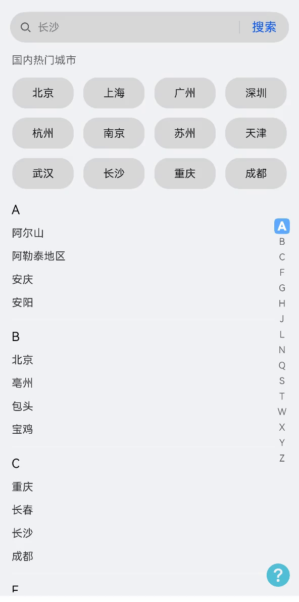

# 城市选择案例

### 介绍

本示例介绍城市选择场景的使用：通过[AlphabetIndexer](https://docs.openharmony.cn/pages/v5.0/zh-cn/application-dev/reference/apis-arkui/arkui-ts/ts-container-alphabet-indexer.md)实现首字母快速定位城市的索引条导航。

### 效果图预览



**使用说明**

分两个功能
- 在搜索框中可以根据城市拼音首字母模糊搜索出相近的城市，例如输入"a"，会出现"阿尔山"、"阿勒泰地区"、"安庆"、"安阳"。输入"b"，会出现"北京"、"亳州"、"包头"、"宝鸡"。
- 下方城市列表通过AlphabetIndexer组件实现拼音索引条，通过滑动选择城市首拼，快速定位相关首拼城市。

### 下载安装

1.模块oh-package.json5文件中引入依赖。
```typescript
"dependencies": {
  "citysearch": "har包地址"
}
```
2.ets文件import列表视图组件。
```typescript
import { AlphabetListView } from 'citysearch';
```

### 快速使用

本文主要介绍了如何快速上手自定义城市列表视图实现城市的索引条导航视图。包括数据初始化以及构建城市视图组件。

1. 数据准备。初始化城市列表和热门城市列表数组。

```typescript
// 热门城市列表
hotCityList: HotCityListItemView[] = [];
 // 城市列表
cityList: CityListItemView[] = [];

aboutToAppear(): void {
  CITY_DATA.forEach((cityItem: AlphabetListItemType) => {
    this.cityList.push(new AlphabetListItemView(cityItem, wrapBuilder(cityListItemSection)))
  })
  HOT_CITY.forEach((hotCityItem: string) => {
    this.hotCityList.push(new HotListItemView(hotCityItem, wrapBuilder(hotCitySection)))
  })
}

```
以上代码中，[AlphabetListItemView](./casesfeature/citysearch/src/main/ets/model/DetailData.ets)为字母数据列表项的类，[HotListItemView](./casesfeature/citysearch/src/main/ets/model/DetailData.ets)为热门列表项的类。两者都包含列表项数据、
列表项视图属性，开发者可以自行配置，也可以使用默认的属性配置。

2. 构建自定义城市列表视图。
```typescript

AlphabetListView({
  hotSelectList: this.hotCityList,
  hotSelectListTitle: $r('app.string.citysearch_hotCity'),
  alphabetSelectList: this.cityList,
  hotSelectHandle: (hotSelectValue: string) => {
    this.hotCityHandle(hotSelectValue);
  },
  alphabetSelectHandle: (alphabetSelectValue: string) => {
    this.cityHandle(alphabetSelectValue);
  }
})

```

### 属性(接口)说明

HotListItemView类属性

|         属性         |            类型            |   释义    | 默认值 |
|:------------------:|:------------------------:|:-------:|:---:|
|    hotListItem     |          string          | 热门列表项数据 |  -  |
|   contentBuilder   | WrappedBuilder<[string]> | 热门列表项视图 |  -  |

AlphabetListItemType类属性

|    属性    |                  类型                  |      释义      |    默认值    |
|:--------:|:------------------------------------:|:------------:|:---------:|
|   name   |                string                |   数据名称的首字母   |     -     |
| dataList |               string[]               |  字母对应的列表数据   |     -     |


AlphabetListItemView类属性

|            属性             |                 类型                  |  释义   | 默认值 |
|:-------------------------:|:-----------------------------------:|:-----:|:---:|
|     alphabetListItem      |        AlphabetListItemType         | 列表项数据 |  -  |
|      contentBuilder       |      WrappedBuilder<[string]>       | 列表项视图 |  -  |


AlphabetListView自定义组件属性

|               属性               |          类型           |     释义      | 默认值 |
|:------------------------------:|:---------------------:|:-----------:|:---:|
|         hotSelectList          | HotCityListItemView[] |  热门选择列表数据   |  -  |
|       hotSelectListTitle       |      ResoureStr       |   热门列表标题    |  -  |
|       alphabetSelectList       |  CityListItemView[]   |  字母选择列表数据   |  -  |
|        hotSelectHandle         |         void          | 热门选择列表项逻辑处理 |  -  |
|      alphabetSelectHandle      |         void          | 字母选择列表项逻辑处理 |  -  |

### 实现思路
#### 场景：通过AlphabetIndexer实现索引条导航

城市列表中的右侧首拼索引条，通过AlphabetIndexer组件实现首字母快速定位城市的索引条导航。

- 通过AlphabetIndexer的selected属性与城市列表中List组件onScrollIndex事件绑定，[AlphabetListView.ets](./casesfeature/citysearch/src/main/ets/utils/AlphabetListView.ets)

```typescript
AlphabetIndexer({ arrayValue: this.alphabetIndexer, selected: this.stabIndex })
  .height(CommonConstants.VIEW_FULL)
  .selectedColor($r('app.color.citysearch_alphabet_select_color'))// 选中项文本颜色
  .popupColor($r('app.color.citysearch_alphabet_pop_color'))// 弹出框文本颜色
  .selectedBackgroundColor($r('app.color.citysearch_alphabet_selected_bgc'))// 选中项背景颜色
  .popupBackground($r('app.color.citysearch_alphabet_pop_bgc'))// 弹出框背景颜色
  .popupPosition({
    x: $r('app.integer.citysearch_pop_position_x'),
    y: $r('app.integer.citysearch_pop_position_y')
  })
  .usingPopup(true)// 是否显示弹出框
  .selectedFont({ size: $r('app.integer.citysearch_select_font'), weight: FontWeight.Bolder })// 选中项字体样式
  .popupFont({ size: $r('app.integer.citysearch_pop_font'), weight: FontWeight.Bolder })// 弹出框内容的字体样式
  .alignStyle(IndexerAlign.Right)// 弹出框在索引条左侧弹出
  .itemSize(CommonConstants.ALPHABET_SIZE)// 每一项的尺寸大小
  .margin({ right: CommonConstants.ALPHABET_MARGIN_RIGHT_SIZE })
  .onSelect((tabIndex: number) => {
    this.scroller.scrollToIndex(tabIndex);
  })
```
- 当用户滑动List组件，list组件onScrollIndex监听到firstIndex的改变，绑定赋值给AlphabetIndexer的selected属性，从而定位到字母索引。
- 当点击AlphabetIndexer的字母索引时，通过scrollToIndex触发list组件滑动并指定firstIndex，从而实现List列表与AlphabetIndexer组件首字母联动吸顶展示，[CityView.ets](./casesfeature/citysearch/src/main/ets/utils/AlphabetListView.ets)。
```typescript
List({ space: CommonConstants.LIST_SPACE, initialIndex: CommonConstants.INITIAL_INDEX, scroller: this.scroller }) {
  .onScrollIndex((firstIndex: number, lastIndex: number) => {
     this.stabIndex = firstIndex;
  })
}
```


### 高性能知识点

由于需要通过搜索按钮频繁的控制自定义组件的显隐状态，[AlphabetListView.ets](./casesfeature/citysearch/src/main/ets/utils/AlphabetListView.ets)，因此推荐使用显隐控制替代条件渲染。

### 工程结构&模块类型

   ```
   citysearch                                      // har类型
   |---src/main/ets/common
   |   |---commonConstants.ets                     // 常量 
   |---src/main/ets/model
   |   |---DetailData.ets                          // 模型层-数据模块 
   |---src/main/ets/util
   |   |---AlphabetListView.ets                    // 视图层-城市列表组件
   |   |---Logger.ets                              // 日志 
   |---src/main/ets/view
   |   |---CitySearch.ets                          // 视图层-主页 
   |   |---SearchView.ets                          // 视图层-搜索组件
   ```

### 参考资料

[AlphabetIndexer参考文档](https://docs.openharmony.cn/pages/v5.0/zh-cn/application-dev/reference/apis-arkui/arkui-ts/ts-container-alphabet-indexer.md)

### 约束与限制

1.本示例仅支持标准系统上运行。

2.本示例已适配API version 12版本SDK。

3.本示例需要使用DevEco Studio 5.0.0 Release及以上版本才可编译运行。

### 下载

如需单独下载本工程，执行如下命令：
```javascript
git init
git config core.sparsecheckout true
echo /code/UI/CitySearch/ > .git/info/sparse-checkout
git remote add origin https://gitee.com/openharmony/applications_app_samples.git
git pull origin master
```