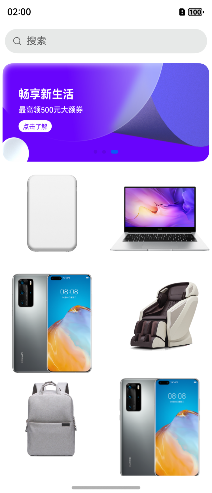

# Navigation实现折叠屏适配案例

### 介绍

本示例展示了如何利用`Navigation`组件的`mode`属性来适配折叠屏设备，主要实现步骤是通过监听主窗口的尺寸变化和路由栈的动态变化来动态改变`Navigation`组件的`mode`属性，为用户带来更加优化和个性化的交互体验。

### 效果图预览

| 首页-折叠                                                          | 首页-展开                                                      |
|----------------------------------------------------------------|------------------------------------------------------------|
|             |       |
| 详情页-折叠-普通                                                      | 详情页-折叠-全屏                                                  |
|    |  |
| 详情页-展开-普通                                                      | 详情页-展开-全屏                                                  |
|  |         |

### 使用说明

1. 在折叠屏上安装应用
2. 查看折叠/展开状态下的首页
3. 查看折叠/展开状态下的详情页

### 工程目录

```
|entry/src/main/ets                  
|   |---entryablity
|   |   |---EntryAbility.ts                         // 程序入口类             
|   |---constants                                   // 常量
|   |---utils                                       // 工具类
|   |---pages                                       // 示例使用
|   |   |---HomePage.ets                            // 首页
|   |   |---NormalPage.ets                          // 普通页面
|   |   |---FullScreenPage.ets                      // 全屏页面
```

### 实现思路

1. 在`EntryAbility`中设置窗口尺寸变化监听并使用`AppStorage`存储。源码参考:[EntryAbility.ets](./entry/src/main/ets/entryability/EntryAbility.ets)
   ```ts
   onWindowStageCreate(windowStage: window.WindowStage): void {
     // 获取默认窗口
     this.mWindow = windowStage.getMainWindowSync();
     this.updateBreakpoint(this.mWindow.getWindowProperties().windowRect.width);
     // 订阅窗口尺寸变化
     this.mWindow.on('windowSizeChange', (size: window.Size) => {
       this.updateBreakpoint(size.width);
       AppStorage.setOrCreate('windowSize', size);
     });
     ...
   }
   private updateBreakpoint(windowWidth: number): void {
     let windowWidthVp = windowWidth / display.getDefaultDisplaySync().densityPixels;
     let curBp: string = '';
     if (windowWidthVp < BreakpointConstants.BREAKPOINT_RANGES[1]) {
       curBp = BreakpointConstants.BREAKPOINT_SM;
     } else if (windowWidthVp < BreakpointConstants.BREAKPOINT_RANGES[2]) {
       curBp = BreakpointConstants.BREAKPOINT_MD;
     } else {
       curBp = BreakpointConstants.BREAKPOINT_LG;
     }
     AppStorage.setOrCreate('currentBreakpoint', curBp);
   }
   ```

2. 自定义应用状态会发生改变的三种模式：设备折叠态发生改变或屏幕旋转、应用从首页进入子路由以及应用从子路由返回首页，并对模式改变进行监听便于进一步处理。源码参考:[HomePage.ets](./entry/src/main/ets/pages/HomePage.ets)和[RouterUtils.ets](./entry/src/main/ets/utils/RouterUtils.ets)
    ```ts
   // 设置导航栏显示改变模式枚举值
   export enum NavMode {
     DefaultMode, // 默认模式
     FoldMode, // 折叠模式
     ChildPageMode, // 进入子页面模式
     HomePageMode // 返回首页模式
   }
   
   // 定义初始模式为NavMode.DefaultMode，并设置监听函数onModeChange
   @State @Watch('onModeChange') navMode: NavMode = NavMode.DefaultMode;
    
   // 监听模式改变
   onModeChange() {
     let lastRouteName :string= this.pageStack.getAllPathName()[this.pageStack.getAllPathName().length-1];
     switch (this.navMode) {
       // 当设备折叠态发生改变或屏幕旋转时响应以下逻辑
       case NavMode.FoldMode:
         // 全屏案例在折叠态变化时不需要切换NavigationMode
         if (FULL_SCREEN_ROUTE.includes(lastRouteName)) {
           this.navigationMode = NavigationMode.Stack;
           break;
         }
         if (this.currentBreakpoint !== BreakpointConstants.BREAKPOINT_SM) {
           if (this.pageStack.size() > 0) {
             // 宽屏条件下且展示了子路由，NavigationMode为Split
             this.navigationMode = NavigationMode.Split;
             this.swiperDisplayCount = 1;
           } else {
             // 宽屏条件下且未展示子路由，NavigationMode为Stack
             this.navigationMode = NavigationMode.Stack;
             this.swiperDisplayCount = 2;
           }
         } else {
           this.navigationMode = NavigationMode.Stack;
           this.swiperDisplayCount = 1;
         }
         break;
       // 当应用进入子路由时响应以下逻辑
       case NavMode.ChildPageMode:
         // 进入全屏案例需切换为Stack
         if (FULL_SCREEN_ROUTE.includes(this.enterRouteName)) {
           this.navigationMode = NavigationMode.Stack;
           break;
         }
         // 根据屏幕宽度决定NavigationMode
         if (this.currentBreakpoint !== BreakpointConstants.BREAKPOINT_SM) {
           this.navigationMode = NavigationMode.Split;
         } else {
           this.navigationMode = NavigationMode.Stack;
         }
         this.swiperDisplayCount = 1;
         break;
       // 当应用返回首页时响应以下逻辑
       case NavMode.HomePageMode:
         if (this.currentBreakpoint !== BreakpointConstants.BREAKPOINT_SM) {
           this.navigationMode = NavigationMode.Stack;
           this.swiperDisplayCount = 2;
         } else {
           this.navigationMode = NavigationMode.Stack;
           this.swiperDisplayCount = 1;
         }
         this.pageStack.disableAnimation(false);
         break;
       default:
         break;
     }
     // 重置NavMode
     if (this.navMode !== NavMode.DefaultMode) {
        this.navMode = NavMode.DefaultMode;
     }
   }
   ```
   
3. 定义兼容折叠屏的路由跳转和退出逻辑，根据不同的屏幕宽度进行合适的路由操作。源码参考:[RouterUtils.ets](./entry/src/main/ets/utils/RouterUtils.ets)
    ```ts
   export class RouterUtils {
     public static pageStack: NavPathStack = new NavPathStack();
     // 全屏子路由
     private static fullScreenRouter: string[] = [];
     private static timer: number = 0;
   
     public static setFullScreenRouter(fullScreenRouter: string[]) {
       RouterUtils.fullScreenRouter = fullScreenRouter;
     }
   
     // 通过获取页面栈并pop
     public static popAppRouter(): void {
       if (RouterUtils.pageStack.getAllPathName().length > 1) {
         RouterUtils.pageStack.pop();
       } else {
         logger.info('RouterStack is only Home.');
       }
       // 定义emitter事件
       let innerEvent: emitter.InnerEvent = {
         eventId: 3
       };
       let eventData: emitter.EventData = {
         data: {
           navMode: NavMode.HomePageMode
         }
       };
       let allPathName: string[] = RouterUtils.pageStack.getAllPathName();
       // 查找到对应的路由栈进行pop
       if (!RouterUtils.fullScreenRouter.includes(allPathName[allPathName.length-1]) &&
         RouterUtils.pageStack.size() === 1) {
         // 非全屏子路由宽屏条件下回到首页，Navigation的mode属性修改默认动画会与过场动画冲突，需关闭过场动画
         if (display.getDefaultDisplaySync().width > DEFAULT_WINDOW_SIZE.width) {
           RouterUtils.pageStack.disableAnimation(true);
         }
         RouterUtils.timer = setTimeout(() => {
           // 触发EntryView下navMode改变
           emitter.emit(innerEvent, eventData);
         }, DELAY_TIME);
         RouterUtils.pageStack.pop();
       } else if (RouterUtils.fullScreenRouter.includes(allPathName[allPathName.length-1])) {
         // 全屏子路由返回逻辑
         RouterUtils.pageStack.pop();
         // 触发EntryView下navMode改变
         emitter.emit(innerEvent, eventData);
       } else {
         RouterUtils.pageStack.pop();
       }
     }
   
     /**
      * 兼容折叠屏下的路由跳转
      * @param uri 路由名称
      * @param param 路由参数
      */
     public static pushUri(uri: string, param?: ESObject) {
       // 记录当前进入路由名称
       AppStorage.setOrCreate('enterRouteName', uri);
       // 定义emitter事件
       let innerEvent: emitter.InnerEvent = {
         eventId: 3
       };
       let eventData: emitter.EventData = {
         data: {
           navMode: NavMode.ChildPageMode
         }
       };
       // 触发EntryView下navMode改变
       emitter.emit(innerEvent, eventData);
       // 获取当前窗口宽度
       let displayInfo: display.Display = display.getDefaultDisplaySync();
       let windowSize: window.Size | undefined =
         AppStorage.get<window.Size>('windowSize') !== undefined ? AppStorage.get<window.Size>('windowSize') : {
           width: displayInfo.width,
           height: displayInfo.height
         } as window.Size;
       // 宽屏条件下跳转
       if (windowSize!.width > DEFAULT_WINDOW_SIZE.width) {
         RouterUtils.pageStack.clear();
         if (RouterUtils.timer) {
           clearTimeout(RouterUtils.timer);
         }
         // Navigation的mode属性修改会有一段响应时间，需延时跳转
         RouterUtils.timer = setTimeout(() => {
           RouterUtils.pageStack.pushPathByName(uri, param);
         }, DELAY_TIME);
       } else {
         RouterUtils.pageStack.pushPathByName(uri, param);
       }
     }
   }
   ```

### 相关权限

不涉及

### 依赖

不涉及

### FAQ

#### 1.  首页swiper的宽度为什么要根据显示的item数量动态计算而不是直接使用100%？
如果直接使用100%首页Navigation切换mode属性时swiper会有缩放闪烁问题，根据显示的item数量动态计算swiper的宽度swiper不会闪烁且item宽度合理。源码参考:[HomePage.ets](./entry/src/main/ets/pages/HomePage.ets)
   ```ts
   Swiper() {
     ForEach(this.swiperData, (dataItem: ResourceStr) => {
       Image(dataItem)
         .width(this.swiperDisplayCount === 2 ? px2vp(this.windowSize.width / 2) : 353)
         ...
     })
   }
   .id("MainSwiper")
   .autoPlay(true)
   .displayCount(this.swiperDisplayCount)
   .margin({ top: 8, bottom: 8 })
   .width(this.swiperDisplayCount === 2 ? px2vp(this.windowSize.width) : 353)
   ```

#### 2.  折叠屏展开条件下从首页进行路由跳转为什么要使用延时？
这是因为Navigation修改完mode属性后有一段反应时长，不能够马上路由跳转，否则子路由页面会从屏幕左侧滑动进入，理想效果是Navigation先分栏子路由页面再从屏幕中间滑动进入。源码参考:[RouterUtils.ets](./entry/src/main/ets/utils/RouterUtils.ets)
   ```ts
   // 宽屏条件下跳转
   if (windowSize!.width > DEFAULT_WINDOW_SIZE.width) {
     RouterUtils.pageStack.clear();
     if (RouterUtils.timer) {
       clearTimeout(RouterUtils.timer);
     }
     // Navigation的mode属性修改会有一段响应时间，需延时跳转
     RouterUtils.timer = setTimeout(() => {
       RouterUtils.pageStack.pushPathByName(uri, param);
     }, DELAY_TIME);
   } else {
     RouterUtils.pageStack.pushPathByName(uri, param);
   }
   ```

#### 3. windowSize的初始值为什么要使用`display.getDefaultDisplaySync()`获取的值而不是从AppStorage中取值？
AppStorage中的windowSize要屏幕发生改变才会赋值，所以初始值需要使用display接口获取。源码参考:[HomePage.ets](./entry/src/main/ets/pages/HomePage.ets)
   ```ts
   @StorageProp('windowSize') windowSize: window.Size = {
     width: display.getDefaultDisplaySync().width,
     height: display.getDefaultDisplaySync().height
   };
   ```

### 约束与限制

1. 本示例仅支持标准系统折叠屏设备上运行。

2. 本示例为Stage模型，从API version 12开始支持。SDK版本号：5.0.0.71 Release，镜像版本号：OpenHarmony 5.0.1.107。

3. 本示例需要使用DevEco Studio 5.0.2 Release (Build Version: 5.0.7.200, built on January 23, 2025)编译运行。

### 下载

如需单独下载本工程，执行如下命令：

```shell
git init
git config core.sparsecheckout true
echo code/UI/FoldableAdaptation/ > .git/info/sparse-checkout
git remote add origin https://gitee.com/openharmony/applications_app_samples.git
git pull origin master
```

### 参考资料

[Navigation](https://docs.openharmony.cn/pages/v5.0/zh-cn/application-dev/reference/apis-arkui/arkui-ts/ts-basic-components-navigation.md)

[windowClass.on('onWindowSizeChange')](https://docs.openharmony.cn/pages/v5.0/zh-cn/application-dev/reference/apis-arkui/js-apis-window.md#onwindowsizechange7)

[display.getDefaultDisplaySync](https://docs.openharmony.cn/pages/v5.0/zh-cn/application-dev/reference/apis-arkui/js-apis-display.md#displaygetdefaultdisplaysync9)