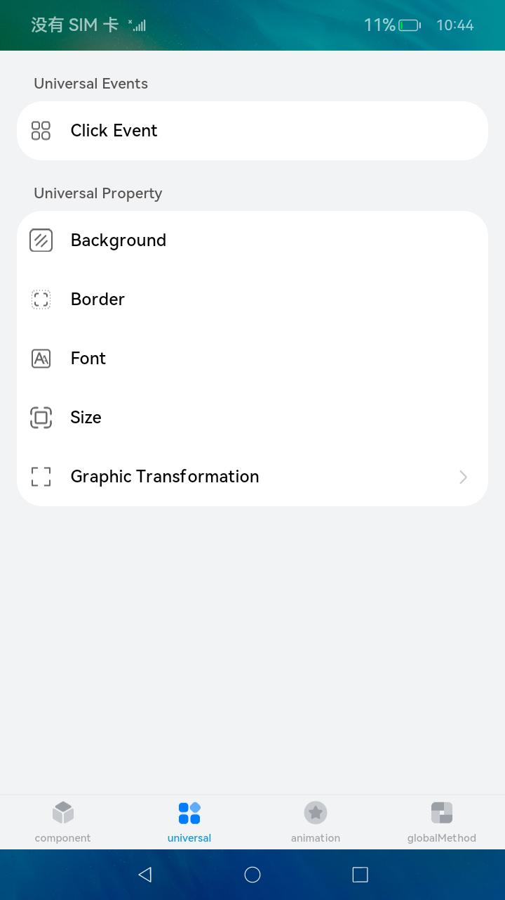
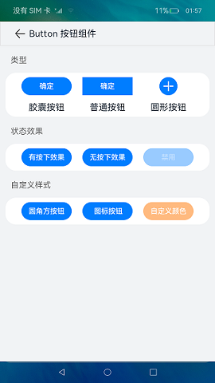
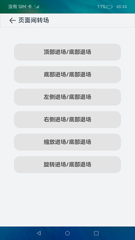

# 组件集合

### 介绍

本示例为ArkUI中组件、通用、动画、全局方法的集合。

本示例使用 [Tabs容器组件](https://gitee.com/openharmony/docs/blob/master/zh-cn/application-dev/reference/arkui-js/js-components-container-tabs.md)搭建整体应用框架，每个 [TabContent内容视图](https://gitee.com/openharmony/docs/blob/master/zh-cn/application-dev/reference/arkui-js/js-components-container-tab-content.md) 使用 [div容器组件](https://gitee.com/openharmony/docs/blob/master/zh-cn/application-dev/reference/arkui-js/js-components-container-div.md) 嵌套布局，在每个 [div](https://gitee.com/openharmony/docs/blob/master/zh-cn/application-dev/reference/arkui-js/js-components-container-div.md) 中使用 [循环渲染](https://gitee.com/openharmony/docs/blob/master/zh-cn/application-dev/reference/arkui-js/js-components-common-attributes.md) 加载此分类下分类导航数据，底部导航菜单使用 [TabContent中tabBar属性](https://gitee.com/openharmony/docs/blob/master/zh-cn/application-dev/reference/arkui-js/js-components-container-tab-content.md) 设置自定义样式 。通过组件、通用、动画、全局方法四个大类展现了ArkUI的能力，并把四大类中的功能进行了分类，方便开发者查看，每个示例又结合了不同的展现方式，以契合实际应用场景为主生动的体现了ArkUI能力的用法。

### 效果预览
   
| 组件                                               | 通用                                              | 动画                                                      | 全局方法                                               |
|--------------------------------------------------|-------------------------------------------------|---------------------------------------------------------|----------------------------------------------------|
|  |  |          |  |
| 按钮组件                                             | 点击事件                                            | 转场动画                                                    | 弹窗                                                 |
|      |      |  |        |

使用说明：

1.点击**组件**、**通用**、**动画**、**全局方法**四个按钮或左右滑动切换不同Tab内容。

2.点击二级导航（如通用属性、通用事件等），若存在三级导航则展开三级导航（如Border 边框、点击事件等）；若不存在三级导航，则点击跳转详情页面。

3.若存在三级导航，点击三级导航则跳转详情页面。

### 工程目录

```
entry/src/main/js/MainAbility
|---app.js
|---common
|   |---commonItemInput                      // 输入框组件
|   |---commonItemSelect                     // 选择菜单组件
|   |---commonItemSlider                     // 滑动条组件
|   |---css                                  // 通用样式
|   |---image                                // 图片资源
|   |---logger                               // 详情页面标题组件
|   |---tabContentNavigation                 // 页面切换组件
|   |---titleBar                             // 页面标题组件
|---pages
|   |---animations                     
|   |   |---pageTransitionSample             // 变换
|   |   |---pageTransitionSampleFromBottom   // 从下变换
|   |   |---pageTransitionSampleFromLeft     // 从左变换
|   |   |---pageTransitionSampleFromRight    // 从右变换
|   |   |---pageTransitionSampleFromTop      // 从上变换
|   |   |---pageTransitionSampleWithRotate   // 旋转变换
|   |   |---pageTransitionSampleWithScale    // 缩小放大变换
|   |---components                           // 首页
|   |   |---badgeSample
|   |   |---basic
|   |   |   |---buttonSample                 // 按钮
|   |   |   |---datePickerSample             // 日期选择器
|   |   |   |---dividerSample                // 分隔器
|   |   |   |---inputSample                  // 输入框
|   |   |   |---qrCodeSample                 // 二维码
|   |   |   |---radioSample                  // 单选
|   |   |   |---selectSample                 // 选择菜单
|   |   |   |---sliderSample                 // 滑动条
|   |   |   |---spanSample                   // 行内文本
|   |   |   |---switchSample                 // 切换
|   |   |   |---textSample                   // 文本
|   |---globalMethods                        // 全局方法
|   |   |---popups
|   |   |   |---dialogSample                 // 自定义弹窗
|   |---index                                // 首页
|   |---universals                           // 通用
|   |   |---events
|   |   |   |---clickSample                  // 点击事件
|   |   |---properties
|   |   |   |---backgroundSample             // 背景
|   |   |   |---borderSample                 // 边框
|   |   |   |---fontSample                   // 字体
|   |   |   |---rotateSample                 // 旋转
|   |   |   |---sizeSample                   // 字号
|   |   |   |---translateSample              // 变换

```

### 具体实现

* 本示例使用 [Tabs容器组件](https://gitee.com/openharmony/docs/blob/master/zh-cn/application-dev/reference/arkui-js/js-components-container-tabs.md)搭建整体应用框架，每个 [TabContent内容视图](https://gitee.com/openharmony/docs/blob/master/zh-cn/application-dev/reference/arkui-js/js-components-container-tab-content.md) 使用 [div容器组件](https://gitee.com/openharmony/docs/blob/master/zh-cn/application-dev/reference/arkui-js/js-components-container-div.md) 嵌套布局，在每个 [div](https://gitee.com/openharmony/docs/blob/master/zh-cn/application-dev/reference/arkui-js/js-components-container-div.md) 中使用 [循环渲染](https://gitee.com/openharmony/docs/blob/master/zh-cn/application-dev/reference/arkui-js/js-components-common-attributes.md) 加载此分类下分类导航数据，底部导航菜单使用 [TabContent中tabBar属性](https://gitee.com/openharmony/docs/blob/master/zh-cn/application-dev/reference/arkui-js/js-components-container-tab-content.md) 设置自定义样式 。

* 将组件库分成四大类，切换查看

    * 组件模块：
        * 空白与分隔
            * 使用全局组件TitleBar，CommonItemSlider，CommonItemSelect，引入全局样式搭建分隔器组件页面
            * 全局封装组件源文件：[titleBar](entry/src/main/js/MainAbility/common/titleBar),[commonItemSlider](entry/src/main/js/MainAbility/common/commonItemSlider),[commonItemSelect](entry/src/main/js/MainAbility/common/commonItemSelect)
            * 全局样式源文件：[common.css](entry/src/main/js/MainAbility/common/css)

        * 按钮与选择
            * 使用全局组件TitleBar，引入全局样式搭建按钮，日期选择器，单选按钮，选择菜单，滑动条，切换按钮组件页面
            * 全局封装组件源文件：[titleBar](entry/src/main/js/MainAbility/common/titleBar)
            * 全局样式源文件：[common.css](entry/src/main/js/MainAbility/common/css)
            * 接口参考：[@ohos.promptAction](https://gitee.com/openharmony/docs/blob/master/zh-cn/application-dev/reference/apis/js-apis-promptAction.md)

        * 信息展示与功效
            * 使用全局组件TitleBar，引入全局样式搭建二维码组件页面
            * 全局封装组件源文件：[titleBar](entry/src/main/js/MainAbility/common/titleBar)
        
        * 文本与输入
            * 使用全局组件TitleBar，引入全局样式搭建行内文本，输入框，文本组件页面
            * 全局封装组件源文件：[titleBar](entry/src/main/js/MainAbility/common/titleBar)
            * 全局样式源文件：[common.css](entry/src/main/js/MainAbility/common/css)
            * 接口参考：[@ohos.promptAction](https://gitee.com/openharmony/docs/blob/master/zh-cn/application-dev/reference/apis/js-apis-promptAction.md)

        * 辅助
            * 使用全局组件TitleBar，引入全局样式搭建标记组件页面
            * 全局封装组件源文件：[titleBar](entry/src/main/js/MainAbility/common/titleBar)
            * 全局样式源文件：[common.css](entry/src/main/js/MainAbility/common/css)
    
    * 通用模块：
        * 通用事件
            * 用到全局组件TitleBar，全局样式实现点击事件组件页面
            * 全局封装组件源文件：[titleBar](entry/src/main/js/MainAbility/common/titleBar)
            * 全局样式源文件：[common.css](entry/src/main/js/MainAbility/common/css)

        * 通用属性
            * 使用全局组件TitleBar，全局样式实现组件页面
            * 全局封装组件源文件：[titleBar](entry/src/main/js/MainAbility/common/titleBar)
            * 全局样式源文件：[common.css](entry/src/main/js/MainAbility/common/css)
            * 使用Math.trunc()方法将参数隐式转换成数字类型后，纯粹的去除小数部分
        
    * 动画模块：
        * 转场动画
            * 用到全局组件TitleBar实现动画转场组件页面
            * 全局封装组件源文件：[titleBar](entry/src/main/js/MainAbility/common/titleBar)
            * 接口参考：[@ohos.router](https://gitee.com/openharmony/docs/blob/master/zh-cn/application-dev/reference/apis/js-apis-router.md)

    * 全局方法模块：
        * 弹窗
            * 使用全局组件TitleBar，全局样式实现弹窗组件页面
            * 全局封装组件源文件：[titleBar](entry/src/main/js/MainAbility/common/titleBar)
            * 全局样式源文件：[common.css](entry/src/main/js/MainAbility/common/css)

### 相关权限

不涉及。

### 依赖

不涉及。

### 约束与限制

1.本示例仅支持标准系统上运行，支持设备：RK3568。

2.本示例已适配API version 9版本SDK，版本号：3.2.11.9。

3.本示例需要使用DevEco Studio 3.1 Beta2 (Build Version: 3.1.0.400, built on April 7, 2023)才可编译运行。

### 下载

如需单独下载本工程，执行如下命令：
```
git init
git config core.sparsecheckout true
echo /code/UI/JsComponentCollection/JsComponentCollection > .git/info/sparse-checkout
git remote add origin https://gitee.com/openharmony/applications_app_samples.git
git pull origin master
```