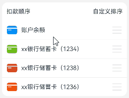

# 列表项交换案例

### 介绍

本案例通过List组件、组合手势GestureGroup、swipeAction属性以及attributeModifier属性等实现了列表项的交换和删除。

### 效果图预览 

 

**使用说明**：

1. 进入页面，长按列表项，执行拖拽操作，当拖拽长度大于列表项所占高度一半的时候，列表项进行交换。
2. 列表项左滑，显示删除按钮，点击删除按钮，此列表项被删除。

### 下载安装

1.模块oh-package.json5文件中引入依赖。
```typescript
"dependencies": {
  "listexchange": "har包地址"
}
```

2.ets文件import自定义视图实现列表视图。

```typescript
import { ListExchange } from 'listexchange';
```
### 快速使用

本章节主要介绍了如何快速上手自定义视图实现列表切换效果组件。

1. 设置列表项元素的类。开发者可以根据自身业务列表项的需求场景自行变更或者拓展属性，但是需要自定义列表项元素视图。

```typescript
class ListInfo {
  icon: ResourceStr = '';
  name: ResourceStr = '';
 
  constructor(icon: ResourceStr = '', name: ResourceStr = '') {
    this.icon = icon;
    this.name = name;
   }
 }
```

2. 数据准备。首先构建一个ListInfo类型的数组，然后向其中传入对应的内容数据。

```typescript
const MEMO_DATA: ListInfo[] = [
      new ListInfo($r("app.media.list_exchange_ic_public_cards_filled"), '账户余额'),
      new ListInfo($r("app.media.list_exchange_ic_public_cards_filled2"), 'xx银行储蓄卡（1234）'),
      new ListInfo($r("app.media.list_exchange_ic_public_cards_filled3"), 'xx银行储蓄卡（1238）'),
      new ListInfo($r("app.media.list_exchange_ic_public_cards_filled4"), 'xx银行储蓄卡（1236）')];

@State appInfoList: ListInfo[] = MEMO_DATA;
```
3. 声明管理列表项交换的类ListExchangeCtrl。通过ListExchangeCtrl来实现列表项与列表项之间的位置交换。具体实现请看后续的实现步骤章节。

```typescript
// 列表项交换类
@State listExchangeCtrl: ListExchangeCtrl<ListInfo> = new ListExchangeCtrl();
```
4. 自定义列表项组件。开发者可以自定义列表项的UI。

```typescript

 // 列表项数据信息
 @Builder deductionView(listItemInfo: ListInfo) {...}

```
5. 构建自定义列表视图。在代码合适的位置使用ListExchange组件并传入对应的参数。

```typescript
/**
 * 列表交换视图
 * appInfoList: 数据源
 * listExchangeCtrl: 列表项交换类
 * deductionView: 自定义列表项元素视图
 */
ListExchange({
  appInfoList: this.appInfoList,
  listExchangeCtrl: this.listExchangeCtrl,
  deductionView: (listItemInfo: Object) => {
    this.deductionView(listItemInfo as Listinfo)
  }
})

```

### 属性(接口)说明

ListInfo类属性(开发者可以自行拓展或者更改列表的属性元素)

|      属性       |     类型      |  释义  | 默认值 |
|:-------------:|:-----------:|:----:|:---:|
|     icon      | ResourceStr | 列表图片 |  -  |
|     name      | ResourceStr | 列表名称 |  -  |


ListExchange组件属性

|        属性        |        类型        |     释义     | 默认值 |
|:----------------:|:----------------:|:----------:|:---:|
|   appInfoList    |    ListInfo[]    |   列表数据源    |  -  |
| listExchangeCtrl | ListExchangeCtrl |  列表项元素交换类  |  -  |
|  deductionView   |       void       | 自定义列表项元素视图 |  -  |

### 实现思路

首先创建一个数组modifier来添加自定义属性对象，根据组合手势GestureGroup来控制自定义属性的值并通过attributeModifier绑定自定义属性对象来动态加载属性。
然后通过swipeAction属性绑定删除组件，左滑显示此删除组件，点击实现列表项的删除。
1. 声明一个数组，添加自定义属性对象，每个自定义属性对象对应一个列表项，源码参考[AttributeModifier.ets](ListExchange/src/main/ets/model/AttributeModifier.ets)和[ListExchangeCtrl.ets](ListExchange/src/main/ets/model/ListExchangeCtrl.ets)。
```typescript
 initData(deductionData: Array<T>) {
  this.deductionData = deductionData;
  deductionData.forEach(() => {
    this.modifier.push(new ListItemModifier());
  })
}
 /**
  * 通过实现AttributeModifier接口，自定义属性修改器
  * 将拖拽排序相关样式封装成属性修改器，可以方便移植
  */
 export class ListItemModifier implements AttributeModifier<ListItemAttribute> {
  // 阴影
  public hasShadow: boolean = false;
  // 缩放
  public scale: number = 1;
  // 纵轴偏移量
  public offsetY: number = 0;
  // 横轴偏移量
  public offsetX: number = 0;
  // 透明度
  public opacity: number = 1;
  // 是否被删除

  public static getInstance(): ListItemModifier {
    if (!ListItemModifier.instance) {
      ListItemModifier.instance = new ListItemModifier();
    }
    return ListItemModifier.instance;
  }

  /**
   * 定义组件普通状态时的样式
   * @param instance: ListItem属性
   */
  applyNormalAttribute(instance: ListItemAttribute): void {
    if (this.hasShadow) {
      instance.shadow({ radius: $r('app.integer.list_exchange_shadow_radius'), color: $r('app.color.box_shadow') });
      instance.zIndex(1);
      instance.opacity(0.5);
    } else {
      instance.opacity(this.opacity);
    }
    instance.translate({ x: this.offsetX, y: this.offsetY });
    instance.scale({ x: this.scale, y: this.scale });
  }
}
```
2. 绑定attributeModifier属性以及组合手势GestureGroup，attributeModifier属性的值为对应的自定义属性对象。源码参考[ListExchangeView.ets](ListExchange/src/main/ets/view/ListExchangeView.ets)。
```typescript
// 列表区域
List() {
  ForEach(this.appInfoList, (item: Object) => {
    ListItem() {
      this.deductionView(item)
    }
    .zIndex(this.currentListItem === item ? 2 : 1) // 层级属性
    .swipeAction({ end: this.defaultDeleteBuilder(item) }) // 用于设置ListItem的划出组件
    .transition(TransitionEffect.OPACITY)
    .attributeModifier(this.listExchangeCtrl.getModifier(item)) //动态设置组件的属性方法， 参数为属性修改器
    .gesture(
      // 以下组合手势为顺序识别，当长按手势事件未正常触发时，则不会出发拖动手势事件
      GestureGroup(GestureMode.Sequence,
        // 长按
        LongPressGesture()
          .onAction((event: GestureEvent) => {
            this.currentListItem = item;
            this.isLongPress = true;
            this.listExchangeCtrl.onLongPress(item);
          }),
        // 拖动
        PanGesture()
          .onActionUpdate((event: GestureEvent) => {
            this.listExchangeCtrl.onMove(item, event.offsetY);
          })
          .onActionEnd((event: GestureEvent) => {
            this.listExchangeCtrl.onDrop(item);
            this.isLongPress = false;
          })
      ).onCancel(() => {
        if (!this.isLongPress) {
          return;
        }
        this.listExchangeCtrl.onDrop(item);
      }))
  }, (item: Object) => JSON.stringify(item))
}
.divider({ strokeWidth: '1px', color: 0xeaf0ef })
.scrollBar(BarState.Off)
.border({
  radius: {
    bottomLeft: $r('app.string.ohos_id_corner_radius_default_l'),
    bottomRight: $r('app.string.ohos_id_corner_radius_default_l')
  }
})
.backgroundColor(Color.White)
.width('100%')
 
```

3. 长按列表项，通过LongPressGesture识别长按手势，执行onLongPress函数方法更改此列表项的scale、shadow、zIndex和opacity等属性，并通过animateTo来实现动画效果，源码参考[ListExchangeCtrl.ets](ListExchange/src/main/ets/model/ListExchangeCtrl.ets)。

```typescript
 onLongPress(item: T) {
   const index: number = this.deductionData.indexOf(item);
   this.dragRefOffset = 0;
   // TODO:知识点:长按当前列表项透明度和放大动画
   animateTo({ curve: Curve.Friction, duration: ANIMATE_DURATION }, () => {
     this.state = OperationStatus.PRESSING;
     this.modifier[index].hasShadow = true;
     this.modifier[index].scale = 1.04; // 放大比例为1.04
   })
 }
```
4. 交换列表项，通过PanGesture手势的onActionUpdate方法监听拖动的纵轴移动长度，然后执行onMove方法，根据移动长度的大小来判断是否执行列表项交换方法changeItem，源码参考[ListExchangeCtrl.ets](ListExchange/src/main/ets/model/ListExchangeCtrl.ets)。
```typescript
 onMove(item: T, offsetY: number) {
   const index: number = this.deductionData.indexOf(item);
   this.offsetY = offsetY - this.dragRefOffset;
   this.modifier[index].offsetY = this.offsetY;
   const direction: number = this.offsetY > 0 ? 1 : -1;
   // 触发拖动时，被覆盖子组件缩小与恢复的动画
   const curveValue: ICurve = curves.initCurve(Curve.Sharp);
   const value: number = curveValue.interpolate(Math.abs(this.offsetY) / ITEM_HEIGHT);
   const shrinkScale: number = 1 - value / 10; // 计算缩放比例，value值缩小10倍
   if (index < this.modifier.length - 1) { // 当拖拽的时候，被交换的对象会缩放
     this.modifier[index + 1].scale = direction > 0 ? shrinkScale : 1;
   }
   if (index > 0) {
     this.modifier[index - 1].scale = direction > 0 ? 1 : shrinkScale;
   }
   // TODO:知识点:处理列表项的切换操作
   if (Math.abs(this.offsetY) > ITEM_HEIGHT / 2) {
     animateTo({ curve: Curve.Friction, duration: commonConstants.ANIMATE_DURATION }, () => {
       this.offsetY -= direction * ITEM_HEIGHT;
       this.dragRefOffset += direction * ITEM_HEIGHT;
       this.modifier[index].offsetY = this.offsetY;
       this.changeItem(index, index + direction);
     })
   }
 }

 changeItem(index: number, newIndex: number): void {
   const tmp: Array<T> = this.deductionData.splice(index, 1);
   this.deductionData.splice(newIndex, 0, tmp[0]);
   const tmp2: Array<ListItemModifier> = this.modifier.splice(index, 1);
   this.modifier.splice(newIndex, 0, tmp2[0]);
 }
```
5. 通过swipeAction属性绑定删除按钮组件，列表项左滑显示删除组件，点击删除按钮，列表项删除。源码参考[ListExchangeCtrl.ets](ListExchange/src/main/ets/model/ListExchangeCtrl.ets)。
```typescript
deleteItem(item: T): void {
  const index = this.deductionData.indexOf(item);
  this.dragRefOffset = 0;
  // TODO:知识点:左偏移以及透明度动画
  animateTo({
    curve: Curve.Friction, onFinish: () => {
      // TODO:知识点:列表项删除动画
      animateTo({
        curve: Curve.Friction, onFinish: () => {
          this.state = OperationStatus.IDLE;
        }
      }, () => {
        this.modifier.splice(index, 1);
        this.deductionData.splice(index, 1);
      })
    }
  }, () => {
    this.state = OperationStatus.DELETE;
    this.modifier[index].offsetX = 150; // 列表项左偏移150
    this.modifier[index].opacity = 0; // 列表项透明度为0
  })
}
```

### 工程结构&模块类型

```
listexchange                                 // har类型
|---common
|   |---commonConstants.ets                  // 常量
|---model
|   |---AttributeModifier.ets                // 属性对象
|   |---ListExchangeCtrl.ets                 // 列表项交换
|   |---ListInfo.ets                         // 列表项信息
|   |---MockData.ets                         // 模拟数据
|---util
|   |---ListExchange.ets                     // 自定义列表视图
|   |---Logger.ets                           // 日志
|---view
|   |---ListExchangeView.ets                 // 视图层-应用主页面
```

### 参考资料

[List](https://docs.openharmony.cn/pages/v5.0/zh-cn/application-dev/reference/apis-arkui/arkui-ts/ts-container-list.md)

[GestureGroup](https://docs.openharmony.cn/pages/v5.0/zh-cn/application-dev/reference/apis-arkui/arkui-ts/ts-combined-gestures.md)

### 约束与限制

1.本示例仅支持标准系统上运行。

2.本示例已适配API version 12版本SDK。

3.本示例需要使用DevEco Studio 5.0.0 Release及以上版本才可编译运行。

### 下载

如需单独下载本工程，执行如下命令：
```javascript
git init
git config core.sparsecheckout true
echo /code/UI/listexchange/ > .git/info/sparse-checkout
git remote add origin https://gitee.com/openharmony/applications_app_samples.git
git pull origin master
```