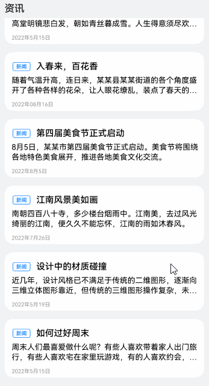

# 下拉刷新与上滑加载案例

### 介绍

本示例介绍使用第三方库的PullToRefresh组件实现列表的下拉刷新数据和上滑加载后续数据。

### 效果图预览



**使用说明**

1. 进入页面，下拉列表触发刷新数据事件，等待数据刷新完成。
2. 上滑列表到底部，触发加载更多数据事件，等待数据加载完成。

### 实现思路

1. 使用第三方库pullToRefresh组件，将列表组件、绑定的数据对象和scroller对象包含进去，并添加上滑与下拉方法。源码参考[PullToRefreshNews.ets](./pulltorefresh/src/main/ets/pages/PullToRefreshNews.ets)
    ```typescript
    PullToRefresh({
      // 必传项，列表组件所绑定的数据
      data: $newsData,
      // 必传项，需绑定传入主体布局内的列表或宫格组件
      scroller: this.scroller,
      // 必传项，自定义主体布局，内部有列表或宫格组件
      customList: () => {
        // 一个用@Builder修饰过的UI方法
        this.getListView();
      },
      // 下拉刷新回调
      onRefresh: () => {
        return new Promise<string>((resolve, reject) => {
          ...
        });
      },
      // 上滑加载回调
      onLoadMore: () => {
        return new Promise<string>((resolve, reject) => {
          ...
        });
      },
      customLoad: () => this.customLoad(),
      customRefresh: null,
    })
    ```
2. 使用LazyForEach循环渲染列表。源码参考[PullToRefreshNews.ets](./pulltorefresh/src/main/ets/pages/PullToRefreshNews.ets)
    ```typescript
    LazyForEach(this.newsData, (item: NewsData) => {
      ListItem() {
        ...
      }
    });
    ```
3. 模拟列表总页数，加载完全部信息后提示已经到底部。源码参考[PullToRefreshNews.ets](./pulltorefresh/src/main/ets/pages/PullToRefreshNews.ets)
   ```javascript
   onLoadMore: () => {
     return new Promise<string>((resolve, reject) => { 
       // 模拟数据列表页超过4页后已到达底部，无法继续加载
       if (this.newsDataListIndex < NEWS_MAX_LIST) {
         // 模拟网络请求操作，请求网络1.5秒后得到数据，通知组件变更列表数据
         setTimeout(() => {
           let newsModelMockData: Array<NewsData> = getNews(MOCK_DATA_FILE_ONE_DIR)
           for (let j = 0; j < NEWS_MOCK_DATA_COUNT; j++) {
             this.newsData.pushData(newsModelMockData[j]);
           }
           this.newsDataListIndex++;
           resolve('');
         }, NEWS_REFRESH_TIME);
       } else {
           // 如果已满4页，更改上拉提示信息提示已经加载完所有数据
           setTimeout(() => {
           resolve('');
         }, NEWS_REFRESH_TIME);
       }
     });
   }
   ```
4. 自定义下拉更新动画。源码参考[PullToRefreshNews.ets](./pulltorefresh/src/main/ets/pages/PullToRefreshNews.ets)
   ```typescript
   @Builder
   private customRefresh() {
      Row() {
         // 下滑加载图片
         Image($r('app.media.pull_icon_load'))
            .width($r('app.string.pull_refresh_load_width'))
            .height($r('app.string.pull_refresh_load_height'))
            .objectFit(ImageFit.Contain)
            .rotate({
               z: 1,
               angle: this.angle2 !== undefined ? this.angle2 : 0
            })
            .width(this.refreshConfigurator.getLoadImgHeight())
            .height(this.refreshConfigurator.getLoadImgHeight())
      
         // 下拉时提示文本
         Stack() {
            Text(CURRENT_DATA_TIP)
               .height($r('app.string.pull_refresh_load_height'))
               .textAlign(TextAlign.Center)
               .margin({ left: this.newsDataListIndex === NEWS_MAX_LIST && this.isLoading ? 0 : 8 })
               .fontColor(this.refreshConfigurator !== undefined ? this.refreshConfigurator.getLoadTextColor() : 0)
               .fontSize(this.refreshConfigurator !== undefined ? this.refreshConfigurator.getLoadTextSize() : 0)
               .visibility(this.pullHeightValue <= CHANGE_PAGE_STATE ? Visibility.Visible : Visibility.Hidden)
            Text(NEW_DATA_TIP)
               .height($r('app.string.pull_refresh_load_height'))
               .textAlign(TextAlign.Center)
               .margin({ left: this.newsDataListIndex === NEWS_MAX_LIST && this.isLoading ? 0 : 8 })
               .fontColor(this.refreshConfigurator !== undefined ? this.refreshConfigurator.getLoadTextColor() : 0)
               .fontSize(this.refreshConfigurator !== undefined ? this.refreshConfigurator.getLoadTextSize() : 0)
               .visibility(this.pullHeightValue > CHANGE_PAGE_STATE ? Visibility.Visible : Visibility.Hidden)
         }
      }
      .height($r('app.string.pull_refresh_load_height'))
   }
   ```
5. 通过下拉距离判断页面是刷新当前数据还是更新为下一页。源码参考[PullToRefreshNews.ets](./pulltorefresh/src/main/ets/pages/PullToRefreshNews.ets)
   ```typescript
   onAnimPullDown: (value) => {
      this.pullHeightValue = value;
   },
   onAnimRefreshing: (value, width, height) => {
      if (value !== undefined && width !== undefined && height !== undefined) {
         if (value) {
            this.angle2 = value * 360;
            if (this.pullHeightValue > LOAD_PULL_STATE_CHANGE && this.pullHeightValue <= CHANGE_PAGE_STATE) {
               this.isChangePage = false;
            } else {
               // 当下拉到最顶部时，触发更新页面，不再刷新当前页。
               this.isChangePage = true;
            }
         }
      }
   }
   ```
6. 自定义上拉加载动画。源码参考[PullToRefreshNews.ets](./pulltorefresh/src/main/ets/pages/PullToRefreshNews.ets)
   ```typescript
   @Builder
   private customLoad() {
     Row() {
       Stack() {
         // 上拉1阶段箭头图片
         Image(pull_icon_up)
           .width('100%')
           .height('100%')
           .objectFit(ImageFit.Contain)
           .visibility(this.isPullUp ? Visibility.Visible : Visibility.Hidden)
           .rotate({
             z: 1,
             angle: this.angle1 !== undefined ? this.angle1 : 0
           })
         // 加载时图片
         Image(pull_icon_load)
           .width('100%')
           .height('100%')
           .objectFit(ImageFit.Contain)
           .visibility(this.isLoading ? Visibility.Visible : Visibility.Hidden)
           .rotate({
             z: 1,
             angle: this.angle2 !== undefined ? this.angle2 : 0
           })
       }
       // 最后一页加载时隐藏加载图片
       .width(this.newsDataListIndex === NEWS_MAX_LIST && this.isLoading ? 0 :
       this.refreshConfigurator.getLoadImgHeight())
       .height(this.newsDataListIndex === NEWS_MAX_LIST && this.isLoading ? 0 :
       this.refreshConfigurator.getLoadImgHeight())
   
       // 上拉过程与加载时提示文本
       Text(this.loadText)
         .height('100%')
         .textAlign(TextAlign.Center)
         .margin({ left: this.newsDataListIndex === NEWS_MAX_LIST && this.isLoading ? 0 : 8 })
         .fontColor(this.refreshConfigurator !== undefined ? this.refreshConfigurator.getLoadTextColor() : 0)
         .fontSize(this.refreshConfigurator !== undefined ? this.refreshConfigurator.getLoadTextSize() : 0)
     }
     .height('100%')
   }
   ```
7. 设置上拉与加载时的动画回调。源码参考[PullToRefreshNews.ets](./pulltorefresh/src/main/ets/pages/PullToRefreshNews.ets)
   ```typescript
   onAnimPullUp: (value, width, height) => {
     if (value !== undefined && width !== undefined && height !== undefined) {
       if (value) {
         this.isLoading = false;
         this.isPullUp = true;
         // 判断上拉拖拽过程中高度是否超过阶段临界值
         if (value < LOAD_PULL_STATE_CHANGE) {
           // 归零角度，保持箭头朝上
            this.angle1 = 0;
            // 改变提示文本为上拉1阶段
            this.loadText = LOAD_TEXT_PULL_UP_1;
         } else {
           // 翻转角度，保持箭头朝下
            this.angle1 = 180;
            // 改变提示文本为上拉2阶段
            this.loadText = LOAD_TEXT_PULL_UP_2;
         }
       }
     }
   },
   
   onAnimLoading: (value, width, height) => {
     if (value !== undefined && width !== undefined && height !== undefined) {
       if (value) {
         this.isPullUp = false;
         this.isLoading = true;
         // 更改角度使加载图片保持旋转
         this.angle2 = value * 360;
         // 判读页码是否为最后一页
         if (this.newsDataListIndex !== NEWS_MAX_LIST) {
           this.loadText = LOAD_DEFAULT_TEXT;
         } else {
           // 最后一页更换文本提示已经到底了
           this.loadText = LOAD_STOP_TEXT;
         }
       }
     }
   }
   ```
### 高性能知识点

不涉及

### 工程结构&模块类型
   ```
   pulltorefreshnews                     // har类型
   |---model 
   |---|---AppInfo.ets                   // App信息
   |---|---UserInformation.ets           // 用户信息    
   |---view                              
   |---|---PullToRefreshNews.ets         // 视图层-场景列表页面
   ```

### 模块依赖

[PullToRefresh](https://gitee.com/openharmony-sig/PullToRefresh)

### 参考资料

[PullToRefresh](https://gitee.com/openharmony-sig/PullToRefresh)
[LazyForEach](https://gitee.com/openharmony/docs/blob/master/zh-cn/application-dev/reference/apis-arkui/arkui-ts/ts-rendering-control-lazyforeach.md)
[PullToRefresh第三方库](https://ohpm.openharmony.cn/#/cn/detail/@ohos%2Fpulltorefresh)

### 相关权限

不涉及。

### 依赖

不涉及。

### 约束与限制

1.本示例仅支持标准系统上运行，支持设备：RK3586。

2.本示例为Stage模型，支持API12版本SDK，SDK版本号（API Version 12 Release）。

3.本示例需要使用DevEco Studio版本号（DevEco Studio 5.0.0 Release）及以上版本才可编译运行。

### 下载

如需单独下载本工程，执行如下命令：

```shell
git init
git config core.sparsecheckout true
echo code/UI/PullToRefresh/ > .git/info/sparse-checkout
git remote add origin https://gitee.com/openharmony/applications_app_samples.git
git pull origin master