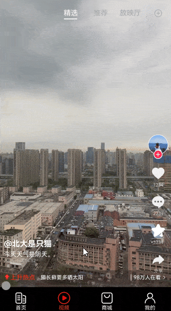

# tabContent内容可以在tabBar上显示并响应滑动事件案例

### 介绍

本示例实现了tabContent内容可以在tabBar上显示并且tabBar可以响应滑动事件的功能。

### 效果图预览



### 使用说明

1. 点击播放按钮进行视频播放，按住进度条按钮和进度条下方区域可以拖动进度条，更改视频播放进度。

### 实现思路

原生的Tabs组件，tabContent内容无法在tabBar上显示。本案例实现tabContent内容可以在tabBar上显示并且tabBar可以响应滑动事件的功能
主要是通过将Tabs组件的barHeight设置为0，重新自定义tabBar。 将TabContent的内容分为上下两部分，上半部高度为100% - 60vp，存放video组件，
下部分高度为60vp，存放进度条。将Tabs组件的zIndex属性设置为2，tabContent的视图就可以堆叠在自定义tabBar之上。再设置hitTestBehavior属性
使被覆盖的tabBar可以响应点击事件。这样就实现tabBar可以响应滑动事件并且tabBar可以响应点击事件的效果。

1. 创建Tabs组件，将barHeight设置为0。

```typescript
Tabs({ index: this.index, controller: this.tabsController }) {
   ...
}
// TODO: 知识点：将zIndex设置为2，TabContent将在tabBar之上，显示的效果就是TabContent外溢的部分在tabBar上。
.zIndex(CONFIGURATION.TABCONTENTOVERFLOWZINDEX)
.scrollable(false)
.barHeight($r('app.integer.tabcontentoverflow_tabs_barheight'))
.animationDuration(CONFIGURATION.TABCONTENTOVERFLOWTABSDURATION)
.onChange((index: number) => {
   this.index = index;
})
// TODO: 知识点：hitTestBehavior属性可以实现在复杂的多层级场景下，一些组件能够响应手势和事件，而一些组件不能响应手势和事件。HitTestMode.Transparent的效果为，自身响应触摸测试，不会阻塞兄弟节点的触摸测试。
.hitTestBehavior(HitTestMode.Transparent)
.id('tabs')
.alignRules({
   top: { anchor: STRINGCONFIGURATION.TABCONTENTOVERFLOWCONTAINER, align: VerticalAlign.Top },
   left: { anchor: STRINGCONFIGURATION.TABCONTENTOVERFLOWCONTAINER, align: HorizontalAlign.Start },
})
```
2. 创建自定义tabBar。

```typescript
 Row() {
   ForEach(this.tabArray, (item: string, index: number) => {
      Column() {
         Image(this.index === index ? $r(this.imageClickArray[index]) : $r(this.imageArray[index]))
            .width($r('app.integer.tabcontentoverflow_row_column_image_width'))
            .height($r('app.integer.tabcontentoverflow_row_column_image_height'))
         Text($r(item))
            .fontSize($r('app.integer.tabcontentoverflow_row_column_text_font_size'))
            .fontColor(this.index === index ? $r('app.color.tabcontentoverflow_click_color') : $r('app.color.tabcontentoverflow_white'))
      }
      .width($r('app.integer.tabcontentoverflow_row_column_width'))
         .margin({ top: $r('app.integer.tabcontentoverflow_margin_samll') })
         // 为将底部视图扩展到非安全区域，可将原本60vp的高度设置为100vp。
         .height($r('app.integer.tabcontentoverflow_row_column_height'))
         .onClick(() => {
            this.index = index;
            this.tabsController.changeIndex(this.index);
         })
   })
 }
 .offset({
    y: $r('app.integer.tabcontentoverflow_row_offset')
 })
 .width($r('app.string.tabcontentoverflow_full_size'))
 // 扩展至所有非安全区域
 .expandSafeArea([SafeAreaType.SYSTEM], [SafeAreaEdge.BOTTOM])
 .backgroundColor($r('app.color.tabcontentoverflow_row_background'))
 .justifyContent(FlexAlign.SpaceAround)
 .id(STRINGCONFIGURATION.TABCONTENT_OVERFLOW_TABBAR)
 .alignRules({
    top: { anchor: STRINGCONFIGURATION.TABCONTENT_OVERFLOW_CONTAINER, align: VerticalAlign.Bottom },
    left: { anchor: STRINGCONFIGURATION.TABCONTENT_OVERFLOW_CONTAINER, align: HorizontalAlign.Start },
 })
```

3. 将TabContent的内容分为上下两部分，上半部高度为100% - 60vp，存放video组件，下部分高度为60vp，存放进度条，设置滑动手势响应事件。

```typescript
RelativeContainer()
{
   Video({
      ...
   })
   .height($r('app.string.tabcontentoverflow_video_height'))
   ...
   
   RelativeContainer() {
   Text()
      ...
   Text()
      ...
   Text()
      ...
}
.id(STRINGCONFIGURATION.TABCONTENT_OVERFLOW_RELATIVE_CONTAINER)
.alignRules({
   top: { anchor: STRINGCONFIGURATION.TABCONTENT_OVERFLOW_VIDEO, align: VerticalAlign.Bottom },
   left: { anchor: STRINGCONFIGURATION.TABCONTENT_OVERFLOW_CONTAINER, align: HorizontalAlign.Start },
})
.width(this.screenW)
.height($r('app.integer.tabcontentoverflow_tabbar_height'))
// 左右拖动触发该手势事件
.gesture(
   PanGesture(this.panOption)
      .onActionStart(() => {
         ...
      })
      /**
       * TODO: 性能知识点: onActionUpdate是系统高频回调函数，避免在函数中进行冗余或耗时操作，例如应该减少或避免在函数打印日志，会有较大的性能损耗。
       * 优化系统使用，减少冗余操作:参考性能优化指南
       */
      .onActionUpdate((event: GestureEvent) => {
         ...
      })
      .onActionEnd(() => {
         ...
      })
)
}
```

4. 将Tabs组件的zIndex属性设置为2，tabContent的视图就可以堆叠在自定义tabBar之上。

```typescript
Tabs({ index: this.index, controller: this.tabsController }) {
   TabContent() {
      ...
   }
   ...

   TabContent() {
      this.videoTabContent();
   }

   TabContent() {
      ...
   }
   ...

   TabContent() {
      ...
   }
   ...
}
// TODO: 知识点：将zIndex设置为2，TabContent将在tabBar之上，显示的效果就是TabContent外溢的部分在tabBar上。
.zIndex(CONFIGURATION.TABCONTENT_OVERFLOW_ZINDEX)
...
```
5. 再设置hitTestBehavior属性使被覆盖的自定义的tabBar可以响应点击事件。
   源码参考[TabContentOverFlow.ets](./casefeature/tabcontentoverflow/src/main/ets/mainpage/TabContentOverFlow.ets)。

```typescript
Tabs({ index: this.index, controller: this.tabsController }) {
   ...
}
// TODO: 知识点：hitTestBehavior属性可以实现在复杂的多层级场景下，一些组件能够响应手势和事件，而一些组件不能响应手势和事件。HitTestMode.Transparent的效果为，自身响应触摸测试，不会阻塞兄弟节点的触摸测试。
.hitTestBehavior(HitTestMode.Transparent)
```

### 工程结构&模块类型

```
   dragtoswitchpictures                             // har包
   |---common
   |   |---Constants.ets                            // 常量类
   |---mainpage
   |   |---TabContentOverFlow.ets                   // 主页面
   |---view
   |   |---Side.ets                                 // 视频信息以及顶部视图
```

### 高性能知识点

本例使用了onActionUpdate函数。该函数是系统高频回调函数，避免在函数中进行冗余或耗时操作，例如应该减少或避免在函数打印日志，会有较大的性能损耗。

界面嵌套带来了渲染和计算的大量开销，造成性能的衰退。本例使用扁平化布局优化嵌套层级，建议采用相对布局RelativeContainer进行扁平化布局，有效减少容器的嵌套层级，减少组件的创建时间。

### 参考资料

[Tabs组件文档](https://gitee.com/openharmony/docs/blob/master/zh-cn/application-dev/reference/apis-arkui/arkui-ts/ts-container-tabs.md)

[ZIndex属性说明](https://gitee.com/openharmony/docs/blob/master/zh-cn/application-dev/reference/apis-arkui/arkui-ts/ts-universal-attributes-z-order.md)

[优化布局性能指南](https://gitee.com/openharmony/docs/blob/master/zh-cn/application-dev/performance/reduce-view-nesting-levels.md)

[相对定位容器文档](https://gitee.com/openharmony/docs/blob/master/zh-cn/application-dev/reference/apis-arkui/arkui-ts/ts-container-relativecontainer.md)

[应用性能优化概览文档](https://gitee.com/openharmony/docs/blob/master/zh-cn/application-dev/performance/performance-overview.md)

[hitTestBehavior属性说明](https://gitee.com/openharmony/docs/blob/master/zh-cn/application-dev/reference/apis-arkui/arkui-ts/ts-universal-attributes-hit-test-behavior.md)

[setWindowSystemBarProperties属性说明](https://gitee.com/openharmony/docs/blob/master/zh-cn/application-dev/reference/apis-arkui/js-apis-window.md#setwindowsystembarproperties9)

### 约束与限制

1.本示例仅支持在标准系统上运行。

2.本示例需要使用DevEco Studio 5.0.0 Release 才可编译运行。

### 下载

如需单独下载本工程，执行如下命令：
```
git init
git config core.sparsecheckout true
echo /code/UI/TabContentTouchHotZone > .git/info/sparse-checkout
git remote add origin https://gitee.com/openharmony/applications_app_samples.git
git pull origin master
```
