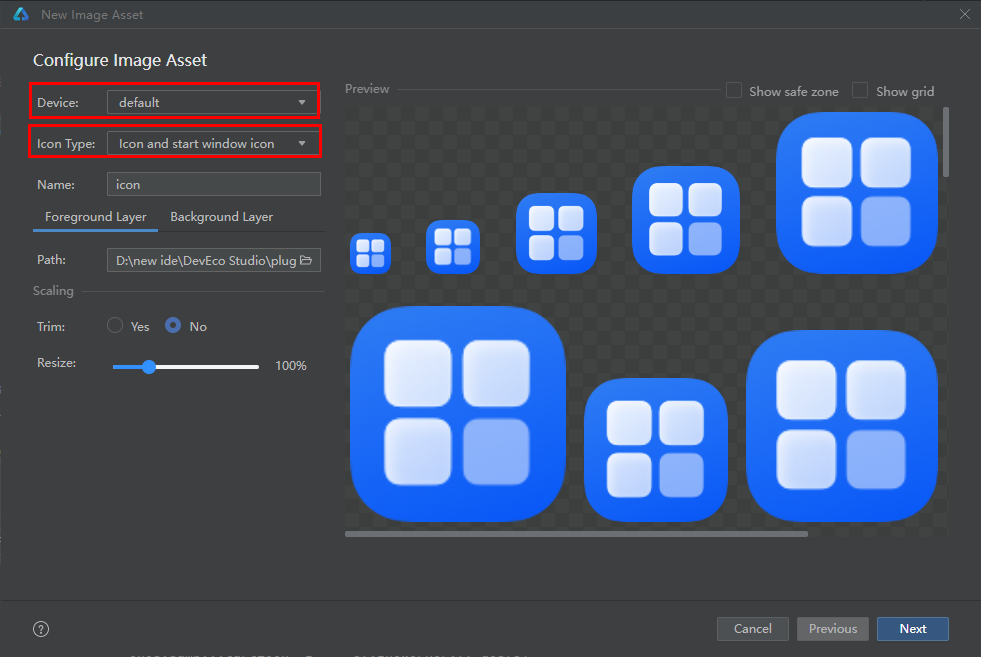

# 启动页实现案例

### 介绍

本示例介绍了使用资源匹配规则实现不同分辨率冷启动应用图标适配和启动广告页的实现。 应用使用某资源时，系统会根据当前设备状态优先从相匹配的限定词目录中寻找该资源。只有当resources目录中没有与设备状态匹配的限定词目录，或者在限定词目录中找不到该资源时，才会去base目录中查找。rawfile是原始文件目录，不会根据设备状态去匹配不同的资源。

### 效果预览


### 使用说明

1. 应用安装到不同分辨率的设备冷启动，显示不同大小的图标
2. 点击应用冷启动弹出加载出广告页面

### 实现思路
1. 新建图片资源
2. 修改module.json5配置文件
3. 新增页面作为启动页面

### 实现步骤
1. 在resources目录右键菜单选择“New > Image Asset”，选择设备和图标类型后可创建限定词目录，按照命名规范自动生成限定词和资源组目录，并将文件创建在限定词目录中。
   

2. 将对应不同分辨率需要显示的图标放到对应文件夹中（图标名称需保持一致），不同文件夹对应屏幕密度如下表  
   | 名称            | 值   | 说明         |
   | -------------- | ---- | ---------- |
   | SCREEN_SDPI    | 120  | 小规模的屏幕密度。  |
   | SCREEN_MDPI    | 160  | 中规模的屏幕密度。   |
   | SCREEN_LDPI    | 240  | 大规模的屏幕密度。   |
   | SCREEN_XLDPI   | 320  | 特大规模的屏幕密度。  |
   | SCREEN_XXLDPI  | 480  | 超大规模的屏幕密度。  |
   | SCREEN_XXXLDPI | 640  | 超特大规模的屏幕密度。 |
3. 修改module.json5中abilities的icon和startWindowIcon字段为第二步中的图标名称
```ts
"abilities": [
  {
    "name": "EntryAbility",
    "srcEntry": "./ets/entryability/EntryAbility.ets",
    "description": "$string:EntryAbility_desc",
    "icon": "$media:icon",
    "label": "$string:EntryAbility_label",
    "startWindowIcon": "$media:start_window_icon",
    "startWindowBackground": "$color:entry_start_window_background",
    "exported": true,
    "skills": [
      {
        "entities": [
        "entity.system.home"
         ],
         "actions": [
         "action.system.home"
          ]
      }
      ]
    }
 ],
  ```
4. 新增一个页面作为启动页面，通过定时器设定固定时间跳转到主页也可手动跳过，该页面可以作为应用广告页面，可将部分ability实例生命周期中的加载逻辑和数据获取逻辑移到广告页面中加载减少ability实例创建时长。
```ts
// 页面显示时打开定时器
onPageShow() {
  this.changeFullScreen(true)
  this.timer = setInterval(() => {
    this.pageCountDown--;
    if (this.pageCountDown === 0) {
      this.changeFullScreen(false);
      clearInterval(this.timer); // 关闭定时器
      router.replaceUrl({ url: 'pages/EntryView' });
    }
  }, 1000)
}
  ```
### 高性能知识点

**不涉及**

### 工程结构&模块类型

```
WindowStartIcon                                    
|---entryability                                       
|   |---EntryAbility.ets                          // EntryAbility  
|---entryformability                                           
|   |---EntryFormAbility.ets                      // EntryBackupAbility       
|---pages                                           
|   |---AdvertisingPage.ets                       // 开屏广告页面        
|   |---Index.ets                                 // 首页页面              
|---resources                                     // 资源文件管理                                                                          
|   |---base                                      // 默认资源   
|   |---en_US                                     // 英文资源 
|   |---zh_CN                                     // 中文资源 
|   |---sdpi                                      // 小屏dpi图标 
|   |---mdpi                                      // 中屏dpi图标
|   |---ldpi                                      // 大屏dpi图标
|   |---xldpi                                     // 特大屏dpi图标 
|   |---xxldpi                                    // 超大屏dpi图标
|   |---xxxldpi                                   // 超特大屏dpi图标      
```

### 参考资料

[资源分类与访问](https://docs.openharmony.cn/pages/v5.0/zh-cn/application-dev/quick-start/resource-categories-and-access.md)

### 依赖
不涉及

### 约束与限制
1.本示例仅支持标准系统上运行，支持设备：RK3568。

2.本示例已适配API version 12（5.0.0.70）版本SDK。

3.本示例需要使用DevEco Studio NEXT Release（Build Version: 5.0.3.900）及以上版本才可编译运行。

### 下载
如需单独下载本工程，执行如下命令：

```
git init
git config core.sparsecheckout true
echo code/UI/WindowStartIcon/ > .git/info/sparse-checkout
git remote add origin https://gitee.com/openharmony/applications_app_samples.git
git pull origin master
```