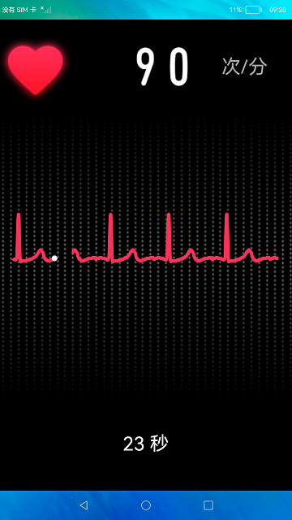

# 心率检测

##### 简介

本示例通过<stack\>组件，模拟显示实时心率监测数据图。实现效果如下：

### 相关概念

Stack：堆叠容器，子组件按照顺序依次入栈，后一个子组件覆盖前一个子组件。

### 相关权限

不涉及。

### 使用说明

每秒采集一次心率和心跳数据，并且以心电图形式实时显示，动态更新心电数据图。

### 约束与限制

1.本示例仅支持在标准系统上运行。

2.本示例需要使用DevEco Studio 3.0 Beta3 (Build Version: 3.0.0.901, built on May 30, 2022)才可编译运行。

3.如果安装本示例报错为error：install sign info inconsistent，则有可能本应用被设置为系统预置应用，已安装在系统中，此时需使用命令进行替换安装，并在替换安装后对设备进行重启操作，具体命令如下：

hdc shell mount -o rw,remount /

hdc file send ./entry-default-signed.hap /system/app/ohos.samples.ecg/Ecg_Demo.hap