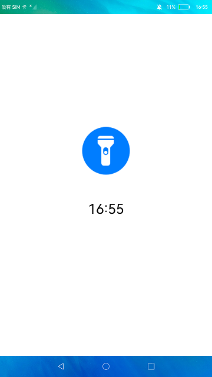
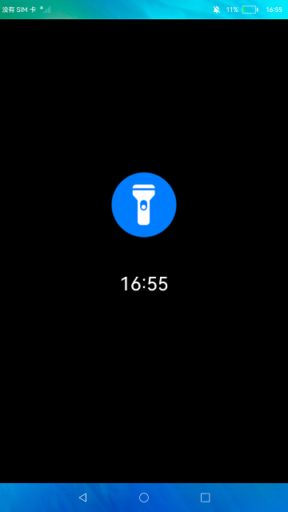

# 手电筒

##### 简介

本示例通过屏幕的亮度变化来模拟手电筒功能，屏幕变亮模拟手电筒打开，屏幕变暗模拟手电筒关闭。实现效果如下：

 

### 相关概念

屏幕亮度：该模块提供屏幕亮度的设置接口。

### 相关权限

不涉及。

### 使用说明

点击应用界面中的手电筒图标来开关手电筒。

### 约束与限制

1.本示例仅支持在标准系统上运行。

2.本示例需要使用DevEco Studio 3.0 Beta3 (Build Version: 3.0.0.901, built on May 30, 2022)才可编译运行。

3.如果安装本示例报错为error：install sign info inconsistent，则有可能本应用被设置为系统预置应用，已安装在系统中，此时需使用命令进行替换安装，并在替换安装后对设备进行重启操作，具体命令如下：

hdc shell mount -o rw,remount /

hdc file send ./entry-default-signed.hap /system/app/ohos.samples.flashlight/Flashlight_Demo.hap

hdc shell  reboot

等设备重启后即可完成应用的替换安装，无需其他操作。