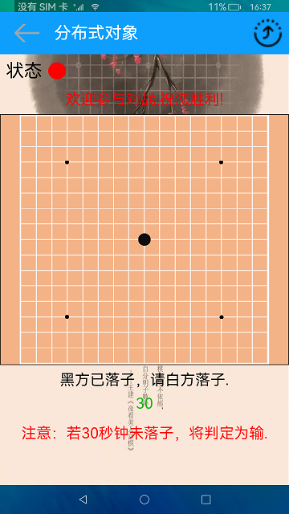

# 分布式五子棋

### 概要简介

五子棋是一款比较流行的棋类游戏，此游戏使用分布式数据管理功能进行开发完成的。实现效果如下：

### 相关概念

分布式五子棋：该示例使用分布式对象实现两个设备间的数据同步。启动应用后，创建分布式对象，分布式对象使用相同的sessionId实现设备间的协同。通过分布式对象的on('status')方法来实现对远程设备上下线的监听，从而更新对端设备的状态，通过on('change')方法实现对数据改变的监听，从而分布式对象的数据发生改变时，对改变的数据进行操作，从而实现五子棋的双人对战

### 相关权限

允许不同设备间的数据交换：ohos.permission.DISTRIBUTED_DATASYNC

### 使用说明

1.启动应用，两个设备都确认权限后，并在同一个网络下，点击右上角图标，选择需要拉起的远程设备，点击后拉起远程设备，第一次拉起设备时，若未进行认证，输入认证码进行认证，认证成功后远程应用启动。

2.点击开始游戏，任意一方下子，然后系统会提示每一步轮到哪一方下子，轮到某一方下子时，若30秒内未下子，则判定对方获胜。提示某一方获胜后，点击开始游戏重新开始。

### 约束与限制

1.本示例仅支持标准系统上运行。

2.本示例为stage模型，从API version 9开始支持。

3.本示例需要使用DevEco Studio 3.0 Beta4 (Build Version: 3.0.0.991, built on July 6, 2022)才可编译运行。

4.设备拉起时，状态灯变为绿色数据进行同步，若状态灯为红色，则组网不成功，数据不能进行同步。