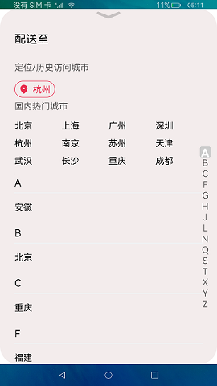

# 位置信息

### 介绍

本示例展示了通过**geolocation**实现获取位置信息。

本示例使用 [geolocation](https://gitee.com/openharmony/docs/blob/master/zh-cn/application-dev/reference/apis/js-apis-geolocation.md) 实现获取当前位置的经纬度，然后通过 [http](https://gitee.com/openharmony/docs/blob/master/zh-cn/application-dev/reference/apis/js-apis-http.md) 请求将经纬度作为请求参数获取到该经纬度所在的城市。通过 [AlphabetIndexer](https://gitee.com/openharmony/docs/blob/master/zh-cn/application-dev/reference/arkui-ts/ts-container-alphabet-indexer.md) 容器组件实现按逻辑结构快速定位容器显示区域。

使用说明：

1.进入主页，点击热门城市，配送地址会会更新为选择的城市。若想要选择的城市没有在热门城市中，点击右边的A-Z可快速定位到想要选择的城市区域，点击该城市，若点击后该城市还细化到区，继续点击该城市的区，配送地址会更新为城市名/区名，若未细化到区，则只选择城市名。

2.若测试机支持GPS，点击国内热门城市上面的定位图标，应用会获取本机所在经纬度，然后根据经纬度获取所在城市，定位图标后的城市会进行刷新。

### 效果预览

### 相关权限

允许使用网络socket：[ohos.permission.INTERNET](https://gitee.com/openharmony/docs/blob/master/zh-cn/application-dev/security/permission-list.md)

允许应用在前台运行时获取位置信息：[ohos.permission.LOCATION](https://gitee.com/openharmony/docs/blob/master/zh-cn/application-dev/security/permission-list.md)

允许应用在后台运行时获取位置信息：[ohos.permission.LOCATION_IN_BACKGROUND](https://gitee.com/openharmony/docs/blob/master/zh-cn/application-dev/security/permission-list.md)

### 依赖

不涉及

### 约束与限制

1.本示例仅支持标准系统上运行，支持设备：RK3568。

2.本示例为Stage模型，仅支持API9版本SDK，版本号：3.2.5.5。

3.本示例需要使用DevEco Studio 3.0 Beta4 (Build Version： 3.0.0.991， built on July 6， 2022)才可编译运行。

4.因接口获取经纬度的时间较长，所以测试需有GPS的测试机，因获取经纬度需要在室外，服务器有需要guest网络，所以测试时需分两部分测试，连接guest网络，打开应用，抓取日志，http请求获取到结果则http测试成功，在室外点击国内热门城市上的定位图标，等几分钟，抓取日志，若经纬度打印出来不为0，则获取经纬度测试成功。