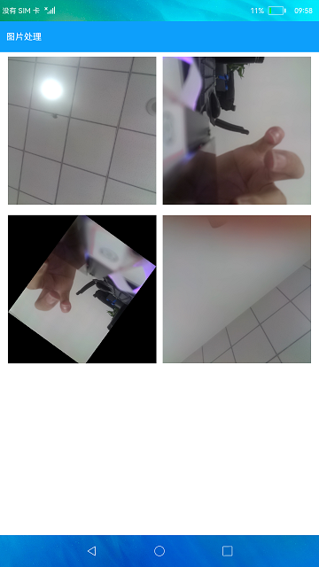
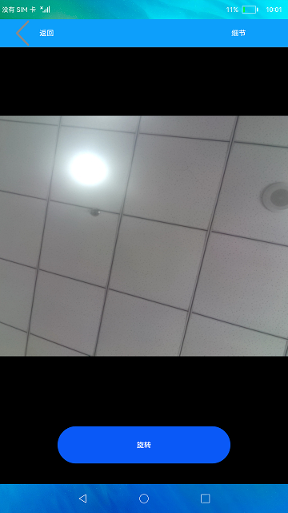

# Image Processing

### Introduction

This sample provides an Image Processing app, using which you can read images from the local device, obtain image information, and rotate images. Below shows the sample app.

 

### Concepts

Image processing: a class that provides APIs to read and write image pixel map data, and obtain pixel map information.

### Required Permissions

ohos.permission.MEDIA_LOCATION (permission to obtain the media file location)

ohos.permission.READ_MEDIA (permission to read media files)

ohos.permission.WRITE_MEDIA  (permission to write media files)

### Usage

1. Touch an image on the home page of the sample app to go to the image details page.

2. Touch the **Details** button in the upper left corner. The size, name, and path of the image are displayed in a dialog box.

3. Touch **Rotate**, drag the slider to select a rotation angle, and touch **Save** to save the rotated image to the local device.

### Constraints

1. This sample can only be run on standard-system devices.

2. At least one image file is available on the local device.

3. DevEco Studio 3.0 Beta3 (Build Version: 3.0.0.901, built on May 30, 2022) must be used.
