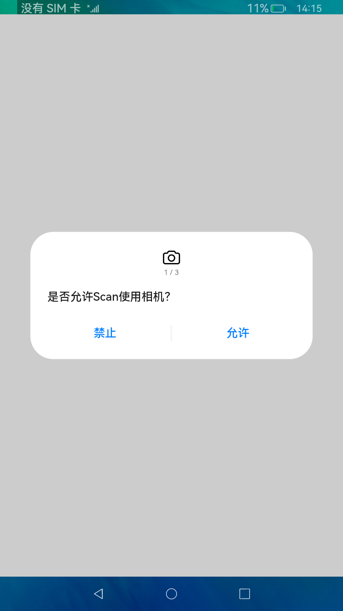
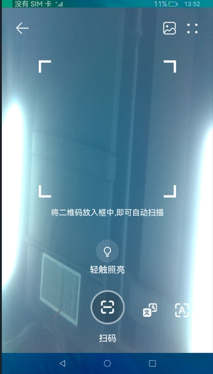

# 媒体库相机

### 介绍

 扫一扫的主要工作是将相册中的二维码图片进行解析并识别和读取,同时点击拍照可以对拍摄的二维码图片信息进行解析和显示。
 
 
 本实例使用[媒体库管理](https://gitee.com/openharmony/docs/blob/master/zh-cn/application-dev/reference/apis/js-apis-medialibrary.md)
 
 本实例使用[相机管理](https://gitee.com/openharmony/docs/blob/master/zh-cn/application-dev/reference/apis/js-apis-camera.md)
 
 本实例使用[图片处理](https://gitee.com/openharmony/docs/blob/master/zh-cn/application-dev/reference/apis/js-apis-image.md)
 
 本实例使用[文件管理](https://gitee.com/openharmony/docs/blob/master/zh-cn/application-dev/reference/apis/js-apis-fileio.md)
 
 
1.启动应用,首页展示扫一扫跳转页面,点击扫一扫跳转至相机模块。

2.点击右上角相册图标可以进入手机本地存储文件,点击picture,点击图片选取相关二维码图片进行识别读取。

3.点击轻触照亮可以对其进行相机拍照并对拍摄的照片进行处理和识别。

### 效果预览

- 
  

### 相关权限

本示例需要在module.json5中配置如下权限:

读取公共媒体文件权限：[ohos.permission.READ_MEDIA](https://gitee.com/openharmony/docs/blob/master/zh-cn/application-dev/security/permission-list.md)

相机权限 [ohos.permission.CAMERA](https://gitee.com/openharmony/docs/blob/master/zh-cn/application-dev/security/permission-list.md)

本地资源读取权限 [ohos.permission.MEDIA_LOCATION](https://gitee.com/openharmony/docs/blob/master/zh-cn/application-dev/security/permission-list.md)

### 依赖

不涉及。

### 约束与限制

1.本示例仅支持标准系统上运行,支持设备:RK3568。

2.本示例为stage模型，从API version 9开始支持,需要手动替换full sdk中的xcomponent.d.ts。

3.本示例需要使用DevEco Studio 3.0 Beta4 (Build Version: 3.0.0.992, built on July 14, 2022)才可编译运行。