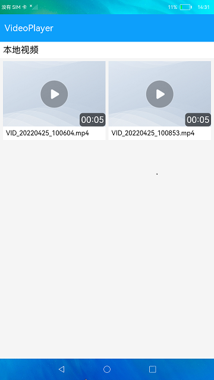
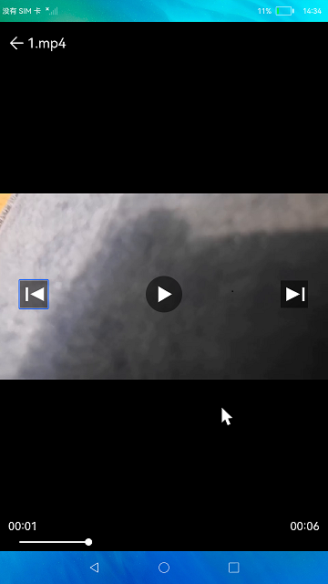

# 视频播放

### 简介

本示例展示了VideoPlayer播放视频，同时提供一个可供其他应用调用播放视频的Ability。实现效果如下：

 

### 相关概念

VideoPlayer：视频播放的主要工作是将视频数据转码并输出到设备进行播放，同时管理播放任务。本文将对视频播放全流程、视频切换、视频循环播放等场景开发进行介绍说明。

### 相关权限

读取公共媒体文件权限：ohos.permission.READ_MEDIA

### 使用说明

1.启动应用,首页展示可以查询到的本地视频。若本地没有视频文件，可以push视频到本地媒体库路径（storage/media/100/local/files/Videos）下后测试，需要先hdc进入storage/media/100/local/files路径下查看是否有Videos文件夹，没有则需要mkdir Videos创建文件夹后push视频文件。

2.点击视频进入视频播放界面，点击**屏幕显示顶部标题**、**暂停**、**上一个**、**下一个**按钮和底部播放进度条。

3.点击**暂停**、**播放**按钮可以暂停和播放视频。

4.点击**上一个**和**下一个**按钮可以切换视频。

### 约束与限制

1.本示例仅支持标准系统上运行。

2.本示例仅支持API9版本SDK，本示例涉及使用系统接口：getXComponentSurfaceId()，需要手动替换Full SDK才能编译通过，具体操作可参考[替换指南](https://gitee.com/openharmony/docs/blob/master/zh-cn/application-dev/quick-start/full-sdk-switch-guide.md)。

3.本示例需要使用DevEco Studio 3.0 Beta4 (Build Version: 3.0.0.992, built on July 14, 2022)才可编译运行。