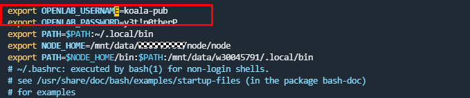

# 服务器部署文档

工具版本（固定版本）

node：18.20.4

meson：1.6.0

ninja：1.11.1

npm：11.0.0或11.0.0以上

## wsl ubuntu 安装

### 开发者模式开启

安装首先要启用windows的开发者模式，左下角搜索 `开发者设置`并启用。


### 启用windows功能

左下角搜索 `启用或关闭windows功能`，勾选 `适用于Linux的windows子系统`。


### linux-Ubuntu 下载

桌面左下角搜索 `Microsoft store`打开商店, 搜索linux，下载Ubuntu22.04.02 LTS。


下载完成后直接双击启动，会自动安装，一两分钟后安装完毕，按提示设置**用户名**、**密码**。


## ubuntu环境配置

### 基本指令下载

在ubuntu命令行工具中输入以下命令安装工具。

```
sudo apt-get update
sudo apt-get install git-lfs bison flex gnupg build-essential zip curl zlib1g-dev gcc-multilib g++-multilib libc6-dev-i386 lib32ncurses-dev x11proto-core-dev libx11-dev libc++1 lib32z1-dev ccache libgl1-mesa-dev libxml2-utils xsltproc unzip m4 libtinfo5 bc genext2fs liblz4-tool libssl-dev ruby gdb libelf-dev libxcursor-dev libxrandr-dev libxinerama-dev
```

### 安装JDK

```
sudo apt-get update
sudo apt-get install openjdk-11-jdk
```

安装完毕后输入 `java -version`验证


### 安装node

```
cd ~
mkdir Node
cd Node
wget https://nodejs.org/download/release/v18.20.4/node-v18.20.4-linux-x64.tar.xz
tar -xvf node-v18.20.4-linux-x64.tar.xz
```


### 配置node环境变量

```
cd node-v18.20.4-linux-x64
pwd
```

右键复制输出的路径，按照以下命令打开配置文件编辑，将userName替换为真实的用户名。

```
vim ~/.bashrc

// 添加以下内容
export NODE_HOME=/home/userName/Node/node-v18.20.4-linux-x64
export PATH=$NODE_HOME:$PATH
export NODE_HOME_BIN=/home/userName/Node/node-v18.20.4-linux-x64/bin
export PATH=$NODE_HOME_BIN:$PATH
```


编辑完键盘按esc 然后输入 `:wq`回车保存。

输入以下命令重载入环境变量，并验证。

```
source ~/.bashrc
node -v
```

### 安装meson和ninja

确保已安装pip，如果没有，请先安装：

```
sudo apt-get install python3-pip
```

安装meson

```
pip3 install meson==1.6.0
meson --version // 验证是否安装成功和版本是否正确
```

安装ninja

```
pip3 install ninja==1.11.1
ninja --version // 验证是否安装成功和版本是否正确
```

## 配置npmrc

通过find -name .npmrc找到npmrc文件位置，按照以下命令打开配置文件编辑。

```
vim npmrcPath

// 添加以下内容
@koalaui:registry=https://nexus.bz-openlab.ru:10443/repository/koala-npm/
@panda:registry=https://nexus.bz-openlab.ru:10443/repository/koala-npm/
```


### 配置编译使用的用户名密码

```
vim ~/.bashrc

// 添加以下内容
export OPENLAB_USERNAME=koala-pub
export OPENLAB_PASSWORD=y3t!n0therP
```



编辑完键盘按esc 然后输入 `:wq`回车保存。

输入以下命令重载入环境变量，并验证。

```
source ~/.bashrc

// 输出内容为刚刚添加的环境变量的值即为成功
echo ${OPENLAB_USERNAME} 
echo ${OPENLAB_PASSWORD}

// login会提示输入用户名密码，用户名和密码为刚刚配置的密码
npm login --registry=https://nexus.bz-openlab.ru:10443/repository/koala-npm
```

### 拉取代码和编译

代码仓：https://gitee.com/openharmony-sig/arkcompiler_ets_frontend

代码分支：master

确保安装了git，没有git可以通过以下方式安装。

```
sudo apt-get update
sudo apt-get install git
```

下载编译需要的SDK，按照下方代码中步骤执行下载解压，地址如下。

https://nexus.bz-openlab.ru:10443/repository/koala-raw/ohos-sdk/5.0.024/ohos-sdk-5.0.0.24-linux.zip

https://nexus.bz-openlab.ru:10443/repository/koala-raw/ohos-sdk-ets/5.0.024/ohos-sdk-ets-5.0.0.24.zip

https://nexus.bz-openlab.ru:10443/repository/koala-raw/command-line-tools/5.0.3502/command-line-tools.5.0.3502.zip

https://nexus.bz-openlab.ru:10443/repository/koala-raw/compiler/1.0.0/llvm-toolchain-linux_x86_64.tar.gz

https://nexus.bz-openlab.ru:10443/repository/koala-raw/compiler/1.0.0/sysroot-arm.tar.gz

https://nexus.bz-openlab.ru:10443/repository/koala-raw/compiler/1.0.0/sysroot-arm64.tar.gz

```
// 以下所有步骤创建文件的名称不能修改
// 在home目录下创建名为download的文件夹，在任意位置cd ~ 切换到home目录
cd ~
mkdir download
cd download

// 下载示例，其他的只需要更换后面链接即可(6个文件全部下载到download文件夹中)
wget --user koala-pub --password y3t\!n0therP https://nexus.bz-openlab.ru:10443/repository/koala-raw/ohos-sdk/5.0.024/ohos-sdk-5.0.0.24-linux.zip

// 全部下载完成后在download目录下创建名为unzip，切换到unzip文件中创建三个文件夹啊将三个zip后缀的文件解压到对应文件夹中
mkdir unzip
cd unzip
mkdir command-line-tools.5.0.3502
mkdir ohos-sdk-ets-5.0.0.24
mkdir ohos-sdk-5.0.0.24-linux
cd ..
unzip ohos-sdk-5.0.0.24-linux.zip -d ./unzip/ohos-sdk-5.0.0.24
unzip ohos-sdk-ets-5.0.0.24.zip -d ./unzip/ohos-sdk-ets-5.0.0.24
unzip command-line-tools.5.0.3502.zip -d ./unzip/command-line-tools.5.0.3502

// 创建三个文件夹分别存放三个.gz文件
mkdir ~/code/arkcompiler_ets_frontend/arkoala/tools/compiler/llvm-toolchain
mkdir ~/code/arkcompiler_ets_frontend/arkoala/tools/compiler/sysroot-arm64
mkdir ~/code/arkcompiler_ets_frontend/arkoala/tools/compiler/sysroot-arm
// 解压三个.gz后缀文件
tar -zxvf llvm-toolchain-linux_x86_64.tar.gz -C ~/code/arkcompiler_ets_frontend/arkoala/tools/compiler/llvm-toolchain
tar -zxvf sysroot-arm64.tar.gz -C ~/code/arkcompiler_ets_frontend/arkoala/tools/compiler/sysroot-arm64
tar -zxvf sysroot-arm.tar.gz -C ~/code/arkcompiler_ets_frontend/arkoala/tools/compiler/sysroot-arm
```

切换到拉取的代码仓中进行npm install，然后进行编译，例如：此处我的代码放在 ~/code目录下，code为我自己创建的文件夹(按步骤执行不要跳过更改顺序否则容易造成报错)。

```
cd ~/code/arkcompiler_ets_frontend
npm install

// ArkTS2.0的编译工具链下载，由于工具链会持续更新，建议每次编译应用包前都要运行此命令
cd incremental/tools/panda
npm run panda:sdk:install
cd ../../../arkoala-arkts/shopping
KOALA_BZ=1 HTTP_CACHE_DIR=$HOME/download npm run har-arm64
```

上述操作执行完生成shopping.har文件，通过下方命令找到文件路径，将这个文件下载到本地

```
find -name shopping.har
```

1.用指定版本SDK中的ets替换本地IDE的SDK中${IDE_PATH}/DevEco Studio/sdk/default/openharmony/下的ets

2.在IDE中新建工程将shopping.har和arkoala.har放到新建的工程中作为依赖添加到oh-package.json5中，此处依赖的名称@koalaui/shopping和@koalaui/arkoala-arkui名称必须与har（shopping.har和arkoala.har）包中的ohpackage.json5中的名称保持一致。


```
"dependencies": {
  "@koalaui/shopping":"file:./shopping/shopping.har",
  "@koalaui/arkoala-arkui":"file:./shopping/arkoala.har"
}
```

3.在entry/src/main文件夹下的module.json5文件中添加metadata

```
"metadata": [
  {
    "name": "ArkoalaPlugin",
    "value": "true"
  }
]
```

4.在指定版本的IDE中编译新建的工程，安装在指定镜像且推送了指定SO的设备中。

### FAQ

**1、代码更目录下npm install失败报错超时**

解决办法：

1.检测node和npm版本环境是否满足要求。

2.替换npm源为华为云的源，registry=https://repo.huaweicloud.com/repository/npm/ 。

3.用户名和密码是否添加正确。

4.login是否登录成功--npm login --registry=https://nexus.bz-openlab.ru:10443/repository/koala-npm

如果上述解决方案都已执行，可以尝试重新拉代码仓重新install。

**2、安装meson和ninja后未生效**

问题原因：meson和ninja的安装路径未被添加到环境变量PATH中

解决办法：如果meson安装在/usr/local/bin（未指定文件夹，一般都在这个路径下），可以将以下内容添加到你的shell配置文件中

```
vim ~/.bashrc

// 添加下方路径到.bashrc文件中
export PATH=$PATH:/usr/local/bin

source ~/.bashrc
```

